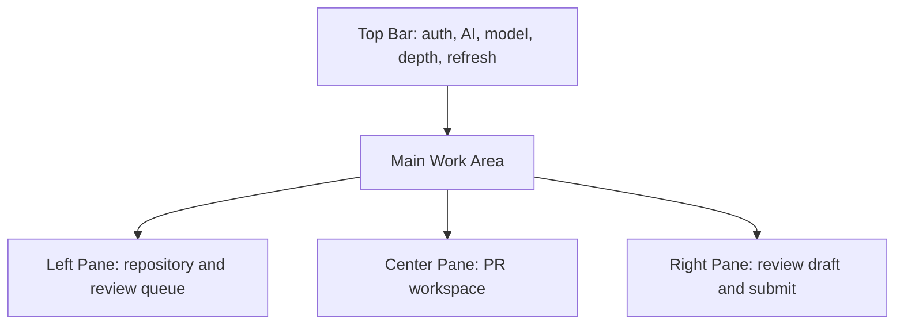
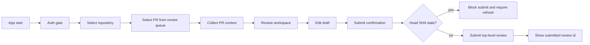
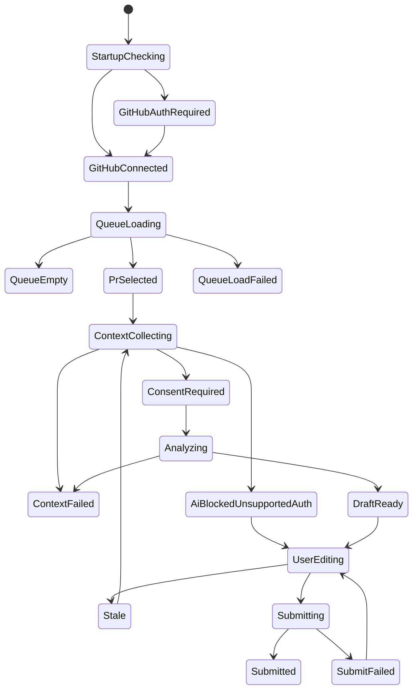

# ReviewDesk egui UI Redesign PRD 0.0.1

## 1. 버전

- 제품명: ReviewDesk
- 문서명: egui UI Redesign PRD
- PRD 버전: 0.0.1
- 작성일: 2026-05-16
- 상태: 에이전트 2차 검증 통과
- 범위: Rust `egui`/`eframe` 기반 데스크톱 UI 리디자인
- 상위 제품 PRD: `docs/prd/reviewdesk-prd-0.0.1.md`

## 2. 한 줄 정의

ReviewDesk egui UI Redesign은 현재의 기능 검증용 2-column shell을 실제 리뷰 업무에 맞는 3-pane 데스크톱 작업대 구조로 재설계해, 사용자가 repository/PR을 빠르게 고르고 PR 맥락을 스캔한 뒤 draft review를 안전하게 제출할 수 있게 만드는 UI 개선 작업이다.

## 3. 문제 정의

현재 `src/app.rs`의 UI는 기능 경계 검증을 위한 최소 shell이다. `egui`가 표현력이 부족해서 생긴 문제가 아니라, 제품 정보 구조와 작업 흐름이 아직 UI로 설계되지 않았기 때문에 다음 문제가 있다.

- 인증, repository 선택, 분석 결과, draft 편집이 업무 우선순위 없이 나열되어 있다.
- 사용자가 다음에 무엇을 해야 하는지 상태와 CTA가 명확하지 않다.
- review queue, PR overview, draft submit 영역이 분리되어 있지 않아 반복 리뷰 업무에 필요한 스캔성이 낮다.
- `AI_BLOCKED_UNSUPPORTED_AUTH`, stale, CI failure, private diff consent 같은 안전 상태가 일반 텍스트로만 보인다.
- draft 작성과 제출은 중요한 작업인데, 현재는 일반 버튼과 텍스트 영역 수준으로 표현된다.
- window 크기에 따른 layout 전략이 없어 작은 창에서 텍스트와 입력 영역이 밀릴 가능성이 높다.

## 4. 리디자인 목표

0.0.1 UI 리디자인의 목표는 다음이다.

1. 앱 첫 화면에서 GitHub/ChatGPT 연결 상태와 다음 액션을 즉시 이해할 수 있다.
2. 사용자는 PR 주소를 직접 입력하지 않아도 repository와 나에게 review requested 또는 assigned 된 PR을 선택할 수 있다.
3. PR을 선택하면 리뷰에 필요한 정보를 `Overview -> Findings -> Files -> Checklist` 순서로 빠르게 훑을 수 있다.
4. draft review 작성과 제출은 오른쪽 고정 영역에서 항상 접근 가능하다.
5. AI가 blocked 상태여도 사용자는 수동 draft 작성, 저장, 복사를 할 수 있다.
6. stale, 권한 부족, CI 실패, private diff consent 미완료 같은 안전 상태는 제출 전에 명확히 차단된다.
7. UI는 `egui`만으로 구현 가능한 구조여야 하며, 웹/Tauri/webview를 도입하지 않는다.

## 5. 제품 원칙

- 업무 도구답게 조용하고 밀도 있게 만든다.
- landing page, hero section, 장식성 그래픽은 만들지 않는다.
- 화면의 첫 목적은 "오늘 내가 리뷰해야 할 PR을 빠르게 고르는 것"이다.
- 정보는 카드 나열이 아니라 작업 영역 단위로 배치한다.
- AI 상태는 과장하지 않고, blocked이면 blocked로 명확히 표시한다.
- Submit Review는 항상 사용자의 명시적 확인 이후에만 가능하다.
- 모든 긴 작업은 상태, 진행 중 표시, 재시도 가능 여부를 가진다.

## 6. 대상 사용자와 작업 맥락

대상 사용자는 GitHub PR 리뷰를 자주 하는 개발자다. 이 사용자는 하루에 여러 repository의 PR을 훑으며 다음 질문에 빠르게 답하고 싶어 한다.

- 내가 지금 봐야 할 PR은 무엇인가?
- 이 PR은 위험한가?
- CI는 통과했는가?
- 변경 파일 중 먼저 봐야 할 곳은 어디인가?
- AI가 만든 draft가 근거 있는가?
- 이 리뷰를 submit해도 안전한가?

따라서 UI는 읽기, 비교, 수정, 제출을 반복하는 데 최적화되어야 한다.

## 7. 제외 범위

이번 UI 리디자인 PRD에는 다음을 포함하지 않는다.

- Tauri/webview 전환
- 웹 UI 또는 브라우저 기반 대시보드
- Figma 수준의 고정 픽셀 시안
- GitHub OAuth 실제 runtime wiring 변경
- ChatGPT OAuth provider 실제 invocation 구현
- inline comment 제출 UI
- diff position mapper UI
- 팀/조직 관리 화면
- 알림 센터
- 다중 창 또는 tray app
- dashboard analytics
- background polling/watch mode
- auto-submit
- API key provider
- Manual ChatGPT copy/paste mode
- local checkout/test execution
- keyboard shortcut 고도화
- local history browser

## 8. 정보 구조

리디자인 후 앱은 단일 window 안에서 다음 3개 작업 영역을 제공한다.

```text
Top Bar
  - App identity
  - GitHub status
  - ChatGPT/AI status
  - Model selector
  - Reasoning depth selector
  - Settings / Refresh
  - Current task status

Left Pane: Review Queue
  - Repository selector
  - My review queue shortcut
  - PR filter
  - PR list
  - Direct PR input fallback

Center Pane: PR Workspace
  - PR header
  - Risk / CI / files / draft status summary
  - Tabs: Overview, Findings, Files, Checklist
  - AI blocked or consent banner

Right Pane: Review Draft
  - Verdict selector
  - Draft editor
  - Safety checklist
  - Save / Copy / Submit actions
  - Report path / submitted review id

Bottom Status Strip
  - Last task result
  - Retryable error summary
  - Rate-limit or SSO guidance
```

우선순위:

- P0: GitHub OAuth 상태 표시, repository/PR 선택, PR context 수집 상태, AI blocked 상태, 수동 draft 저장/복사/제출, stale submit 차단.
- P1: AI provider ready 상태의 model/depth 선택, AI review 생성 상태, findings/checklist 품질 표시, private diff consent.
- P2: local history, debug sanitized input viewer, richer queue filtering, keyboard shortcuts, visual polish.

## 9. 기본 Layout

Wide layout 기준:

- 최소 권장 window: `1280x760`
- Left pane: 280-340 px
- Center pane: flexible, 최소 520 px
- Right pane: 360-440 px
- Top bar: 48-56 px
- Row height: PR queue 52-64 px
- Primary action button height: 32-36 px

Medium layout:

- `960-1279` px에서는 left pane 폭을 줄이고 center/right 비율을 유지한다.
- Queue row의 subtitle은 한 줄로 축약한다.
- Right pane은 최소 340 px을 유지한다.

Narrow layout:

- `960` px 미만에서는 3-pane을 억지로 유지하지 않는다.
- left/center/right를 `Queue`, `Review`, `Draft` tab으로 전환한다.
- Submit Review는 `Draft` tab 안에서만 노출한다.

## 10. 화면 구성

### 10.1 Top Bar

Top Bar는 앱 전체 상태와 전역 액션만 담는다.

필수 요소:

- `ReviewDesk` 제품명
- GitHub 연결 badge: `Connected`, `Auth required`, `Scope missing`, `SSO required`
- AI 연결 badge: `Ready`, `Auth required`, `Blocked`
- GPT model selector
- Reasoning depth segmented control: `빠름`, `균형`, `깊게`
- `Refresh` action
- `Settings` action
- 현재 task status label

Top Bar에서는 긴 설명문을 표시하지 않는다. 세부 설명은 hover tooltip 또는 상태 banner에서 보여준다.

### 10.2 Left Pane: Review Queue

Left Pane의 목적은 "리뷰할 PR 선택"이다.

필수 요소:

- Repository selector
- `My Queue` shortcut
- `Review requested` / `Assigned` filter toggle
- PR search input
- PR list
- Direct PR input fallback
- Empty state
- Loading state
- Refresh error state
- Rate-limit, scope missing, SSO required inline error

PR row 표시 정보:

- repo short name
- PR number
- title
- author
- risk badge
- CI badge
- draft/analyzing/blocked/stale status
- changed files count
- updated time

선택된 PR row는 명확한 highlight를 가져야 한다.

PR list는 자유 텍스트 영역이 아니라 선택 가능한 row list 또는 `egui_extras::TableBuilder` 기반 table로 구현한다. 각 row는 hover, selected, disabled 상태를 가진다.

### 10.3 Center Pane: PR Workspace

Center Pane의 목적은 "PR을 이해하고 AI/수동 리뷰 근거를 확인"하는 것이다.

PR header:

- PR title
- owner/repo#number
- author
- base -> head
- head SHA short
- GitHub에서 열기 action

Summary strip:

- Risk
- CI
- changed files
- additions/deletions
- review run status
- suggested verdict

Tabs:

- `Overview`: PR summary, key changes, 먼저 볼 파일
- `Findings`: correctness/security/UX/test/maintainability findings
- `Files`: changed files, excluded files, partial patch 표시
- `Checklist`: human QA checklist, missing context, blocked reason

Findings 요구사항:

- 각 finding은 severity, confidence, evidence, suggested action을 분리해 표시한다.
- findings는 기본적으로 read-only다.
- low-confidence finding은 draft에 자동 포함되었는지 여부를 명확히 표시한다.
- multiline editable textarea로 findings 전체를 표현하면 불합격이다.

AI blocked banner:

- `AI_BLOCKED_UNSUPPORTED_AUTH` 상태를 warning banner로 표시한다.
- API key fallback, cookie/session 우회가 금지됨을 짧게 설명한다.
- 수동 draft 작성은 가능하다는 액션을 함께 보여준다.

Private diff consent banner:

- private repository 분석 전에 provider, model, 전송 범위를 표시한다.
- 사용자가 동의하기 전에는 AI 분석 버튼을 비활성화한다.

### 10.4 Right Pane: Review Draft

Right Pane의 목적은 "검토한 review를 저장하거나 제출"하는 것이다.

필수 요소:

- Verdict selector: `COMMENT`, `APPROVE`, `REQUEST_CHANGES`
- Draft editor
- Draft quality indicators
- Safety checklist
- `Save Draft`
- `Copy Draft`
- `Submit Review`
- Submit confirmation dialog
- Markdown report path
- Submitted review id
- Disabled reason helper text

Safety checklist:

- GitHub connected
- PR still open
- head SHA not stale
- draft body not empty
- event selected
- private diff consent satisfied when AI-generated
- blocked AI 상태에서 자동 생성 코멘트가 아님을 표시

Submit button disabled 조건:

- GitHub 연결 없음
- PR 미선택
- draft body empty
- stale 상태
- closed/merged 상태
- submit in progress
- 권한 부족 또는 SSO 미승인

`APPROVE`와 `REQUEST_CHANGES`는 사용자가 직접 선택한 경우에만 활성 event가 된다. 기본값은 항상 `COMMENT`다.

## 11. 상태 설계

UI는 다음 상태를 명확하게 표현해야 한다.

- `StartupChecking`: keychain token과 provider 상태 확인 중
- `GitHubAuthRequired`: GitHub 인증 필요
- `GitHubConnected`: repository/PR 조회 가능
- `AiReady`: AI 분석 가능
- `AiBlockedUnsupportedAuth`: 공식 provider 부재로 AI 분석 불가
- `RepoLoading`
- `RepoLoadFailed`
- `QueueLoading`
- `QueueEmpty`
- `QueueLoadFailed`
- `PrSelected`
- `ContextCollecting`
- `ContextFailed`
- `ConsentRequired`
- `Analyzing`
- `DraftReady`
- `UserEditing`
- `Stale`
- `Submitting`
- `SubmitFailed`
- `Submitted`

각 상태는 UI에서 다음 중 최소 하나로 드러나야 한다.

- badge
- banner
- disabled action
- inline error
- progress indicator
- confirmation dialog

### 11.1 검증 가능한 UI 상태 표

| 상태 | 표시 위치 | 표시 문구 또는 badge | enabled controls | disabled controls | 다음 액션 |
| --- | --- | --- | --- | --- | --- |
| `StartupChecking` | Top Bar, Center | `Checking saved sessions` | 없음 | repo refresh, analyze, submit | token 검증 완료 대기 |
| `GitHubAuthRequired` | Top Bar, Left Pane | `GitHub Auth required` | GitHub OAuth 연결 | repo refresh, PR 선택, analyze, submit | Device Flow 시작 |
| `GitHubConnected` | Top Bar | `GitHub Connected` | repo refresh, repo selector | submit, analyze | repository 선택 |
| `AiReady` | Top Bar, Center | `AI Ready` | model/depth 선택, consent 후 analyze | 없음 | AI 분석 시작 |
| `AiBlockedUnsupportedAuth` | Center banner | `AI_BLOCKED_UNSUPPORTED_AUTH` | manual draft, save, copy | AI 분석 | 수동 draft 작성 |
| `RepoLoading` | Left Pane | `Loading repositories` | 취소 가능하면 cancel | repo selector, PR 선택 | 로딩 완료 대기 |
| `RepoLoadFailed` | Left Pane | 오류 종류별 message | retry, reauth if needed | PR 선택 | 오류 조치 후 retry |
| `QueueLoading` | Left Pane | `Loading review queue` | cancel/retry 가능 상태 표시 | PR 선택 | 로딩 완료 대기 |
| `QueueEmpty` | Left Pane | `No open review requested or assigned PRs` | refresh, direct input | analyze, submit | repo 변경 또는 direct input |
| `QueueLoadFailed` | Left Pane | rate-limit/scope/SSO/network message | retry, reauth | PR 선택 | 오류 조치 |
| `PrSelected` | Center | PR header, summary skeleton | collect context | submit | context 수집 |
| `ContextCollecting` | Center | `Collecting PR context` | cancel if available | analyze, submit | 수집 완료 대기 |
| `ContextFailed` | Center | context error banner | retry, open GitHub | analyze, submit | retry 또는 권한 조치 |
| `ConsentRequired` | Center | provider/model/scope consent banner | consent checkbox | analyze | consent 확인 |
| `Analyzing` | Center | `Analyzing with selected model` | cancel if available | analyze, submit | 분석 완료 대기 |
| `DraftReady` | Right Pane | `Draft ready` | edit, save, copy, submit if safe | 없음 | draft 검토 |
| `UserEditing` | Right Pane | `Unsaved changes` | save, copy, submit if safe | 없음 | 저장 또는 제출 |
| `Stale` | Center, Right Pane | `Draft stale: head SHA changed` | refresh/reanalyze, copy | submit | 재수집/재분석 |
| `Submitting` | Right Pane dialog | `Submitting review` | 없음 | save, submit, event selector | 제출 결과 대기 |
| `SubmitFailed` | Right Pane | failure kind and next action | retry, edit, copy | 없음 | 수정 후 재시도 |
| `Submitted` | Right Pane | `Submitted #review_id` | copy, open GitHub | submit same draft | 결과 확인 |

### 11.2 오류 위치 규칙

- GitHub 인증 오류는 Top Bar와 관련 pane에 함께 표시한다.
- repository/queue 오류는 Left Pane 안에 표시한다.
- PR context/AI/consent 오류는 Center Pane 안에 표시한다.
- draft validation/stale/submit 오류는 Right Pane 안에 표시한다.
- Bottom Status Strip은 마지막 작업 결과 요약만 표시하고, primary error location을 대체하지 않는다.

## 12. Interaction Flow

### 12.1 첫 실행

1. 앱 실행
2. Top Bar와 Auth Gate 표시
3. GitHub token 검증
4. GitHub 미연결이면 left/center/right 주요 action disabled
5. GitHub OAuth Device Flow 시작 버튼 제공
6. GitHub 연결 후 repository 목록 refresh
7. ChatGPT/AI 상태 확인
8. AI blocked이면 warning banner 표시, 수동 draft flow 유지

### 12.2 PR 선택 및 분석

1. 사용자가 repository 선택
2. Review queue refresh
3. 사용자가 PR row 선택
4. Center Pane에 PR header와 skeleton 표시
5. context 수집 완료 후 Overview/Files/Checklist 표시
6. AI ready이고 consent가 완료되면 AI 분석 가능
7. AI blocked이면 manual draft 상태 유지

### 12.3 Draft 제출

1. 사용자가 draft body 수정
2. verdict 선택
3. `Submit Review` 클릭
4. confirmation dialog 표시
5. stale check 수행
6. GitHub Review API 호출
7. 성공 시 submitted 상태와 review id 표시
8. 실패 시 draft 유지, 실패 원인별 action 표시

### 12.4 PR 직접 입력 fallback

1. 사용자가 direct PR input에 URL 또는 `owner/repo#number` 입력
2. 입력 옆에서 즉시 parse validation 수행
3. unsupported host 또는 invalid pattern이면 inline error 표시
4. parse 성공 시 GitHub 접근 권한과 PR 상태 확인
5. closed/merged/access denied이면 inline error와 다음 조치 표시
6. 접근 가능하면 repository와 selected PR 상태를 자동 전환

### 12.5 실패/복구 흐름

- Scope missing: GitHub 재인증 CTA를 제공한다.
- SSO required: 조직 SSO 승인 안내를 제공한다.
- Rate limited: reset/retry 가능 시각을 표시하고 자동 반복 요청을 멈춘다.
- Network error: retry CTA를 제공하고 기존 draft를 유지한다.
- Closed/merged/stale: submit을 막고 refresh/reanalyze CTA를 제공한다.
- AI unsupported: AI 분석만 막고 manual draft flow는 유지한다.

## 13. Visual Design Requirements

egui로 구현 가능한 범위 안에서 다음 기준을 따른다.

- 배경은 과도한 gradient 없이 neutral gray 기반으로 유지한다.
- 업무용 앱이므로 화려한 hero, 큰 일러스트, 장식 blob을 사용하지 않는다.
- pane 구분은 얇은 stroke, spacing, header hierarchy로 처리한다.
- badge color는 의미를 가진다.
- Risk badge: low/medium/high
- CI badge: pass/fail/pending/unknown
- AI badge: ready/auth-required/blocked
- Submit button은 화면에서 유일한 강한 primary action이어야 한다.
- 위험 action은 confirmation dialog 없이는 실행되지 않는다.
- 긴 텍스트는 줄바꿈 또는 ellipsis 처리한다.
- queue row, tab, editor, toolbar는 hover/selected/disabled 상태를 가진다.

색상 원칙:

- dominant palette는 단색 계열로 흐르지 않게 한다.
- 기본 배경은 neutral.
- 상태 색은 제한적으로 사용한다.
- red는 submit failure, stale, blocking issue에만 사용한다.
- amber는 warning, AI blocked, consent required에 사용한다.
- green은 connected, CI pass, submitted에만 사용한다.
- blue는 selected row, informational state, primary action에 사용한다.

## 14. Accessibility and Ergonomics

필수 기준:

- 모든 primary action은 keyboard focus가 가능해야 한다.
- `Tab` 순서는 Top Bar -> Left Pane -> Center Pane -> Right Pane 흐름을 따른다.
- `Enter`는 선택/확정, `Esc`는 dialog 닫기 또는 transient state 취소로 동작한다.
- button text는 좁은 창에서 잘리지 않아야 한다.
- status badge는 색상만으로 의미를 전달하지 않고 text label을 포함한다.
- disabled action은 이유를 tooltip 또는 inline message로 설명한다.
- draft editor는 최소 높이를 가져야 하며, right pane 전체 높이를 활용한다.
- 에러 메시지는 사용자가 취할 수 있는 다음 액션을 포함한다.
- confirmation dialog는 submit event, repository, PR number, draft head SHA를 보여준다.
- read-only 결과 영역과 editable draft 영역은 시각적으로 구분한다.
- findings/checklist/summary는 기본 read-only다.
- draft editor만 primary editable 영역이다.
- 최소 창 크기, high-DPI, 긴 한글/영문 repository name, 긴 PR title에서 텍스트 겹침이 없어야 한다.

## 15. egui 구현 요구사항

UI 구현은 다음 구조를 권장한다.

```text
src/app.rs
  - ReviewDeskApp shell
  - top-level state routing

src/ui/mod.rs
  - shared UI module exports

src/ui/theme.rs
  - spacing, colors, typography helpers

src/ui/components.rs
  - status badge, risk badge, CI badge, icon/text button helpers

src/ui/top_bar.rs
  - global connection/model/depth controls

src/ui/queue_pane.rs
  - repository selector, filter, PR list

src/ui/pr_workspace.rs
  - PR header, summary strip, tabs

src/ui/draft_pane.rs
  - verdict selector, editor, safety checklist, submit actions

src/ui/dialogs.rs
  - submit confirmation, auth guidance, error details

src/ui/state.rs
  - view model structs and UI-only state
```

필수 UI component:

- `AuthGate`
- `ProviderStatusBadge`
- `RepositoryPicker`
- `PullRequestQueue`
- `DirectPrInput`
- `ReviewRunStatusView`
- `AnalysisResultView`
- `FindingList`
- `ChangedFileList`
- `DraftEditor`
- `SubmitConfirmDialog`
- `ErrorBanner`
- `TaskProgressBar`
- `BottomStatusStrip`

필수 UI state model:

```rust
struct AppViewState {
    auth: AuthViewState,
    provider: ProviderViewState,
    queue: QueueViewState,
    run: RunViewState,
    draft: DraftViewState,
    task: Option<TaskViewState>,
    dialog: Option<DialogState>,
}

struct QueueViewState {
    repositories_loaded: bool,
    selected_repository: Option<String>,
    filter: QueueFilter,
    direct_pr_input: String,
    direct_pr_error: Option<String>,
}

struct DraftViewState {
    body: String,
    event: ReviewEvent,
    dirty: bool,
    stale: bool,
    submit_disabled_reason: Option<String>,
}

struct TaskViewState {
    id: String,
    label: String,
    cancellable: bool,
    retryable: bool,
    last_error: Option<String>,
}
```

구현 규칙:

- network/OAuth/AI/file IO는 UI thread에서 blocking으로 실행하지 않는다.
- background 작업은 `tokio task -> channel/event -> egui repaint` 흐름으로 상태를 갱신한다.
- UI layer는 domain model을 직접 조작하지 않고 view model을 통해 표시한다.
- large function 하나에 모든 panel을 넣지 않는다.
- 각 pane은 자체 render function과 작은 view model을 가진다.
- 테스트 가능한 pure helper를 둔다.
- `egui::ScrollArea`, `egui::SidePanel`, `egui::CentralPanel`, `egui::TopBottomPanel`, `egui::Window`를 활용한다.
- PR queue는 stable row height를 유지한다.
- text edit/editor는 parent 크기에 맞춰 확장되며 버튼을 밀어내지 않는다.
- `ReviewRunStatus`와 `ReviewEvent`는 domain enum을 source of truth로 사용한다.
- Submit confirm dialog는 `dialog open -> confirmed action -> cancel action` 상태를 명시적으로 가진다.

## 16. 테스트 ID 및 스냅샷 요구

UI 구현은 다음 test id 또는 snapshot name을 문서화해야 한다. egui 자체가 DOM test id를 제공하지 않으므로, 이름은 snapshot fixture, view model test, manual QA checklist에서 동일하게 사용한다.

| 이름 | 목적 |
| --- | --- |
| `startup_auth_required` | 첫 실행, GitHub 미연결, AI blocked |
| `github_connected_ai_blocked` | GitHub 연결 완료, AI 분석 disabled, manual draft 가능 |
| `queue_empty` | repository 선택 후 리뷰 대상 PR 없음 |
| `queue_loaded_with_selection` | PR queue row, selected row, badges 표시 |
| `direct_pr_invalid` | 직접 입력 invalid inline error |
| `context_collecting` | PR 선택 후 context 수집 중 |
| `consent_required_private_repo` | private diff consent 미완료 |
| `draft_ready` | 분석 또는 수동 draft 준비 완료 |
| `stale_submit_blocked` | stale 상태에서 submit disabled |
| `submit_confirm_dialog` | event, repo, PR number, head SHA 표시 |
| `submit_failed_draft_preserved` | 실패 후 draft body 유지 |
| `submitted_review_id` | 제출 성공 후 review id 표시 |

## 17. 수용 기준

UI 리디자인은 다음 기준을 만족해야 한다.

### 17.1 구조

- 앱은 Top Bar, Left Queue Pane, Center PR Workspace, Right Draft Pane으로 구성된다.
- wide window에서 3-pane layout이 보인다.
- medium window에서 right pane이 최소 폭을 유지한다.
- narrow window에서 tabbed layout으로 전환된다.
- Submit Review action은 Right Pane에만 위치한다.

### 17.2 상태

- GitHub 미연결 상태에서 repository/PR action은 disabled다.
- AI blocked 상태에서 AI 분석 버튼은 disabled이고, 수동 draft 작성은 가능하다.
- private diff consent 미완료 상태에서 AI 분석은 disabled다.
- stale 상태에서 Submit Review는 disabled다.
- submit 실패 시 draft body는 유지된다.
- GitHub 미연결 상태에서 Refresh, PR 선택, Analyze, Submit Review는 disabled다.
- AI blocked 상태에서 model/depth selector는 볼 수 있지만 AI Analyze CTA는 disabled reason을 표시한다.
- 권한 부족, SSO, rate limit, network 오류는 서로 다른 메시지와 action을 가진다.

### 17.3 작업 흐름

- 사용자는 PR URL 입력 없이 repository와 PR list를 통해 리뷰 대상을 선택할 수 있다.
- 직접 입력 fallback은 별도 영역으로 제공되며 primary flow를 방해하지 않는다.
- 선택된 PR의 summary, findings, files, checklist가 Center Pane tab으로 분리된다.
- draft editor는 항상 review event selector와 함께 보인다.
- Submit confirmation dialog는 제출 대상과 event를 명확히 보여준다.
- Submit confirmation dialog에는 repository, PR number, event, head SHA short, stale check status가 표시된다.
- `APPROVE` 또는 `REQUEST_CHANGES` payload는 사용자가 명시적으로 선택한 경우에만 생성된다.

### 17.4 시각 품질

- 모든 badge에는 text label이 있다.
- 긴 PR title과 repository name은 layout을 깨지 않는다.
- 버튼 텍스트는 부모 안에서 잘리지 않는다.
- pane 안에 pane을 중첩한 카드형 UI를 남발하지 않는다.
- 화면은 한 가지 색 계열로만 지배되지 않는다.
- findings는 severity/confidence/evidence/action이 분리되어 보인다.
- read-only 영역과 editable 영역이 명확히 구분된다.

### 17.5 검증

- `cargo fmt --check` 통과
- `cargo check` 통과
- UI state helper unit test 통과
- queue filtering/view model test 통과
- submit disabled reason test 통과
- direct PR input validation view model test 통과
- dialog open/cancel/confirm state test 통과
- 최소 3개 viewport 수동 검증 결과 문서화: wide, medium, narrow
- AI blocked, stale, submit failed, empty queue 상태를 각각 수동 검증 문서에 기록
- `16. 테스트 ID 및 스냅샷 요구`의 모든 이름이 구현 검증 문서에 포함된다.

## 18. Mermaid Diagrams

### 18.1 Layout



### 18.2 Primary Flow



### 18.3 UI State Machine



## 19. 에이전트 검증 결과

검증일: 2026-05-16

1차 검증 결과:

| 에이전트 | 관점 | 1차 판정 | 반영 내용 |
| --- | --- | --- | --- |
| Product/UX | 사용자 흐름, 정보 구조, 우선순위 | 미통과, 반영 완료 | P0/P1/P2, 3-pane 정보 구조, 실패/복구 흐름, direct input fallback 보강 |
| Rust egui Architecture | 구현 가능성, 상태/비동기 모델 | 조건부 통과, 보강 완료 | `AppViewState`, `QueueViewState`, `DraftViewState`, `TaskViewState`, background task event flow 보강 |
| Visual/Accessibility | 시각 품질, 접근성 | 미통과, 반영 완료 | findings 표시 기준, read-only/editable 구분, badge/text label, overflow/accessibility 기준 보강 |
| QA/Acceptance | 검증 가능성, snapshot, 상태별 수용 기준 | 미통과, 반영 완료 | 검증 가능한 UI 상태 표, 테스트 ID/snapshot 이름, disabled condition, dialog state 기준 보강 |

추가 환경 메모:

- `AGENTS.md`에서 참조된 `RTK.md`는 현재 workspace에서 발견되지 않았다. 따라서 이 PRD 검증에는 현재 대화에 제공된 지시와 repository 파일만 적용했다.

2차 검증 결과:

| 에이전트 | 관점 | 2차 판정 | 통과 이유 |
| --- | --- | --- | --- |
| Product/UX | 사용자 흐름, 정보 구조, 우선순위 | PASS | 첫 실행, PR 선택/분석, 제출, 직접 입력 fallback, 실패/복구 흐름이 구체화되었고 P0/P1/P2와 제외 범위가 명확함 |
| Rust egui Architecture | 구현 가능성, 상태/비동기 모델 | PASS | view state 분리, `tokio task -> channel/event -> egui repaint`, enable/disable 조건, dialog/stale UX가 egui 0.34에서 구현 가능한 수준으로 고정됨 |
| Visual/Accessibility | 시각 품질, 접근성 | PASS | 3-pane 구조, selectable PR row, overflow/layout 기준, 상태 badge/banner, findings 구조화, keyboard/focus/read-only 기준이 반영됨 |
| QA/Acceptance | 검증 가능성, snapshot, 상태별 수용 기준 | PASS | 상태별 UI 표, disabled reason, dialog/submit flow, snapshot/test id, viewport/manual QA 기준이 검증 가능한 형태로 정리됨 |

비차단 권고:

- Submit confirmation dialog는 열릴 때 preflight stale check를 시작하고, safe 결과가 확인된 뒤 confirm 버튼을 활성화하는 구현이 가장 명확하다.
- 구현 단계에서는 snapshot 이름별 fixture 입력 데이터와 기대 결과 파일 위치를 추가로 문서화하면 QA 재현성이 좋아진다.

최종 판정:

- Product/UX: 통과
- Rust egui Architecture: 통과
- Visual/Accessibility: 통과
- QA/Acceptance: 통과

따라서 이 PRD는 ReviewDesk egui UI 리디자인 구현 계획을 작성할 수 있는 상태로 본다.
