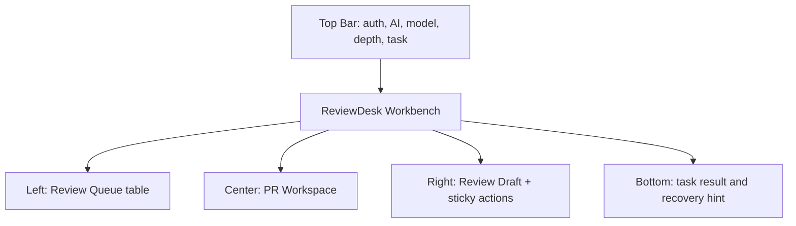
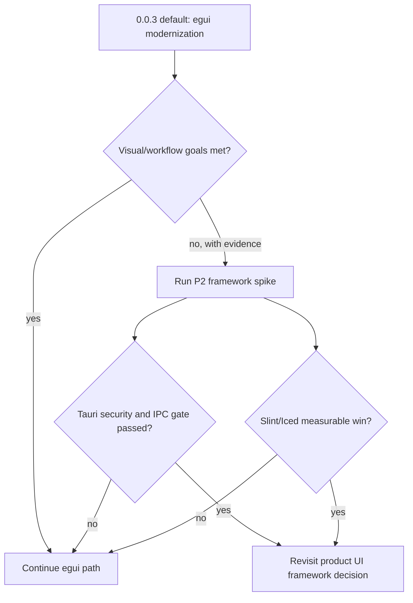
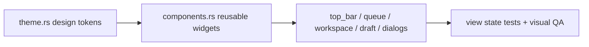

# ReviewDesk UI/UX Modernization PRD 0.0.3

## 1. 버전

- 제품명: ReviewDesk
- 문서명: UI/UX Modernization PRD
- PRD 버전: 0.0.3
- 작성일: 2026-05-16
- 상태: 에이전트 토론 반영 완료, 구현 계획 작성 가능
- 범위: Rust `egui`/`eframe` 기반 데스크톱 UI/UX 고도화
- 이전 UI PRD: `docs/prd/prd-0.0.2.md`
- 기본 기술 결정: `egui` 유지
- 조건부 탐색: Tauri / Slint / Iced는 P2 spike로만 검토

## 1.1 0.0.3 변경 요약

0.0.3은 0.0.2의 3-pane 작업대 구조를 유지하면서, 사용자가 지적한 "현대적으로 보이지 않는다"는 문제를 구체적인 제품 UI 품질 기준으로 분해한다.

핵심 변경:

- `egui` 자체의 한계가 아니라 theme/component/hierarchy 부족을 주된 문제로 정의한다.
- Top Bar, Queue, Workspace, Draft, Dialog, Bottom Status를 제품 UI 컴포넌트 체계로 승격한다.
- `Submit Review`를 유일한 강한 primary action으로 정의한다.
- PR queue를 단순 `selectable_label` 목록이 아니라 stable row/table 기반 업무 리스트로 고도화한다.
- Direct PR input은 primary flow가 아니라 보조 fallback으로 낮춘다.
- wide/medium/narrow viewport 스크린샷 검증을 수용 기준에 추가한다.
- 긴 한글/영문 title, 긴 repo/path/error/draft가 layout을 깨지 않는지 검증한다.
- Tauri 전환은 즉시 실행하지 않고, 보안/IPC/제품 동등성 gate를 통과한 spike 이후에만 검토한다.

## 2. 한 줄 정의

ReviewDesk UI/UX Modernization 0.0.3은 현재의 기능 구현형 egui UI를 실제 제품처럼 느껴지는 밀도 높은 데스크톱 리뷰 작업대로 고도화해, 사용자가 PR queue를 빠르게 스캔하고 draft review를 안전하게 제출할 수 있게 만드는 작업이다.

## 3. 문제 정의

0.0.2 구현은 정보 구조 측면에서 Top Bar, Left Queue, Center Workspace, Right Draft, Bottom Status의 기본 골격을 만들었다. 하지만 현재 화면은 아직 "현대적인 제품 UI"라기보다 "동작을 확인하기 위한 Rust 도구 UI"에 가깝게 보일 수 있다.

구체적 원인:

- `theme.rs`가 pane 폭, breakpoint, 상태 색상 정도만 제공하고 spacing, typography, stroke, radius, focus, hover, selected, disabled surface 토큰이 없다.
- `components.rs`의 badge와 button이 egui 기본 위젯에 가깝고, padding/radius/height/hierarchy가 안정적이지 않다.
- Top Bar가 앱 상태를 요약하는 toolbar가 아니라 여러 control을 한 줄에 나열한 형태에 가깝다.
- PR queue가 stable row/table이 아니라 `selectable_label`과 separator 반복이라 업무용 list density와 selected/hover state가 약하다.
- Direct PR fallback이 primary queue flow와 같은 레벨에 있어 "OAuth 후 repo/PR 선택"이라는 핵심 흐름을 흐린다.
- Center Workspace는 tab 구조는 있으나 header, summary strip, findings row의 시각 위계가 약하다.
- Draft Pane에서 Save, Copy, Submit이 같은 button helper를 사용해 Submit Review의 위험도와 중요도가 충분히 드러나지 않는다.
- Safety checklist가 `[x]`, `[ ]` 텍스트라 빠르지만, 상태별 중요도와 scanability가 약하다.
- Dialog가 label 나열 형태라 submit 전 마지막 확인 화면으로서의 신뢰감이 부족하다.
- 0.0.2 검증은 state helper 중심이며, 실제 화면이 현대적으로 보이는지를 screenshot/visual QA로 충분히 증명하지 않는다.

## 4. 현대적 UX의 정의

ReviewDesk에서 "현대적"은 landing page처럼 화려하거나 웹 SaaS처럼 장식적인 UI를 의미하지 않는다.

이 제품의 현대적 UX는 다음이다.

- 앱 시작 후 5초 안에 GitHub 연결 상태, AI 상태, 다음 액션을 이해할 수 있다.
- GitHub OAuth 후 PR URL을 입력하지 않아도 repo와 review queue에서 리뷰 대상을 선택할 수 있다.
- PR row에서 위험도, CI, draft/analyzing/stale 상태, 변경 파일 수가 한눈에 보인다.
- 선택한 PR의 Overview, Findings, Files, Checklist가 명확한 위계로 정리된다.
- AI가 blocked 상태여도 수동 draft 작성, 저장, 복사, 제출 흐름은 막히지 않는다.
- private diff consent, stale head, closed PR, write scope missing, SSO required가 제출 전에 명확히 차단된다.
- `Submit Review`는 항상 사용자의 명시적 확인 이후에만 실행된다.
- 시각적으로는 조용하고 밀도 있지만, debug form처럼 보이지 않는다.

## 5. 제품 원칙

- 업무 도구답게 조용하고 밀도 있게 만든다.
- 카드와 장식을 늘리는 방식으로 현대성을 만들지 않는다.
- 첫 화면의 주인공은 PR queue와 다음 action이다.
- `Submit Review`는 화면에서 유일한 강한 primary action이다.
- 상태는 색상만으로 전달하지 않고 항상 text label을 포함한다.
- 결과 영역은 read-only, draft 영역은 editable로 명확히 분리한다.
- AI는 draft를 준비하지만 최종 판단과 제출은 사용자가 한다.
- 보안과 제출 안전성을 UI polish보다 낮은 우선순위로 두지 않는다.

## 6. 기본 기술 결정

0.0.3의 기본 구현 경로는 `egui` 유지다.

이유:

- 기존 코드와 0.0.2 PRD가 이미 `eframe`/`egui` 구조로 정렬되어 있다.
- 토큰은 OS keychain에 저장하고, 로컬 산출물은 `.reviewdesk` 아래 owner-only 권한으로 저장하는 현재 Rust-native 보안 모델을 유지할 수 있다.
- GitHub API, stale check, error classification, submit review 도메인 로직이 Rust core에 있으므로 UI shell을 갈아엎지 않아도 제품 흐름을 개선할 수 있다.
- 현재 "덜 현대적" 문제는 대부분 framework 문제가 아니라 theme/component/hierarchy 문제다.

Tauri, Slint, Iced는 0.0.3 구현 범위가 아니다. 단, P2 spike로 별도 검토할 수 있다.

## 7. 제외 범위

0.0.3에는 다음을 포함하지 않는다.

- Tauri/webview 제품 전환
- 웹 대시보드화
- Figma 수준의 pixel-perfect 시안
- 장식 중심 리브랜딩, hero, landing page
- inline comment 작성 UI
- diff position mapper UI
- full IDE 수준 diff editor
- local checkout/test runner
- GitHub Actions 로그 뷰어
- background polling, 알림 센터, tray app
- 팀/조직 관리
- analytics dashboard
- auto-submit
- ChatGPT cookie/session 우회
- API key fallback
- 비공식 auth workaround
- 다중 PR batch review
- 코드 수정 patch 자동 생성

## 8. 범위와 우선순위

### P0

- Design token 체계: colors, spacing, typography, stroke, radius, focus ring, hover/selected/disabled surfaces
- Button hierarchy: primary, secondary, outline, danger, ghost
- Status component: badge, banner, inline error, disabled reason
- Stable PR queue row/table
- Direct PR fallback의 시각 우선순위 하향
- Top Bar overflow/priority 정리
- Center Workspace header/summary/finding/file/checklist row 고도화
- Draft editor가 남은 높이를 안정적으로 차지하고, action bar는 항상 접근 가능
- Submit safety checklist를 구조화된 row로 고도화
- Submit confirmation dialog polish
- wide `1280x760`, medium `1100x760`, narrow `800x760` visual QA
- 긴 텍스트/좁은 화면/오류 상태 layout 깨짐 방지

### P1

- `egui_extras::TableBuilder` 또는 동등한 stable row/table 도입
- Skeleton/loading/empty/error/retry/cancel state 고도화
- Task progress bar 또는 spinner
- Keyboard-only review/submit flow 수동 QA
- AI model/depth selector의 blocked/disabled reason tooltip
- Status icon 또는 compact symbol 도입
- Finding row의 severity/confidence/evidence/action grid 정렬
- Screenshot 기반 verification 문서화

### P2

- Tauri spike
- Slint spike
- Iced spike
- Rich markdown/diff viewer spike
- 고급 keyboard shortcut 체계
- local history browser

## 9. 정보 구조

0.0.3은 0.0.2의 3-pane 구조를 유지하되, 각 영역의 시각 역할을 더 명확히 한다.

```text
Top Bar
  - 제품명
  - GitHub OAuth status
  - ChatGPT/AI OAuth status
  - Model selector
  - Reasoning depth selector
  - Refresh / Settings
  - Current task status

Left Pane: Review Queue
  - My Queue / Repository picker
  - Review requested / Assigned filters
  - Search
  - Stable PR row/table
  - Empty/loading/error state
  - Direct PR fallback as secondary block

Center Pane: PR Workspace
  - PR header
  - Summary strip
  - Tabs: Overview / Findings / Files / Checklist
  - AI blocked / consent / stale banners
  - Read-only review context

Right Pane: Review Draft
  - Verdict selector
  - Draft editor
  - Safety checklist
  - Sticky action bar
  - Save / Copy / Submit
  - Report path and submitted review id

Bottom Status Strip
  - Last task result
  - Retryable error summary
  - Rate-limit / SSO / scope guidance
```

## 10. 화면별 요구사항

### 10.1 Top Bar

Top Bar는 앱 전체 상태와 전역 action만 보여준다.

필수:

- `ReviewDesk` 제품명
- GitHub status badge: `Auth required`, `Connected`, `Scope missing`, `SSO required`
- AI status badge: `Auth required`, `Ready`, `Blocked`, `Model unavailable`
- Model selector
- Reasoning depth segmented control: `빠름`, `균형`, `깊게`
- Refresh
- Settings
- Current task label 또는 progress

수용 기준:

- 1280px에서는 모든 주요 control이 한 줄에서 겹치지 않는다.
- 960px에서는 낮은 우선순위 label은 축약되며, status와 primary action은 유지된다.
- 720px 또는 narrow layout에서는 Top Bar가 중요한 상태만 남기고 나머지는 Settings나 overflow 영역으로 내릴 수 있다.
- 긴 설명문은 Top Bar에 직접 넣지 않고 tooltip, banner, Bottom Status로 보낸다.
- OAuth action은 인증이 필요한 경우에만 강하게 보인다.

### 10.2 Left Pane: Review Queue

Left Pane의 목적은 PR URL 입력이 아니라 "내가 지금 리뷰할 PR 선택"이다.

필수:

- `My Queue` shortcut
- Repository picker
- `Review requested`, `Assigned`, `All` filter
- Search
- PR row/table
- Empty/loading/error state
- Direct PR fallback

PR row 표시 정보:

- repo short name
- PR number
- title
- author
- risk badge
- CI badge
- draft/analyzing/blocked/stale status badge
- changed files count
- updated time

수용 기준:

- row height는 52-64px 범위를 유지한다.
- selected row는 fill, stroke, left accent 중 최소 하나로 명확히 표시한다.
- hover row는 selected와 구분되는 surface를 가진다.
- title은 한 줄 우선, 필요 시 ellipsis 또는 2줄 clamp로 처리한다.
- badge는 같은 행에서 정렬되어 흔들리지 않는다.
- Direct PR fallback은 queue 아래 secondary block으로 표시한다.
- queue loading 중에는 skeleton row 또는 progress state를 보여준다.
- empty state는 "No open review requested or assigned PRs"와 다음 action을 제공한다.

### 10.3 Center Pane: PR Workspace

Center Pane의 목적은 PR을 이해하고 draft에 반영할 근거를 확인하는 것이다.

필수:

- PR title
- owner/repo#number
- author
- base -> head
- head SHA short
- GitHub에서 열기 action
- summary strip: risk, CI, files, additions/deletions, review run status, suggested verdict
- tabs: Overview, Findings, Files, Checklist

Findings 요구사항:

- finding은 severity, confidence, title, evidence, suggested action, selected-for-draft를 분리해 표시한다.
- low-confidence finding은 자동으로 draft에 포함되지 않았음을 표시한다.
- finding 전체를 하나의 editable textarea로 표현하면 불합격이다.
- read-only review context와 editable draft는 시각적으로 분리되어야 한다.

Banner 요구사항:

- `AI_BLOCKED_UNSUPPORTED_AUTH`: AI 분석만 blocked이며 manual draft는 가능함을 표시한다.
- `ConsentRequired`: provider, model, 전송 범위, consent checkbox를 표시한다.
- `Stale`: head SHA 변경으로 submit이 막혔고 refresh/reanalyze가 필요함을 표시한다.
- `ContextFailed`: retry와 GitHub에서 열기 action을 제공한다.

### 10.4 Right Pane: Review Draft

Right Pane의 목적은 사용자가 최종 리뷰를 수정하고 제출하는 것이다.

필수:

- Verdict selector: `COMMENT`, `APPROVE`, `REQUEST_CHANGES`
- Draft editor
- Draft quality/status indicators
- Safety checklist
- Sticky action bar
- Save Draft
- Copy Draft
- Submit Review
- Markdown report path
- Submitted review id
- Disabled reason helper text

수용 기준:

- 기본 verdict는 항상 `COMMENT`다.
- `APPROVE`와 `REQUEST_CHANGES`는 사용자가 명시적으로 선택했을 때만 active event가 된다.
- `Submit Review`는 유일한 강한 primary button이다.
- Save/Copy는 secondary 또는 outline button이다.
- Draft editor는 Right Pane의 남은 높이를 활용한다.
- action bar는 draft scroll에 밀려 사라지지 않는다.
- empty draft, stale, PR closed/merged, missing write scope, SSO required, submit in progress는 submit을 막는다.
- AI-generated draft인 경우 private diff consent 상태를 checklist에 표시한다.
- submit 실패 시 body, verdict, selected PR, report path를 보존한다.

### 10.5 Submit Confirmation Dialog

Submit dialog는 단순 label 나열이 아니라 최종 제출 확인 화면이다.

필수 표시:

- repository
- PR number/title
- review event
- head SHA
- stale check result
- draft source: manual 또는 AI-generated
- 위험 event warning: `APPROVE`, `REQUEST_CHANGES`

수용 기준:

- `Cancel`은 secondary action이다.
- `Confirm Submit`은 primary action이지만 stale check가 safe일 때만 enabled다.
- `Esc`는 dialog를 닫는다.
- `Enter`는 focus가 confirm에 있을 때만 제출을 확정한다.
- dialog를 닫아도 draft body는 유지된다.

### 10.6 Bottom Status Strip

Bottom Status Strip은 primary error location을 대체하지 않는다. 마지막 작업 결과와 복구 힌트만 요약한다.

필수:

- last task label
- last task result
- retryable 여부
- rate-limit reset, SSO required, scope missing 같은 guidance

## 11. Visual System

### 11.1 Design Tokens

`src/ui/theme.rs`는 다음 token을 제공해야 한다.

- Background: app, pane, elevated, input
- Text: primary, secondary, muted, danger
- Stroke: subtle, strong, focus
- Radius: small, medium
- Spacing: xs, sm, md, lg
- Typography: app title, section title, row title, metadata, helper
- Status colors: info, success, warning, danger, neutral
- Row surfaces: hover, selected, disabled
- Button surfaces: primary, secondary, outline, danger, ghost

색상 원칙:

- neutral background를 기본으로 한다.
- red는 stale, submit failure, blocking issue에만 사용한다.
- amber는 AI blocked, consent required, warning에 사용한다.
- green은 connected, CI pass, submitted에만 사용한다.
- blue는 selected row, informational state, primary submit action에 제한적으로 사용한다.
- 화면 전체가 단일 blue/gray 계열로만 보이면 불합격이다.

### 11.2 Components

`src/ui/components.rs`는 다음 reusable component를 제공해야 한다.

- `StatusBadge`
- `RiskBadge`
- `CiBadge`
- `StateBanner`
- `InlineError`
- `PrimaryButton`
- `SecondaryButton`
- `DangerButton`
- `GhostButton`
- `SegmentedControl`
- `QueueRow`
- `FindingRow`
- `FileRow`
- `ChecklistRow`
- `StickyActionBar`
- `SkeletonRow`
- `EmptyState`
- `TaskProgress`

요구사항:

- 모든 badge는 text label을 포함한다.
- 모든 button은 hover, focused, disabled state를 가진다.
- button variant는 CTA hierarchy를 표현한다.
- checklist row는 `[x]` 텍스트만 쓰지 않고 pass/fail/warning 상태를 구조화한다.
- component 안에서 긴 텍스트가 부모 폭을 깨지 않아야 한다.

## 12. Layout

### Wide

- 기준: `1280x760` 이상
- Top Bar: 52-60px
- Bottom Status: 36-44px
- Left Pane: 300-360px
- Right Pane: 380-460px
- Center Pane: 남은 폭, 최소 520px
- 3-pane layout 유지

### Medium

- 기준: `960-1279px`
- 3-pane layout 유지
- Left Pane은 280-320px
- Right Pane은 최소 340px
- Queue metadata는 축약 가능
- Top Bar low-priority text는 축약 가능

### Narrow

- 기준: `960px` 미만
- 3-pane 강제 유지 금지
- `Queue`, `Review`, `Draft` tab으로 전환
- Submit Review는 `Draft` tab에서만 표시
- Top Bar는 status와 핵심 action 중심으로 축약

## 13. 상태와 상호작용

0.0.3은 0.0.2의 상태를 유지하고 다음 상태/검증 이름을 추가한다.

| 상태/케이스 | 목적 |
| --- | --- |
| `oauth_required_first_run` | 첫 실행, GitHub OAuth 필요 |
| `queue_loaded_no_pr_selected` | queue는 로드됐지만 PR 미선택 |
| `pr_context_collecting` | PR 선택 후 context 수집 중 |
| `ai_ready_consent_required` | AI ready이나 private diff consent 필요 |
| `ai_blocked_manual_draft` | AI blocked이지만 manual draft 가능 |
| `draft_generated_needs_review` | AI draft 생성 후 사용자 검토 필요 |
| `submit_disabled_stale_head` | stale head로 submit disabled |
| `submit_confirm_approve_explicit` | 사용자가 APPROVE를 명시 선택한 confirmation |
| `submit_failed_draft_preserved` | 제출 실패 후 draft 보존 |
| `submitted_review_linked` | 제출 성공 후 review id/link 표시 |
| `modern_visual_baseline` | 3개 viewport visual QA |
| `long_content_resilience` | 긴 텍스트 layout 회복력 |

Submit disabled reason은 최소 다음을 포함한다.

- GitHub auth required
- No pull request selected
- Draft body empty
- Draft stale
- Pull request closed or merged
- Submitting
- GitHub write scope missing
- SSO required
- Private diff consent required for AI-generated draft
- Explicit verdict confirmation required for APPROVE/REQUEST_CHANGES

## 14. Accessibility and Ergonomics

필수:

- 모든 primary action은 keyboard focus 가능해야 한다.
- `Tab` 순서는 Top Bar -> Queue -> Workspace -> Draft -> Bottom/action 순서를 따른다.
- `Esc`는 dialog를 닫는다.
- `Enter`는 선택/확정에만 사용하며, 위험 제출은 confirm focus가 있을 때만 실행한다.
- status badge는 색상만으로 의미를 전달하지 않는다.
- disabled action은 tooltip 또는 inline reason을 제공한다.
- 긴 repo명, PR title, branch명, file path, error, draft body에서 overlap이 없어야 한다.
- narrow layout에서 Draft tab 안의 editor, checklist, action bar가 모두 접근 가능해야 한다.
- high-DPI와 기본 light/dark OS setting에서 text contrast가 읽을 수 있어야 한다.

## 15. 구현 요구사항

권장 dependency:

- `egui_extras`: PR queue table 또는 stable row list 구현에 사용한다.

구현 규칙:

- `theme.rs`와 `components.rs`를 먼저 고도화한다.
- 각 pane은 raw egui widget을 직접 남발하지 않고 reusable component를 사용한다.
- `Submit Review`와 다른 action의 button variant를 분리한다.
- Draft Pane의 action bar는 sticky 영역으로 둔다.
- PR queue는 row height와 column alignment가 안정적이어야 한다.
- Direct PR input은 collapsible 또는 secondary block으로 낮춘다.
- network/OAuth/AI/file IO는 UI thread에서 blocking 실행하지 않는다.
- background 작업은 `tokio task -> channel/event -> AppViewState update -> ctx.request_repaint()` 흐름을 따른다.
- view state helper는 pure test로 검증 가능해야 한다.
- `ReviewEvent`, `ReviewRunStatus` 같은 domain enum은 source of truth로 유지한다.

## 16. 기술 전환 Gate

### 16.1 Tauri Gate

Tauri는 0.0.3 구현 범위가 아니다. 다음 조건을 모두 만족하는 spike 이후에만 제품 전환을 검토한다.

- Rust core가 token, file, network submit을 계속 소유한다.
- JS/frontend는 OAuth token을 절대 받지 않는다.
- strict CSP와 external navigation 차단 전략이 문서화된다.
- untrusted PR title/body/diff/comment/AI output sanitization 전략이 있다.
- IPC command별 capability, payload schema, deny-by-default 정책이 정의된다.
- stale submit 차단, private diff consent, keychain 저장, secret masking, GitHub error classification이 egui와 동등하게 재현된다.
- npm dependency audit, packaging, signing, updater 비용이 승인된다.
- egui 대비 시각 품질과 개발속도 개선이 screenshot과 구현 diff로 증명된다.

### 16.2 Slint/Iced Gate

Slint/Iced는 P2 spike로만 둔다.

Spike 범위:

- Review Queue
- PR Header
- Draft Pane
- Submit disabled reason

제외:

- 실제 OAuth
- 실제 GitHub submit
- AI provider wiring
- 전체 기능 이식

평가 기준:

- wide/medium/narrow viewport
- visual quality
- keyboard/focus
- table/list 표현력
- async event integration
- packaging 영향
- binary size/build time
- accessibility
- Rust core 재사용성

승격 조건:

- egui 대비 명확한 measurable win이 있다.
- P0 기능 이식 예상 비용이 1 sprint 이하이다.
- keychain/storage/GitHub submit 경계를 훼손하지 않는다.
- submit safety 기준을 동등하게 만족한다.

## 17. 검증 계획

### 17.1 자동 검증

필수 명령:

```bash
cargo fmt --check
cargo check
cargo test
```

필수 test:

- view state snapshot name coverage
- submit disabled reason coverage
- explicit verdict selection coverage
- private diff consent submit blocking
- queue filter/search coverage
- long content fixture helper
- viewport mode helper
- dialog open/cancel/confirm state
- draft preserved on submit failure

### 17.2 Visual QA

검증 문서는 `docs/verification/reviewdesk-ui-0.0.3.md`에 작성한다.

필수 viewport:

- wide: `1280x760`
- medium: `1100x760`
- narrow: `800x760`

필수 screenshot/manual QA case:

- `modern_visual_baseline`
- `dense_workbench_not_form_shell`
- `selected_pr_scanability`
- `draft_primary_action_hierarchy`
- `blocked_ai_manual_flow`
- `stale_submit_preflight`
- `submit_confirm_keyboard_flow`
- `long_content_resilience`
- `narrow_tabbed_workflow`
- `submit_failed_draft_preserved`
- `color_not_only_signal`

통과 기준:

- 첫 화면이 입력폼 나열이 아니라 업무용 workbench로 보인다.
- 현재 선택 PR, risk/CI 상태, draft 제출 가능 여부가 3초 안에 구분된다.
- `Submit Review`가 유일한 강한 primary action이다.
- Save/Copy/Refresh/Settings는 Submit과 같은 강조 레벨이 아니다.
- 긴 텍스트가 겹치거나 버튼을 밀어내지 않는다.
- narrow layout에서 queue/review/draft를 정상 탐색할 수 있다.
- 색상 없이 text label만 봐도 상태 의미를 이해할 수 있다.

## 18. 수용 기준

### 18.1 구조

- Top Bar, Left Queue, Center Workspace, Right Draft, Bottom Status 구조를 유지한다.
- wide/medium에서는 3-pane layout을 유지한다.
- narrow에서는 tabbed layout으로 전환한다.
- Direct PR input은 primary flow가 아니라 fallback으로 보인다.
- Submit Review는 Right Draft Pane에만 있다.

### 18.2 시각 품질

- `theme.rs`에 design token이 정의되어 있다.
- `components.rs`에 reusable component가 정의되어 있다.
- 모든 pane은 component와 token을 사용한다.
- PR queue는 stable row/table로 구현되어 있다.
- row, tab, button, editor, dialog는 hover/selected/focused/disabled 상태를 가진다.
- badge와 banner는 text label을 가진다.
- screen은 한 가지 색상 계열로만 지배되지 않는다.

### 18.3 작업 흐름

- GitHub 미연결 상태에서 OAuth가 다음 action으로 명확하다.
- GitHub 연결 후 URL 입력 없이 repo/PR queue로 리뷰 대상을 선택할 수 있다.
- PR 선택 후 context 수집 상태가 표시된다.
- AI blocked 상태에서 manual draft 작성/저장/복사/제출 흐름이 가능하다.
- AI ready + private diff consent 미완료 상태에서 analyze는 disabled다.
- stale, closed/merged, missing write scope, SSO required, empty draft는 submit을 막는다.
- APPROVE/REQUEST_CHANGES는 explicit selection과 confirmation을 요구한다.

### 18.4 검증

- 자동 검증 명령 3개가 통과한다.
- UI state helper test가 0.0.3 신규 상태를 포함한다.
- visual QA 문서가 작성된다.
- wide/medium/narrow viewport 검증이 기록된다.
- long content fixture 검증이 기록된다.
- keyboard submit flow 검증이 기록된다.
- 4개 에이전트 관점 검토가 문서에 반영되어 있다.

## 19. Mermaid Diagrams

### 19.1 Modernized Layout



### 19.2 Primary UX Flow

```mermaid
flowchart LR
    Start["App start"] --> Auth{"GitHub OAuth connected?"}
    Auth -->|"no"| OAuth["Start GitHub OAuth"]
    OAuth --> Queue["Load repositories and review queue"]
    Auth -->|"yes"| Queue
    Queue --> Select["Select PR from queue"]
    Select --> Context["Collect PR context"]
    Context --> AI{"AI ready and consent ok?"}
    AI -->|"yes"| Analyze["Generate review draft"]
    AI -->|"no"| Manual["Manual draft flow"]
    Analyze --> Edit["User reviews and edits draft"]
    Manual --> Edit
    Edit --> Safety{"Submit safety passed?"}
    Safety -->|"no"| Block["Show disabled reason and recovery action"]
    Safety -->|"yes"| Confirm["Submit confirmation dialog"]
    Confirm --> Submit["Submit GitHub review"]
    Submit --> Done["Show review id and report path"]
```



### 19.3 Technology Decision Gate



### 19.4 Component System



## 20. 에이전트 토론 결과

검증일: 2026-05-16

| 에이전트 관점 | 판정 | 반영 내용 |
| --- | --- | --- |
| egui UI System | PASS | 현재 문제는 egui 한계보다 token/component/hierarchy 부족으로 판단. `theme.rs`, `components.rs`, stable queue row/table, sticky draft action bar를 P0로 반영 |
| Product UX / Workflow | PASS | 현대적 UX를 장식이 아니라 상태 중심 workflow, review queue, 안전 제출, manual draft 유지로 정의 |
| Architecture / Security | PASS | 0.0.3은 egui 유지. Tauri는 IPC/security/product parity gate를 통과한 P2 spike 이후에만 검토 |
| QA / Accessibility | PASS | wide/medium/narrow screenshot QA, long content resilience, keyboard submit flow, color-not-only-signal 검증을 추가 |

공통 결론:

- 0.0.3은 Tauri 전환 PRD가 아니라 `egui UI 시스템 고도화 PRD`다.
- 현재 UI가 현대적으로 보이지 않는 주된 이유는 기본 위젯 조합, 얕은 theme layer, 약한 row/action hierarchy다.
- ReviewDesk의 현대성은 시각 장식보다 "빠른 PR 선택, 명확한 상태, 안전한 제출, 반복 리뷰 효율"로 정의해야 한다.
- framework 전환은 measurable win과 보안 gate 없이 진행하지 않는다.

## 21. 문서 Self-Review Checklist

- "현대적이지 않다"는 문제를 주관 표현이 아니라 hierarchy/density/spacing/state/screenshot 기준으로 분해했다.
- 모든 P0 수용 기준은 구현 위치 또는 검증 방법을 가진다.
- 0.0.2의 3-pane 구조와 draft-first 원칙을 유지한다.
- Tauri 전환을 즉시 결정하지 않고 gate와 spike로 제한했다.
- wide/medium/narrow viewport 검증을 포함했다.
- 긴 한글/영문 title, repo명, path, error, draft 검증을 포함했다.
- keyboard-only submit flow와 dialog cancel/confirm flow를 포함했다.
- 색상만으로 상태를 전달하지 않는 기준을 포함했다.
- stale, closed/merged, missing scope, SSO, empty body, submitting 상태의 제출 차단을 유지했다.
- 검증 문서 위치와 필요한 QA case를 명시했다.

## 22. 최종 판정

`prd-0.0.3.md`는 ReviewDesk UI/UX 고도화 구현 계획을 작성할 수 있는 상태다.

다음 구현의 핵심은 framework 교체가 아니라 `egui` 안에서 제품 UI 시스템을 만드는 것이다. 구체적으로는 design token, reusable component, stable queue table, draft sticky action bar, submit safety hierarchy, visual QA를 먼저 완성해야 한다.

## 23. 구현 현황

구현일: 2026-05-16

0.0.3 UI/UX modernization은 Rust `egui`/`eframe` 코드에 반영되었다.

구현된 범위:

- `theme.rs` design token 확장: 색상, spacing, typography, stroke, radius, 상태 색, button surface
- `components.rs` reusable component 확장: badge, banner, button variant, summary metric, finding/file/checklist row, sticky action bar, draft editor helper
- Top Bar: status hierarchy, responsive model/depth priority, secondary refresh/settings action
- Review Queue: stable framed row, selected surface, review/assigned/CI/files metadata, empty/loading state, direct PR fallback demotion
- PR Workspace: header, summary strip, AI blocked/private consent banner, structured findings/files/checklist
- Review Draft: explicit verdict selection, structured safety checklist, sticky action bar, Submit primary hierarchy
- Submit Dialog: repository/PR/event/head SHA/stale check를 구조화한 confirmation dialog, risky verdict warning
- UI state: SSO, private diff consent, explicit verdict confirmation submit disabled reason 추가
- Tests: 0.0.3 snapshot names, explicit verdict, private consent, submit failure preservation regression 추가

구현 파일:

- `Cargo.toml`
- `src/app.rs`
- `src/ui/theme.rs`
- `src/ui/components.rs`
- `src/ui/top_bar.rs`
- `src/ui/queue_pane.rs`
- `src/ui/pr_workspace.rs`
- `src/ui/draft_pane.rs`
- `src/ui/dialogs.rs`
- `src/ui/bottom_status.rs`
- `src/ui/state.rs`
- `tests/ui_state_tests.rs`

검증 문서:

- `docs/verification/reviewdesk-ui-0.0.3.md`

검증 명령:

```bash
cargo fmt --check
# pass

cargo check
# pass

cargo test
# pass: auth 1, github 11, review 4, security 4, ui_state 10
```

운영 전제:

- 실제 GitHub OAuth runtime wiring과 실제 ChatGPT OAuth provider invocation은 기존 제품 범위상 별도 작업이다.
- Tauri/Slint/Iced는 0.0.3 구현 범위가 아니며, PRD의 기술 전환 gate를 통과한 P2 spike 이후에만 검토한다.
- 자동 screenshot capture는 추가하지 않았다. wide/medium/narrow 실제 스크린샷은 제품 릴리스 전 수동 QA에서 보강한다.
