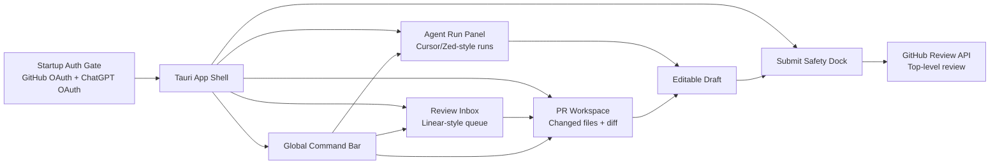
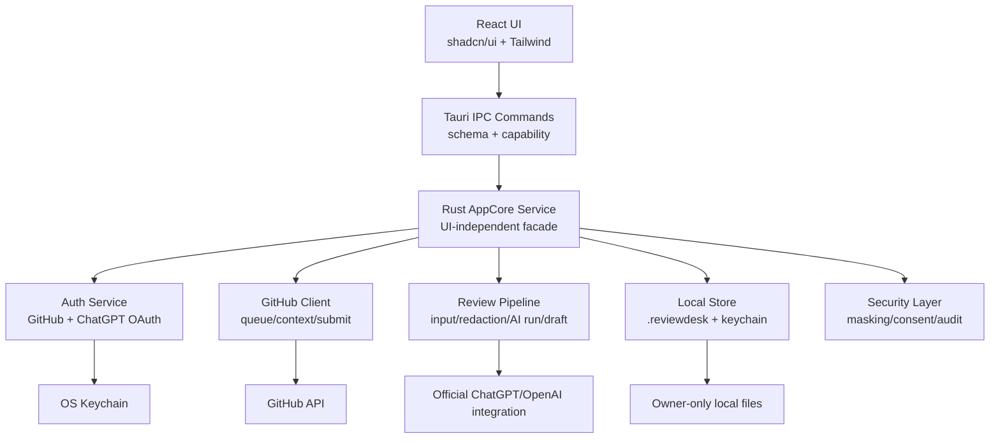
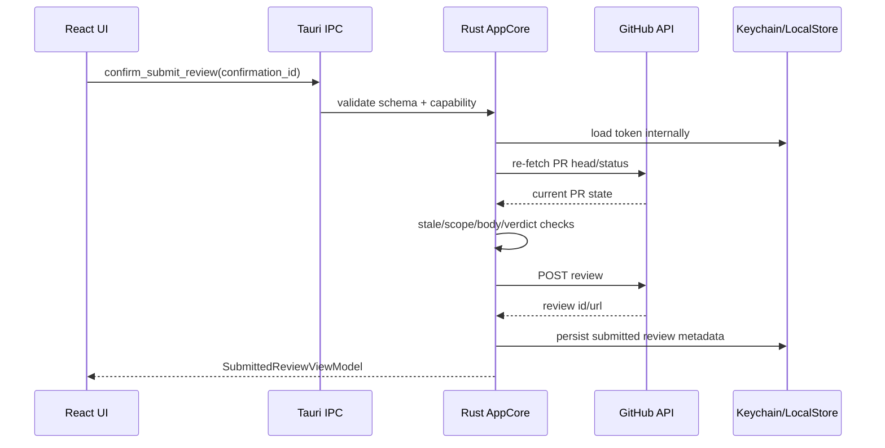
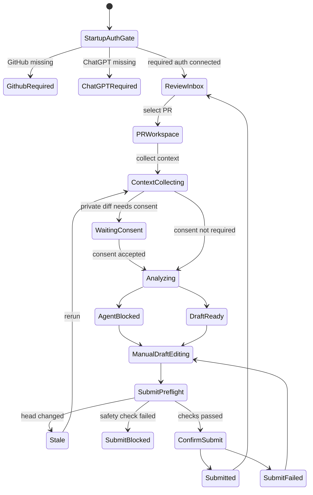

# ReviewDesk PRD 0.0.4

## 1. 문서 정보

- 제품명: ReviewDesk
- 문서명: Reference-driven Product Redesign
- 버전: 0.0.4
- 작성일: 2026-05-16
- 상태: 0.0.4 구현 완료, 검증 문서 작성 완료
- 이전 기준: `docs/prd/prd-0.0.3.md`
- 핵심 결정: 0.0.4는 `egui polish`가 아니라 `Tauri + React + shadcn/ui + Tailwind` 기반 제품 재설계다.

## 2. 한 줄 정의

ReviewDesk 0.0.4는 GitHub OAuth와 ChatGPT OAuth로 시작하는 Rust 데스크톱 앱이며, Linear식 Review Inbox, Cursor/Zed식 Agent Run Panel, GitHub Desktop식 changed files/diff workspace, Warp/Raycast식 command bar, 별도 Submit Safety Dock을 결합한 현대적인 PR review workspace로 재설계한다.

## 3. 왜 방향을 바꾸는가

0.0.3의 `egui` 개선은 현재 Rust 앱의 가독성과 배치를 올리는 데는 유효하다. 하지만 사용자가 원하는 수준은 단순 색상, spacing, card 정리가 아니라 요즘 생산성 앱의 작업 흐름이다.

판정:

- `egui`로도 구현은 가능하지만, command palette, 고밀도 diff workspace, web 수준의 컴포넌트 조합, 반응형 패널, screenshot 기반 QA를 빠르게 쌓기에는 비용이 크다.
- Rust core는 계속 유지한다. GitHub OAuth, ChatGPT OAuth, token storage, local report, PR context collection, submit safety는 Rust가 소유한다.
- UI shell은 Tauri webview로 전환한다. React/shadcn/Tailwind가 제품 표현과 interaction layer를 맡는다.
- 기존 `egui` shell은 parity가 증명될 때까지 fallback으로 남긴다.

## 4. P0 제품 목표

P0 목표:

- 프로그램 시작 시 GitHub OAuth와 ChatGPT OAuth 연결 상태를 확인하고, 미연결이면 onboarding gate를 먼저 보여준다.
- GitHub OAuth 후 사용자는 PR URL을 입력하지 않고 repo를 선택할 수 있어야 한다.
- 선택한 repo에서 나에게 review requested 또는 assigned 된 open PR을 Review Inbox에 표시한다.
- PR을 선택하면 changed files와 diff 중심 workspace로 리뷰를 시작한다.
- Agent Run Panel에서 모델, 추론 깊이, 실행 상태, finding, draft 생성 과정을 추적한다.
- Draft는 사용자가 편집하고, Submit Safety Dock의 preflight를 통과해야 실제 GitHub PR에 올라간다.
- 자동 제출은 여전히 제외한다. 사용자가 버튼을 눌러야 submit된다.

비목표:

- 전체 IDE 복제
- GitHub App 팀 모드
- inline comment 자동 제출
- local checkout/test runner
- Slack 알림
- API key 입력 UX
- ChatGPT 웹 쿠키/세션 scraping
- AI가 사용자 확인 없이 GitHub에 댓글 남기기

## 5. 레퍼런스 원칙

| 레퍼런스 | 가져올 것 | 가져오면 안 되는 것 |
| --- | --- | --- |
| Linear | Inbox 중심 시작점, saved/dynamic view, keyboard navigation, contextual action | issue tracker 전체, 팀 로드맵/사이클 모델 |
| Cursor | Agent tab/thread, context별 model selection, diff review before accept | 코드 수정 IDE, 자동 patch 적용 중심 UX |
| Zed | Agent Panel, thread sidebar, model/profile selector, tool permission 사고방식 | editor/worktree 전체 복제 |
| GitHub Desktop | changed files list, unified/split diff, whitespace hide, submit 전 safety loop | commit authoring, local git operation 전체 |
| Warp | command palette, action/search/toggle 통합 | terminal clone |
| Raycast | keyboard-first, action panel, global command mental model | OS launcher 기능 전체 |

근거:

- Linear Inbox는 notification 중심 list, contextual action, keyboard action을 강조한다.
- GitHub Desktop은 diff display를 unified/split으로 바꾸고 whitespace를 숨기는 review-focused diff 옵션을 제공한다.
- Zed Agent Panel은 multiple threads, model switching, tool permissions, reviewing changes를 Agent UI의 핵심으로 둔다.
- Warp와 Raycast는 command/search/action을 keyboard-first로 묶는다.
- Tauri v2 capability는 frontend가 접근할 수 있는 core/plugin 권한을 제한하는 보안 경계로 설계되어 있다.

## 6. 정보 구조



기본 레이아웃:

```text
Top:    Global Command Bar + context chips
Left:   Review Inbox
Center: Changed Files + Diff Workspace
Right:  Agent Run Panel + Draft Composer
Bottom: Submit Safety Dock
```

## 7. Startup Auth Gate

프로그램 시작 직후 연결 상태를 확인한다.

필수:

- GitHub OAuth 연결이 없으면 Review Inbox 진입을 막고 GitHub 연결 CTA를 보여준다.
- ChatGPT OAuth 연결이 없으면 AI run을 막고 ChatGPT 연결 CTA를 보여준다.
- 기본 onboarding은 `Connect GitHub` 다음 `Connect ChatGPT` 순서다.
- 사용자가 GitHub만 연결한 경우 repo/PR queue는 볼 수 있지만, `Run AI Review`는 `ChatGPT OAuth required` 상태로 disabled된다.
- OAuth token string은 React로 전달하지 않는다. React는 `connected`, `missing_scope`, `expired`, `reauth_required` 같은 상태만 받는다.

GitHub OAuth:

- Rust core가 OAuth flow 시작, polling, token 저장, scope 확인을 담당한다.
- repo 선택은 GitHub OAuth 이후 `list_repositories` command로 제공한다.
- fine-grained access와 SSO required 상태를 UI에 분명히 표시한다.

ChatGPT OAuth:

- P0 UX는 API key 입력을 제공하지 않는다.
- ChatGPT OAuth 기반 AI 사용을 요구사항으로 둔다.
- 공식 지원 경로가 확인된 SDK/flow만 허용한다.
- 공식 경로가 구현 시점에 ReviewDesk 같은 독립 Tauri 앱에 제공되지 않으면 AI 실행은 `Official ChatGPT OAuth integration required`로 막고, 비공식 쿠키/웹 세션 재사용은 금지한다.
- 모델 선택과 추론 깊이 선택은 ChatGPT 연결 후 Agent Run Panel과 Command Bar에서 제공한다.

모델/추론 설정:

- 모델 선택: 사용 가능한 모델 목록, 즐겨찾기, 최근 사용 모델
- 추론 깊이: `low`, `medium`, `high`, `xhigh` 또는 provider가 허용하는 등가 옵션
- run별 기록: provider, model, reasoning depth, prompt version, diff hash, private diff consent snapshot
- 모델이 tool/use case를 지원하지 않으면 disabled reason을 보여준다.

## 8. 핵심 화면 요구사항

### 8.1 Review Inbox

Review Inbox는 URL 입력을 대체하는 첫 화면이다.

필수:

- `My Reviews`를 기본 view로 둔다.
- repo picker에서 사용자가 GitHub OAuth로 접근 가능한 repo를 선택한다.
- 선택 repo 또는 all watched repos 기준으로 review requested/assigned open PR을 표시한다.
- view: `Review Requested`, `Assigned`, `Draft Ready`, `Stale`, `CI Failed`, `High Risk`, `Later`
- row 정보: repo, PR number, title, author, reason, risk, CI, changed files, run status, updated time
- keyboard navigation: 위/아래 이동, Enter open, Cmd/Ctrl+K action panel, `/` filter
- row action: `Open Diff`, `Run Agent`, `Refresh`, `Draft Review`, `Copy PR Link`, `Mark Later`

수용 기준:

- 사용자는 PR URL을 모르는 상태에서 repo를 고르고 5초 안에 다음 리뷰 대상을 선택할 수 있다.
- PR row 선택만으로 center workspace와 right agent context가 갱신된다.
- Direct PR URL input은 command bar의 `Open PR by URL` fallback으로만 남긴다.

### 8.2 Command Bar

Command Bar는 ReviewDesk의 주 조작 모델이다.

필수:

- shortcut: `Cmd/Ctrl+K`
- 검색 대상: PR, repo, file, command, saved view, agent run
- command 예시: `/refresh`, `/run-agent`, `/draft`, `/submit`, `/open-pr`, `/filter`, `/model`, `/reasoning`
- context chip: repo, PR, selected file, branch, model, reasoning depth, consent, auth status
- state-changing command는 confirmation 또는 Submit Safety Dock을 거친다.
- 불가능한 action은 숨기지 않고 disabled reason을 보여준다.

수용 기준:

- 주요 작업은 마우스 없이 실행 가능하다.
- command result는 현재 context에 따라 달라진다.
- submit 관련 command는 바로 제출하지 않고 Safety Dock으로 focus를 이동한다.

### 8.3 Changed Files / Diff Workspace

리뷰의 중심은 Overview card가 아니라 changed files와 diff다.

필수:

- changed files list를 center-left 또는 center header의 핵심 navigation으로 둔다.
- file status: added, modified, deleted, renamed, binary, generated, ignored
- 표시: additions/deletions, risk, finding count, viewed state
- diff mode: P0 unified, P1 split, whitespace hide
- 큰 diff는 접고 summary + expand action을 제공한다.
- binary/generated/lockfile은 별도 상태로 표현한다.
- finding은 가능한 경우 file/line/range에 연결하고, 불가능하면 unmapped finding으로 둔다.

수용 기준:

- PR 선택 후 사용자는 Overview를 거치지 않고 diff를 읽을 수 있다.
- file list와 diff selection은 keyboard navigation을 지원한다.
- 긴 파일명, 긴 line, 큰 diff가 레이아웃을 깨지 않는다.

### 8.4 Agent Run Panel

AI는 배지나 배너가 아니라 일급 작업 단위다.

필수:

- PR별 agent thread를 가진다.
- run 상태: `queued`, `collecting_context`, `waiting_for_consent`, `analyzing`, `draft_ready`, `blocked`, `failed`, `canceled`, `submitted`, `archived`
- 표시: model, reasoning depth, selected files, consent status, prompt/context summary, findings, draft output
- action: run, cancel, retry, re-run with latest diff, re-run selected files
- blocked reason: missing ChatGPT OAuth, private diff consent missing, model unavailable, scope missing, rate limit, stale PR
- AI가 blocked여도 manual draft edit/save/submit은 독립적으로 가능해야 한다.

수용 기준:

- 사용자는 AI가 무엇을 하고 있는지, 어떤 모델과 context를 쓰는지, 왜 막혔는지 바로 이해할 수 있다.
- 이전 run과 현재 draft의 관계가 보인다.
- 모델과 추론 깊이는 run 시작 전과 re-run 시 선택 가능하다.

### 8.5 Draft Composer

Draft Composer는 오른쪽 패널에 둔다.

필수:

- verdict selector: `COMMENT`, `APPROVE`, `REQUEST_CHANGES`
- editable markdown body
- included/excluded findings
- tone/language indicator
- local save state
- submitted review link
- report path

수용 기준:

- 최종 제출물은 agent output이 아니라 사용자가 편집한 draft다.
- `APPROVE`와 `REQUEST_CHANGES`는 explicit selection이 필요하다.
- empty body 또는 stale draft는 submit 불가다.

### 8.6 Submit Safety Dock

Submit은 일반 버튼이 아니라 bottom/right의 safety dock으로 분리한다.

필수 preflight:

- GitHub connected
- required scope present
- SSO not blocking
- PR open and not merged
- head sha unchanged
- draft not empty
- verdict selected
- private diff consent valid if AI draft used
- user confirmation present

필수 UI:

- current target: owner/repo#number
- head sha / stale status
- event
- body preview
- blocked reasons
- `Prepare Submit`과 `Confirm Submit`의 2-step flow

수용 기준:

- `Submit Review`는 앱에서 가장 강한 action으로 보인다.
- Submit 직전 Rust가 PR state를 다시 조회한다.
- 실패해도 draft body와 local report는 보존된다.

## 9. Rust/Tauri 아키텍처



원칙:

- Rust owns secrets, local files, GitHub network calls, AI prompt boundary, submit safety.
- React owns layout, panel state, keyboard interaction, draft editor buffer, visual presentation.
- Tauri IPC는 narrow command surface다.
- frontend는 GitHub token, ChatGPT token, Authorization header, keychain secret을 절대 받지 않는다.

기존 Rust core 재사용:

- `src/auth.rs`: token store, OAuth 상태
- `src/storage.rs`: owner-only `.reviewdesk` 저장
- `src/github.rs`: repo/PR/context/checks/review submit
- `src/security.rs`: secret masking, private diff consent
- `src/review.rs`: review input, diff hash, markdown report, AI pipeline

새 layer:

- `AppCore` service facade
- `tauri_commands` adapter
- `ViewModel` mapper
- `IpcError` / `DomainError` mapper
- `SecurityAuditLog`

## 10. IPC Command Scope

허용 command:

| Command | 목적 | Token 노출 |
| --- | --- | --- |
| `get_app_status` | auth/provider/storage 상태 조회 | 없음 |
| `start_github_oauth` | GitHub OAuth 시작 | 없음 |
| `poll_github_oauth` | GitHub OAuth 완료 확인 후 keychain 저장 | 없음 |
| `start_chatgpt_oauth` | ChatGPT OAuth 시작 | 없음 |
| `poll_chatgpt_oauth` | ChatGPT OAuth 완료 확인 후 keychain 저장 | 없음 |
| `list_repositories` | repo picker 데이터 | 없음 |
| `load_review_queue` | review requested/assigned PR 조회 | 없음 |
| `collect_pr_context` | PR snapshot/files/comments/checks 수집 | 없음 |
| `set_private_diff_consent` | private diff consent 저장 | 없음 |
| `generate_review_draft` | redaction 후 AI draft 생성 | 없음 |
| `save_draft` | local draft 저장 | 없음 |
| `prepare_submit_review` | submit preflight | 없음 |
| `confirm_submit_review` | final stale check 후 GitHub submit | 없음 |
| `open_external_url` | allowlisted URL 열기 | 없음 |

금지 command:

- token string 반환
- arbitrary filesystem read/write
- arbitrary shell command
- arbitrary HTTP proxy
- frontend-provided prompt를 그대로 provider에 제출
- frontend-provided GitHub API path/body relay
- runtime capability/CSP 완화



## 11. Data/State Model 추가

추가 또는 보강할 모델:

```text
AuthState
  github: Connected | Missing | Expired | ScopeMissing | SsoRequired
  chatgpt: Connected | Missing | Expired | Unsupported | ModelUnavailable

RepositorySelection
  owner
  repo
  privacy
  watched
  lastSyncedAt

AgentRun
  id
  pullRequestId
  status
  provider
  model
  reasoningDepth
  promptVersion
  diffHash
  consentSnapshot
  selectedFiles
  findings
  draftId

SubmitPreflight
  draftId
  target
  event
  expectedHeadSha
  currentHeadSha
  blockedReasons
  confirmationId
```

## 12. 상태 흐름



## 13. Frontend Stack

추천:

- Tauri v2
- React
- TypeScript
- Vite
- Tailwind CSS
- shadcn/ui
- Radix primitives via shadcn components
- TanStack Query for IPC-backed async server state
- Zustand 또는 reducer/context for local UI state
- CodeMirror/Monaco diff viewer spike
- Playwright/WebDriver for screenshot and keyboard E2E

폴더 구조 초안:

```text
src-tauri/
  src/
    main.rs
    commands/
    app_core/
    view_models/
    security_audit.rs
  capabilities/
  tauri.conf.json

ui/
  src/
    app/
    components/
      command/
      inbox/
      workspace/
      agent/
      draft/
      safety/
    features/
      auth/
      github/
      review/
      agent-runs/
    lib/
      ipc.ts
      query.ts
      shortcuts.ts
      view-models.ts
    styles/
```

shadcn mapping:

| 기능 | 컴포넌트 |
| --- | --- |
| Command Bar | `Command`, `Popover`, `Kbd`, `Input` |
| Review Inbox | `ScrollArea`, `Table` or custom list, `Badge`, `DropdownMenu` |
| Repo Picker | `Combobox`, `Command`, `Dialog` |
| Agent Run Panel | `Tabs`, `Accordion`, `Progress`, `Alert`, `Tooltip` |
| Draft Composer | `Textarea`, `Select`, `ToggleGroup`, markdown preview |
| Submit Safety Dock | `Sheet` or fixed dock, `AlertDialog`, `Checkbox`, `Button` |
| Settings/Auth | `Dialog`, `Form`, `Alert`, `Separator` |

## 14. Visual Design Direction

원칙:

- 카드/배지 나열을 줄이고, list/panel/command/workflow 중심으로 간다.
- SaaS landing page 느낌을 피한다.
- dense but calm workspace를 목표로 한다.
- primary color 하나로 도배하지 않는다.
- diff와 editor 영역은 높은 정보 밀도, 명확한 hierarchy, 안정된 monospace rhythm을 가진다.
- Submit Safety Dock만 강한 시각적 무게를 가진다.

Layout tokens:

- app background: neutral zinc/slate 계열, 낮은 대비
- panels: 1px border, 6-8px radius
- row height: inbox 44-56px
- command bar height: 44-48px
- safety dock height: 72-104px
- diff font: monospace 12-13px
- body font: system sans 13-14px

## 15. 구현 단계

### Phase 0: Core Boundary Freeze

- Rust core를 `AppCore` facade로 묶는다.
- egui와 Tauri가 같은 service를 호출할 수 있게 한다.
- token/file/GitHub submit regression test를 보존한다.

Gate:

- `cargo fmt --check`
- `cargo check`
- `cargo test`
- token string 반환 API 없음

### Phase 1: Tauri Skeleton

- Tauri v2 scaffold 추가
- React/shadcn/Tailwind skeleton
- command bar, inbox, workspace, agent panel, safety dock mock layout
- IPC command allowlist와 capability 파일 작성

Gate:

- Tauri dev build 실행
- screenshot으로 0.0.3 대비 product shell 개선 확인
- broad fs/shell/http capability 없음

### Phase 2: GitHub OAuth + Repo/Inbox

- startup auth gate
- GitHub OAuth 연결
- repo picker
- review requested/assigned PR queue
- PR selection -> workspace context

Gate:

- PR URL 없이 repo/PR 선택 가능
- token frontend 미노출
- missing scope/SSO 상태 표시

### Phase 3: Diff Workspace

- changed files list
- unified diff viewer
- file status/risk/finding count
- large/binary/generated/renamed/deleted state

Gate:

- keyboard navigation
- long file path/large diff layout 안정성
- screenshot QA

### Phase 4: ChatGPT OAuth + Agent Run Panel

- ChatGPT OAuth gate
- model selector
- reasoning depth selector
- private diff consent
- AI run lifecycle
- draft generation

Gate:

- 공식 ChatGPT OAuth integration path만 사용
- API key 입력 UX 없음
- private diff consent 없으면 Rust에서 AI run 차단
- prompt redaction test

### Phase 5: Draft + Submit Safety Dock

- draft edit/save
- prepare submit
- confirm submit
- submitted review history

Gate:

- stale double-check
- approve/request changes explicit confirmation
- submit failure preserves draft

### Phase 6: Product QA + Cutover Decision

- screenshot set
- keyboard E2E
- accessibility check
- security review
- egui fallback 유지/제거 ADR

Gate:

- reference-driven UX criteria PASS
- Tauri shell product parity PASS
- release rollback path exists

## 16. QA / Acceptance Criteria

문서 수용 기준:

- Tauri + React/shadcn/Tailwind 전환이 명시되어 있다.
- Linear/Cursor/Zed/GitHub Desktop/Warp/Raycast 레퍼런스가 기능 단위로 반영되어 있다.
- GitHub OAuth + ChatGPT OAuth startup gate가 정의되어 있다.
- API key 입력 UX 제외가 명시되어 있다.
- 모델 선택과 추론 깊이 선택이 정의되어 있다.
- Rust core ownership과 IPC 금지 command가 정의되어 있다.
- Mermaid diagram이 architecture, IA, submit flow, state machine에 포함되어 있다.

구현 수용 기준:

- GitHub OAuth 후 repo picker에서 repo를 고를 수 있다.
- 선택 repo에서 나에게 review requested/assigned 된 open PR이 표시된다.
- PR 선택 후 changed files/diff workspace가 열린다.
- Agent Run Panel에서 model/reasoning/run state를 볼 수 있다.
- Draft는 사용자가 편집 가능하다.
- Submit Safety Dock preflight를 통과해야 GitHub top-level review가 제출된다.
- OAuth token은 React state, browser storage, IPC response, log에 남지 않는다.

자동 검증:

```bash
cargo fmt --check
cargo check
cargo test
npm audit
npm test
npm run lint
npm run build
```

UI 검증:

- desktop screenshot: `1440x900`, `1280x800`, `1024x768`
- narrow screenshot: `800x760`
- keyboard flow: auth gate -> repo picker -> PR open -> run agent -> edit draft -> prepare submit
- a11y: focus ring, tab order, aria label, contrast, text overflow
- visual: 카드/배지 나열 중심으로 회귀하지 않았는지 확인

Security 검증:

- IPC allowlist snapshot
- capability snapshot
- token never serialized regression
- arbitrary path rejection
- private diff consent blocking
- prompt redaction before provider call
- submit stale double-check
- external URL allowlist
- production CSP smoke test

## 17. 에이전트 검증 결과

| 에이전트 | 검증 영역 | 판정 | 반영 |
| --- | --- | --- | --- |
| Lovelace | Product/UX reference | PASS for PRD direction | egui polish가 아니라 reference-driven redesign으로 재정의 |
| Russell | Tauri architecture/security | PASS with mandatory gates | Rust core ownership, IPC allowlist, token boundary 반영 |
| Pascal | Frontend feasibility | PASS | React/shadcn/Tailwind stack, folder structure, phase plan 반영 |
| Noether | QA/accessibility/acceptance | PASS for PRD, implementation evidence required later | screenshot/E2E/a11y/security acceptance criteria 반영 |

정리:

- PRD 자체는 구현 가능한 상태로 통과한다.
- 구현 결과는 아직 존재하지 않으므로 screenshot, E2E, a11y, security gate는 구현 후 별도 검증이 필요하다.
- Noether의 초기 `FAIL`은 “구현 증거 없음”에 대한 판정이므로, 본 PRD에서는 구현 후 gate로 이동했다.

## 18. 외부 공식 참고 자료

- [Tauri Capabilities](https://v2.tauri.app/security/capabilities/)
- [shadcn/ui Components](https://ui.shadcn.com/docs/components)
- [Linear Inbox](https://linear.app/docs/inbox)
- [Cursor Agent Tabs](https://docs.cursor.com/agent/chats)
- [Zed Agent Panel](https://zed.dev/docs/ai/agent-panel)
- [GitHub Desktop diff review](https://docs.github.com/en/desktop/making-changes-in-a-branch/committing-and-reviewing-changes-to-your-project-in-github-desktop)
- [Warp Command Palette](https://docs.warp.dev/terminal/command-palette)
- [Raycast Keyboard Shortcuts](https://manual.raycast.com/keyboard-shortcuts)
- [OpenAI Codex Authentication](https://developers.openai.com/codex/auth#openai-authentication)
- [OpenAI Codex App Server authentication modes](https://developers.openai.com/codex/app-server#authentication-modes)

## 19. 0.0.4 구현 결과

구현된 항목:

- `src/app_core.rs`: frontend-safe app status, IPC command allowlist, submit preflight 모델
- `src-tauri/`: Tauri v2 shell, capability 파일, command adapter, GitHub OAuth/queue/context/submit command
- `ui/src/`: React + TypeScript + Tailwind 기반 Review Inbox, Command Bar, Diff Workspace, Agent Run Panel, Draft Composer, Submit Safety Dock
- `tests/app_core_tests.rs`: token/secret/authorization 문자열이 frontend-safe app status에 직렬화되지 않는지 검증
- `tests/tauri_shell_tests.rs`: Tauri manifest, capability, command allowlist 검증
- `ui/src/lib/view-models.test.ts`: frontend view-model helper 검증
- `docs/verification/reviewdesk-tauri-0.0.4.md`: 구현 및 검증 결과 문서화

명시적 제한:

- ChatGPT OAuth는 UX gate와 IPC command는 구현했다.
- 단, 독립 Tauri 앱에서 사용할 공식 ChatGPT OAuth generation adapter가 아직 연결되지 않았으므로, AI draft generation은 `ChatGPT OAuth required` 또는 `Official ChatGPT OAuth integration ... not configured` 상태로 안전하게 blocked 된다.
- API key 입력 UX, ChatGPT cookie/session scraping, 비공식 웹 세션 재사용은 구현하지 않았다.
- inline comment 자동 제출, local checkout/test runner, GitHub App 팀 모드는 여전히 제외다.

## 20. 최종 결론

0.0.4는 `egui` UI를 더 다듬는 버전이 아니다. ReviewDesk를 현대적인 PR review desktop workspace로 바꾸는 기준 문서다.

실행 방향:

- Rust core는 유지한다.
- UI는 Tauri + React/shadcn/Tailwind로 전환한다.
- 시작 시 GitHub OAuth와 ChatGPT OAuth를 연결한다.
- PR URL 입력은 fallback으로 내리고, repo picker와 Review Inbox를 기본 진입점으로 둔다.
- 리뷰 경험은 changed files/diff, agent run, draft, safety submit의 작업 흐름으로 재구성한다.
- Submit은 항상 사용자가 최종 확인한다.

다음 버전에서 할 일은 공식 ChatGPT OAuth generation adapter 연결, 실제 GitHub OAuth client id 설정 가이드, 그리고 Tauri packaging/signing 검증이다.
