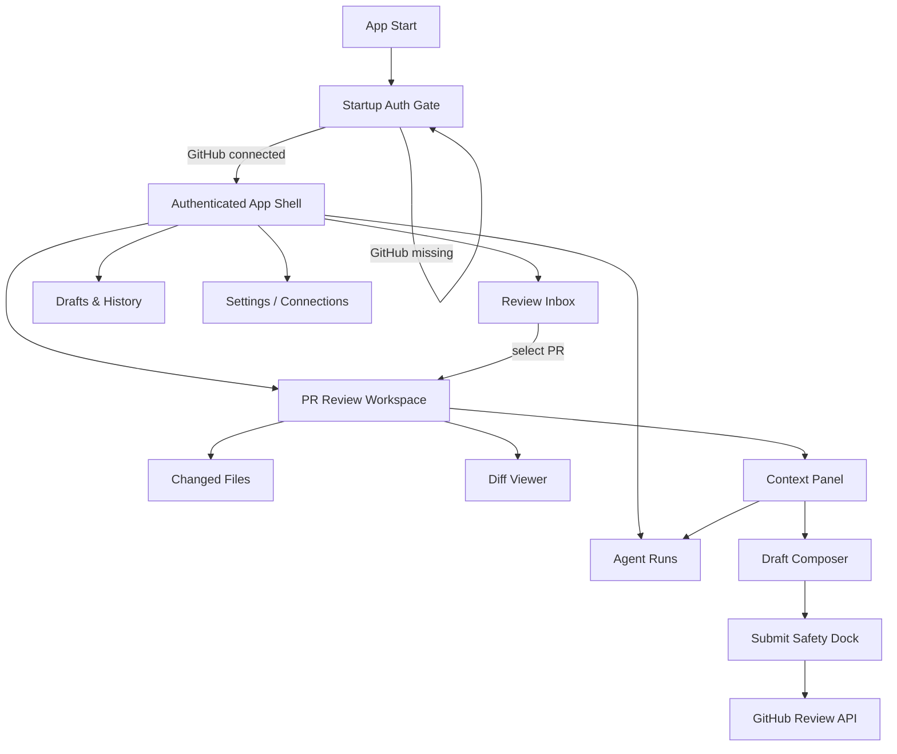
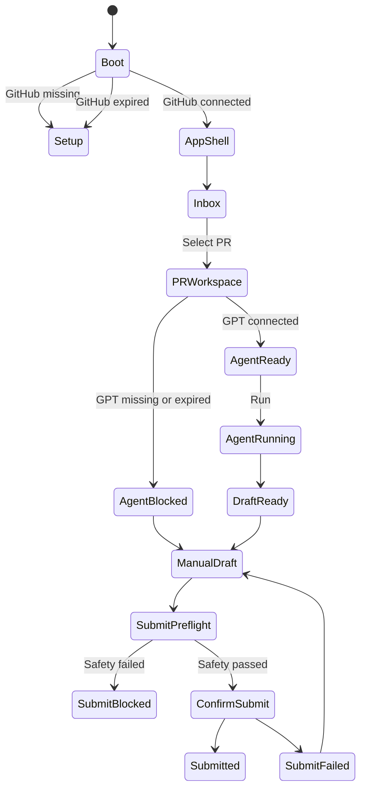
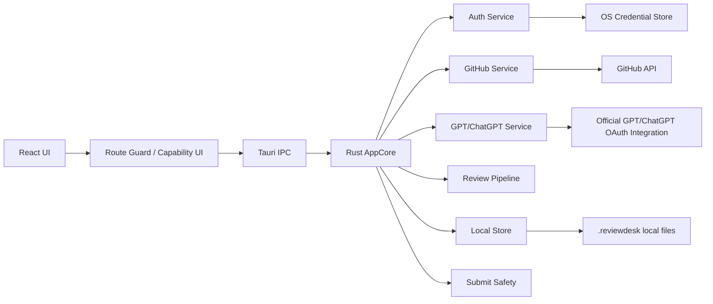

# ReviewDesk PRD 0.0.5

## 1. 문서 정보

- 제품명: ReviewDesk
- 문서명: Auth-first Navigation & Multi-Workspace IA
- 버전: 0.0.5
- 작성일: 2026-05-16
- 상태: 0.0.5 구현 완료, 검증 문서 작성 완료
- 이전 기준: `docs/prd/prd-0.0.4.md`
- 핵심 결정: 0.0.5는 한 화면 집중형 workspace를 기능별 화면으로 분리하고, 앱 시작 시 인증 상태를 먼저 해결하는 auth-first 제품 구조로 재설계하며, UI와 AI 리뷰 출력에 영어/한국어 다국어 지원을 추가한다.

## 2. 한 줄 정의

ReviewDesk 0.0.5는 프로그램 시작 직후 GitHub OAuth 연결을 먼저 요구하고, GitHub 연결 후 Review Inbox, PR Diff Workspace, Agent Runs, Drafts, Settings를 분리해 사용자가 PR 선택부터 AI 분석, 초안 편집, 안전 제출까지 단계적으로 진행하는 Rust/Tauri 데스크톱 앱이며, 초기 언어는 영어와 한국어를 지원한다.

## 3. 왜 0.0.5가 필요한가

0.0.4는 Tauri + React 기반으로 현대적인 레이아웃 방향을 잡았지만, 실제 제품 흐름은 여전히 한 화면에 많은 기능이 동시에 노출된다.

문제:

- 프로그램을 처음 시작했을 때 실제 GitHub 인증 전에도 sample queue, sample PR, sample diff가 보일 수 있다.
- GitHub OAuth, ChatGPT/GPT OAuth, repo 선택, PR queue, diff, agent, draft, submit safety가 한 화면에 섞여 작업 단계가 흐려진다.
- 인증 상태가 header badge나 disabled reason으로만 보이고, 앱 진입 조건과 기능별 사용 가능 조건이 명확히 분리되지 않는다.
- 현재 검증은 주요 영역이 화면에 보이는지에 가깝고, auth-first flow와 multi-screen context propagation 검증이 부족하다.

0.0.5의 목표는 polish가 아니라 정보 구조 재설계다.

## 4. 제품 결정

### 4.1 GitHub는 앱 진입 hard gate

GitHub OAuth가 없으면 ReviewDesk의 실제 작업 화면에 진입할 수 없다.

이유:

- Review Inbox, repo picker, PR diff, review submit은 모두 GitHub 계정 권한에 의존한다.
- 사용자에게 PR URL 입력을 요구하지 않는 제품 방향과 맞다.
- 인증 전 sample data가 실제 업무 데이터처럼 보이는 혼선을 없앤다.

GitHub 미연결 상태에서 허용되는 화면:

- Startup Auth Gate
- GitHub OAuth 연결 CTA
- 인증/권한 설명
- Settings의 제한된 diagnostics

GitHub 미연결 상태에서 금지되는 화면:

- Review Inbox
- repo picker
- PR Workspace
- Agent Runs
- Draft submit
- production mode sample queue

### 4.2 GPT/ChatGPT는 기본적으로 Agent gate

GPT/ChatGPT OAuth는 기본 설정에서 전체 앱 진입 조건이 아니라 AI 기능 사용 조건이다.

GitHub만 연결된 상태에서 허용:

- repo 선택
- review requested/assigned PR queue 조회
- changed files/diff 읽기
- manual draft 작성
- GitHub top-level review submit

GitHub만 연결된 상태에서 차단:

- AI review draft 생성
- Agent run 시작
- 모델 선택 기반 실행
- reasoning depth 기반 실행

이유:

- ReviewDesk의 핵심은 AI가 없더라도 GitHub review workspace로 작동해야 한다.
- ChatGPT/GPT OAuth 공식 연동 경로가 계정/제품 정책에 따라 달라질 수 있으므로, 전체 앱을 막으면 실제 사용성이 낮아진다.
- 수동 draft와 submit은 사용자의 GitHub 권한만으로 충분하다.

### 4.3 Strict Auth Mode는 옵션

사용자가 “GitHub와 GPT를 모두 연결해야 실제 화면을 보여주고 싶다”는 정책을 원할 수 있다. 이를 위해 P1에서 Strict Auth Mode를 제공한다.

Strict Auth Mode:

- GitHub OAuth와 GPT/ChatGPT OAuth가 모두 connected일 때만 App Shell 진입
- GitHub만 connected인 경우에도 Setup 화면에 머무름
- 보안이 강한 개인/회사 환경에서 선택적으로 사용

기본값:

- GitHub hard gate
- GPT/ChatGPT agent gate

### 4.4 다국어는 UI 언어와 리뷰 언어를 분리

0.0.5는 영어와 한국어를 초기 지원 언어로 둔다.

분리 기준:

- UI 언어: ReviewDesk 앱의 navigation, button, label, empty/error/loading state, settings 문구
- 리뷰 언어: AI가 생성하는 summary, finding, draft review comment의 언어

기본 정책:

- 앱 첫 실행 시 OS locale이 `ko-*`이면 UI 언어 기본값은 한국어, 그 외는 영어다.
- 리뷰 언어 기본값은 UI 언어를 따른다.
- 사용자는 Settings에서 UI 언어와 리뷰 언어를 따로 바꿀 수 있다.
- repo별 `.reviewdesk.yml` 또는 local repo setting에 `comment_style.language`가 있으면 리뷰 언어 기본값보다 우선한다.
- GitHub에 제출되는 최종 review body는 사용자가 편집한 draft 언어 그대로 유지한다.

비목표:

- 0.0.5에서 세 번째 언어 추가
- 자동 번역 품질 평가 시스템
- 기존 GitHub 댓글의 자동 번역
- PR diff/code identifier 번역

## 5. 인증 UX

### 5.1 Startup Auth Gate

앱 시작 시 첫 화면은 실제 dashboard가 아니라 Startup Auth Gate다.

필수 요소:

- 제품명과 현재 상태
- Step 1: Connect GitHub
- Step 2: Connect GPT/ChatGPT
- 권한/scope/SSO/expiry 상태
- 연결 후 이동할 기본 화면 안내
- production mode에서 sample PR data 미노출

상태별 동작:

| 상태 | 앱 shell | Review Inbox | Agent Run | Manual Draft | Submit |
| --- | --- | --- | --- | --- | --- |
| GitHub missing | 차단 | 차단 | 차단 | 차단 | 차단 |
| GitHub expired | 제한 | 차단 | 차단 | 로컬 draft만 가능 | 차단 |
| GitHub scope missing | 제한 | 일부 차단 | 차단 가능 | 로컬 draft만 가능 | 차단 |
| GitHub SSO required | 제한 | 차단 또는 read-only | 차단 | 로컬 draft만 가능 | 차단 |
| GitHub connected, GPT missing | 허용 | 허용 | 차단 | 허용 | 허용 |
| GitHub connected, GPT expired | 허용 | 허용 | 차단 | 허용 | 허용 |
| GitHub connected, GPT connected | 허용 | 허용 | 허용 | 허용 | 허용 |

### 5.2 OAuth 연결 순서

기본 순서:

1. 앱 시작
2. `get_app_status`
3. GitHub missing이면 Startup Auth Gate 유지
4. `Connect GitHub`
5. GitHub OAuth browser/device flow 진행
6. Rust가 token을 OS credential store에 저장
7. scope, SSO, 사용자 login 확인
8. Review Inbox 진입
9. GPT/ChatGPT missing이면 Agent 기능에 연결 CTA 표시
10. GPT/ChatGPT 연결 후 model/reasoning selector 활성화

### 5.3 공식 인증 근거

GitHub OAuth:

- GitHub OAuth App은 사용자를 GitHub로 보내 인증하고, callback의 code를 access token으로 교환하는 web application flow를 제공한다.
- device flow도 OAuth App에서 사용할 수 있으므로 데스크톱 앱 fallback으로 고려한다.

GPT/ChatGPT:

- OpenAI Codex 문서는 OpenAI 모델 사용 인증 방식으로 ChatGPT sign-in과 API key sign-in을 구분한다.
- ChatGPT sign-in은 브라우저 로그인 후 access token을 앱/CLI/IDE extension으로 돌려주는 흐름을 설명한다.
- Codex App Server 문서는 ChatGPT managed auth mode에서 Codex가 OAuth flow, token persistence, refresh를 소유한다고 설명한다.
- ReviewDesk는 사용자의 요구에 따라 API key UX를 기본 제공하지 않고, 공식 GPT/ChatGPT OAuth 또는 공식적으로 지원되는 equivalent flow만 사용한다.

참고:

- GitHub OAuth Apps: https://docs.github.com/en/apps/oauth-apps/building-oauth-apps/authorizing-oauth-apps
- OpenAI Codex Authentication: https://developers.openai.com/codex/auth#openai-authentication
- OpenAI Codex App Server auth modes: https://developers.openai.com/codex/app-server#authentication-modes
- OpenAI Codex models: https://developers.openai.com/codex/models#recommended-models

## 6. 정보 구조

0.0.5는 한 화면에 모든 기능을 놓지 않는다. 사용자의 의도별 workspace로 나눈다.



기본 navigation:

- `Setup`
- `Inbox`
- `PR Workspace`
- `Agent Runs`
- `Drafts`
- `Settings`

P0에서는 URL router 의존성 없이 internal screen state로 구현한다. Tauri 데스크톱 앱에서는 deep link 요구가 아직 없으므로 `activeScreen`/reducer 기반으로 시작한다.

## 7. 화면별 요구사항

### 7.1 Setup

목적:

- 앱 사용 전 인증 상태를 해결한다.

필수:

- GitHub OAuth card
- GPT/ChatGPT OAuth card
- UI language selector: `English`, `한국어`
- Review language selector: `English`, `한국어`
- scope, SSO, expired, reauth_required, unsupported 상태 표시
- 연결 완료 후 자동으로 Review Inbox 이동
- GPT 미연결 상태에서는 `Skip for now`가 아니라 `Continue without AI`로 명확히 표현
- Strict Auth Mode가 켜져 있으면 GPT 미연결 시 계속 Setup에 머문다.

수용 기준:

- GitHub token이 없으면 Review Inbox, PR Workspace, Agent Runs, Drafts 화면이 렌더링되지 않는다.
- React에는 token string, Authorization header, raw OAuth response가 전달되지 않는다.
- production mode에서는 sample PR data가 보이지 않는다.

### 7.2 Review Inbox

목적:

- 사용자가 PR URL을 입력하지 않고, GitHub OAuth 계정으로 접근 가능한 repo와 PR을 선택한다.

필수:

- repo picker
- watched repos/all accessible repos toggle
- queue view: `Review Requested`, `Assigned`, `Draft Ready`, `Stale`, `CI Failed`, `High Risk`, `Later`
- row 정보: repo, PR number, title, author, requested/assigned reason, CI, files, risk, agent status, updated time
- keyboard navigation: up/down, enter open, `/` filter, Cmd/Ctrl+K
- PR 선택 시 PR Workspace context 갱신

수용 기준:

- GitHub 연결 후 사용자는 PR URL 없이 repo를 선택하고 리뷰 대상 PR 목록을 볼 수 있다.
- PR row 선택은 diff, agent target, draft target, safety dock target을 같은 PR로 맞춘다.
- GitHub missing/expired/scope missing 상태에서는 queue가 실제 데이터처럼 보이지 않는다.

### 7.3 PR Review Workspace

목적:

- changed files와 diff 중심으로 PR을 읽는다.

필수:

- PR header: owner/repo#number, title, author, base/head, head sha, CI summary
- changed files list
- diff viewer
- file status: added, modified, deleted, renamed, binary, generated, ignored
- additions/deletions, risk, finding count, viewed state
- unified diff P0, split diff P1
- large diff collapsed state
- generated/lockfile ignore state
- right panel tabs: `Summary`, `Agent`, `Draft`

수용 기준:

- PR Workspace에 진입하면 overview card보다 changed files/diff가 우선적으로 보인다.
- 긴 repo명, 파일명, PR title, 긴 diff line이 레이아웃을 깨지 않는다.
- Agent가 막혀도 diff 읽기와 manual draft 작성은 계속 가능하다.

### 7.4 Agent Runs

목적:

- AI 분석을 독립된 작업 단위로 보여준다.

필수:

- 현재 PR agent run
- run history
- model selector
- reasoning depth selector
- selected files
- private diff consent snapshot
- prompt/context summary
- findings
- generated draft
- run/cancel/retry/rerun latest/rerun selected files

상태:

- `idle`
- `queued`
- `collecting_context`
- `waiting_for_consent`
- `analyzing`
- `draft_ready`
- `blocked`
- `failed`
- `canceled`

blocked reason:

- `chatgpt_auth_required`
- `chatgpt_expired`
- `official_oauth_required`
- `model_unavailable`
- `private_diff_consent_required`
- `rate_limited`
- `github_scope_missing`
- `pr_stale`

수용 기준:

- GPT/ChatGPT 미연결 상태에서는 Agent Run 화면 자체는 볼 수 있지만 실행 버튼은 disabled이고 이유가 명확하다.
- 모델과 추론 깊이는 run 시작 전 선택 가능하다.
- run 결과가 어떤 PR/head sha/diff hash/model/reasoning depth에서 생성됐는지 추적 가능하다.

### 7.5 Drafts & History

목적:

- AI draft와 manual draft를 저장하고 제출 이력을 확인한다.

필수:

- PR별 draft 목록
- draft body editor
- verdict: `COMMENT`, `APPROVE`, `REQUEST_CHANGES`
- included/excluded findings
- local report path
- submitted review id/url
- stale marker
- failed submit recovery

수용 기준:

- 최종 제출물은 AI output이 아니라 사용자가 편집한 draft다.
- submit 실패 후 draft body는 보존된다.
- `APPROVE`와 `REQUEST_CHANGES`는 explicit confirmation 없이는 제출할 수 없다.

### 7.6 Settings / Connections

목적:

- 계정, 인증, 모델, 보안 설정을 관리한다.

필수:

- GitHub account login
- GitHub scopes
- SSO 상태
- GPT/ChatGPT account status
- available models
- default model
- default reasoning depth
- UI language
- default review language
- per-repo review language override
- Strict Auth Mode toggle
- demo mode indicator
- local storage location
- token disconnect/reconnect

수용 기준:

- 사용자는 왜 특정 기능이 막혔는지 Settings에서 확인할 수 있다.
- disconnect 후 앱 상태가 즉시 gate/capability matrix에 반영된다.

## 8. Route Guard와 Capability Matrix



Capability matrix는 Rust AppCore가 계산한다.

```text
AppCapability
  app_shell_available
  review_queue_available
  pr_context_available
  ai_review_available
  manual_draft_available
  submit_available
  settings_available
  blocked_reasons[]
```

React는 capability를 받아 화면을 바꾸지만, 보안 판단의 source of truth는 Rust다.

## 9. Rust/Tauri 아키텍처 요구사항



원칙:

- Rust owns secrets, token refresh, GitHub network calls, AI prompt boundary, local report, submit safety.
- React owns layout, screen state, keyboard interaction, draft editor buffer.
- React는 token string, provider credential, Authorization header를 받지 않는다.
- production mode에서 IPC mock/sample fallback은 비활성화한다.
- demo mode는 `REVIEWDESK_DEMO_MODE=1` 같은 명시적 플래그에서만 활성화한다.

필수 보강:

- `frontend_safe_app_status`는 GitHub/GPT 상태를 확장해 `expired`, `reauth_required`, `scope_missing`, `sso_required`, `unsupported`, `model_unavailable`, `rate_limited`를 표현한다.
- `prepare_submit_review`는 frontend-provided boolean만 신뢰하지 않고, Rust가 scope/SSO/PR state/head sha를 authoritative하게 확인한다.
- `confirm_submit_review`는 제출 직전 GitHub에서 PR snapshot을 재조회한다.
- `open_external_url`은 allowlisted host뿐 아니라 `https` scheme만 허용한다.
- `safeInvoke` sample fallback은 production build에서 금지한다.

## 10. IPC Command 요구사항

허용 command:

| Command | 목적 | Auth requirement | Token exposure |
| --- | --- | --- | --- |
| `get_app_status` | 연결/capability 상태 조회 | 없음 | 없음 |
| `start_github_oauth` | GitHub OAuth 시작 | 없음 | 없음 |
| `poll_github_oauth` | GitHub OAuth 완료 확인 | 없음 | 없음 |
| `start_chatgpt_oauth` | GPT/ChatGPT OAuth 시작 | 없음 | 없음 |
| `poll_chatgpt_oauth` | GPT/ChatGPT OAuth 완료 확인 | 없음 | 없음 |
| `list_repositories` | repo picker 데이터 | GitHub connected | 없음 |
| `load_review_queue` | review requested/assigned PR 조회 | GitHub connected | 없음 |
| `collect_pr_context` | PR snapshot/diff/checks 수집 | GitHub connected | 없음 |
| `generate_review_draft` | AI review draft 생성 | GitHub + GPT connected | 없음 |
| `save_draft` | local draft 저장 | GitHub connected | 없음 |
| `prepare_submit_review` | submit preflight | GitHub connected | 없음 |
| `confirm_submit_review` | GitHub review submit | GitHub connected + preflight ready | 없음 |
| `open_external_url` | allowlisted external URL 열기 | 없음 | 없음 |

금지:

- token 반환
- arbitrary filesystem read/write
- arbitrary shell command
- arbitrary HTTP proxy
- raw prompt relay
- frontend-provided GitHub API path relay
- 비공식 ChatGPT cookie/session scraping

## 11. 모델과 추론 깊이

GPT/ChatGPT 연결 후 Agent Runs에서 모델과 추론 깊이를 선택할 수 있어야 한다.

필수:

- model picker
- reasoning depth picker
- default model
- default reasoning depth
- unavailable model disabled reason
- run마다 model/reasoning depth 기록

초기 모델 목록은 provider가 반환하는 available model list를 우선한다. fallback display list는 공식 문서의 recommended models를 기준으로 하되, 실제 사용 가능 여부를 account capability로 확인한다.

기본 후보:

- `gpt-5.5`
- `gpt-5.4`
- `gpt-5.4-mini`
- `gpt-5.3-codex`
- `gpt-5.3-codex-spark`

추론 깊이:

- `low`
- `medium`
- `high`
- `xhigh`

provider가 다른 명칭을 쓰면 ReviewDesk 내부 enum으로 mapping한다.

## 12. 다국어 지원

0.0.5의 다국어 범위는 영어와 한국어다.

### 12.1 Language Model

```text
Locale
  code: "en" | "ko"
  displayName: "English" | "한국어"
  source: "os" | "user" | "repo"

LanguagePreferences
  uiLocale
  reviewLocale
  repoReviewLocaleOverrides
  updatedAt
```

UI 언어와 리뷰 언어를 분리하는 이유:

- 사용자는 앱 UI는 한국어로 쓰면서 회사 PR 리뷰 코멘트는 영어로 남길 수 있다.
- 반대로 글로벌 UI를 영어로 쓰면서 개인 repo 리뷰는 한국어로 작성할 수 있다.
- repo별 convention이 사용자 UI 선호보다 우선할 수 있다.

우선순위:

```text
Review language
  1. repo override
  2. .reviewdesk.yml comment_style.language
  3. user default review language
  4. UI language
  5. OS locale fallback
```

### 12.2 UI Copy 요구사항

필수:

- React UI의 사용자 표시 문자열은 message catalog를 통해 렌더링한다.
- P0에서는 `en`과 `ko` catalog만 제공한다.
- code, file path, branch name, model id, GitHub login, PR title, commit sha는 번역하지 않는다.
- error code는 내부 key를 유지하고, 사용자 표시 문구만 locale에 맞춘다.
- fallback은 `en`이다.

금지:

- 컴포넌트 안에 긴 hardcoded 사용자 표시 문구 추가
- GitHub에서 가져온 PR title/body/diff/code 번역
- LLM이 UI copy를 런타임에서 번역하게 하기

### 12.3 AI Review 언어 요구사항

Agent Runs는 review language를 명시적으로 prompt boundary에 포함한다.

필수:

- run metadata에 `reviewLocale` 저장
- draft metadata에 `reviewLocale` 저장
- Agent prompt에 “응답 언어”를 명시
- 사용자가 draft 언어를 바꾸고 rerun하면 새 run으로 기록
- manual draft는 사용자가 입력한 언어를 그대로 보존

리뷰 언어별 comment style:

| Locale | Default tone |
| --- | --- |
| `ko` | 정중한 한국어, 불확실하면 질문형, 과장 금지 |
| `en` | concise professional English, question form when uncertain, no exaggeration |

### 12.4 i18n 수용 기준

- 첫 실행에서 OS locale이 한국어면 UI 기본값이 한국어다.
- OS locale이 한국어가 아니면 UI 기본값이 영어다.
- Settings에서 UI 언어를 바꾸면 앱 shell, navigation, empty/error/loading state가 즉시 바뀐다.
- Settings에서 리뷰 언어를 바꾸면 다음 Agent Run과 새 Draft에 적용된다.
- 기존 draft의 언어는 자동으로 바뀌지 않는다.
- repo override가 있는 PR은 user default review language보다 repo override를 따른다.
- `en`/`ko` catalog에 key 누락이 있으면 테스트가 실패한다.

## 13. Frontend 분리 계획

P0에서는 새 router 의존성 없이 internal screen state를 사용한다.

권장 구조:

```text
ui/src/app/
  App.tsx
  AppShell.tsx
  app-state.ts
  capabilities.ts
  i18n.ts

ui/src/components/auth/
  StartupAuthGate.tsx
  OAuthConnectionCard.tsx
  AuthStatusSummary.tsx

ui/src/components/inbox/
  ReviewInboxScreen.tsx
  RepoPicker.tsx
  PullRequestQueueList.tsx
  PullRequestQueueRow.tsx

ui/src/components/workspace/
  PrReviewWorkspace.tsx
  PrHeader.tsx
  ChangedFilesList.tsx
  DiffViewer.tsx
  WorkspaceRightPanel.tsx

ui/src/components/agent/
  AgentRunsScreen.tsx
  AgentRunPanel.tsx
  AgentRunControls.tsx

ui/src/components/draft/
  DraftsHistoryScreen.tsx
  DraftComposer.tsx
  VerdictSelector.tsx

ui/src/components/safety/
  SubmitSafetyDock.tsx
  PreflightReasons.tsx

ui/src/components/settings/
  SettingsScreen.tsx
  ConnectionsPanel.tsx
  ModelDefaultsPanel.tsx
  LanguagePanel.tsx
```

State ownership:

```text
IPC/server state
  appStatus
  capabilities
  repositories
  reviewQueue
  prContext
  agentRuns
  drafts
  submitPreflight

Local UI state
  activeScreen
  selectedRepo
  selectedPrRef
  selectedFilePath
  inboxFilter
  commandQuery
  uiLocale
  reviewLocale
  selectedModel
  reasoningDepth
  privateConsent
  draftBuffer
  verdict
```

## 14. 구현 단계

### Phase 1: Auth Gate와 Capability 확장

- `AppStatusView`를 capability matrix 중심으로 확장
- GitHub missing이면 Setup만 렌더링
- GPT missing이면 Agent만 blocked
- production mode sample fallback 제거
- Strict Auth Mode flag 추가

완료 기준:

- no GitHub 상태에서 Review Inbox가 렌더링되지 않는다.
- GitHub only 상태에서 Inbox/Diff/Manual Draft는 가능하고 Agent Run은 blocked다.

### Phase 2: 화면 분리

- `App.tsx`에서 Setup, Inbox, PR Workspace, Agent Runs, Drafts, Settings를 분리
- `activeScreen` reducer 도입
- PR 선택 context propagation 정리
- Global Command Bar는 App Shell 안에 유지

완료 기준:

- 사용자는 left/top navigation으로 화면을 이동할 수 있다.
- PR row 선택 시 모든 target state가 같은 PR/head sha를 가리킨다.

### Phase 3: Agent Runs와 Model Controls

- Agent Runs 화면 추가
- model/reasoning selector 추가
- blocked reason 확대
- run metadata 저장

완료 기준:

- GPT missing/expired/model unavailable 상태가 각각 다르게 보인다.
- run record에 model, reasoning depth, diff hash, prompt version이 남는다.

### Phase 4: Submit Safety 강화

- Rust authoritative preflight
- confirm 직전 PR snapshot 재조회
- scope/SSO/head sha/body/verdict/private consent check
- failed submit recovery

완료 기준:

- Submit은 2-step flow를 통과해야 한다.
- 실패해도 draft와 local report가 유지된다.

### Phase 5: Settings / Connections

- Connections 화면 추가
- disconnect/reconnect
- Strict Auth Mode toggle
- model defaults
- UI language / review language 설정
- repo별 review language override
- local storage diagnostics

완료 기준:

- 연결 상태 변화가 즉시 capability matrix에 반영된다.
- 언어 설정 변경이 UI와 다음 Agent Run metadata에 반영된다.

### Phase 6: i18n Catalog 정리

- `en`, `ko` message catalog 추가
- 사용자 표시 문자열 catalog 이관
- missing key test 추가
- AI review language prompt field 추가

완료 기준:

- 영어/한국어 UI 전환이 Settings에서 가능하다.
- Agent Run과 Draft metadata에 review language가 저장된다.

## 15. 수용 기준

P0 acceptance:

- 앱 첫 실행에서 GitHub token이 없으면 Startup Auth Gate만 보인다.
- GitHub token이 없으면 production mode에서 sample queue/sample PR/sample diff가 보이지 않는다.
- GitHub OAuth 연결 후 repo picker와 Review Inbox에 진입할 수 있다.
- PR URL 입력 없이 repo 선택으로 review requested/assigned open PR을 볼 수 있다.
- GitHub connected + GPT missing 상태에서 Agent Run은 disabled이고, Inbox/Diff/Manual Draft/Submit은 사용 가능하다.
- Strict Auth Mode가 켜져 있으면 GitHub와 GPT가 모두 connected일 때만 App Shell에 진입한다.
- PR row 선택 시 PR Workspace, Agent target, Draft target, Submit Safety target이 같은 PR/head sha를 가리킨다.
- Submit은 Rust preflight와 confirm 2단계를 거친다.
- React payload와 rendered text에 token/authorization/bearer/refresh token 문자열이 포함되지 않는다.
- UI 언어는 영어/한국어를 지원하고, 첫 실행 기본값은 OS locale을 따른다.
- 리뷰 언어는 UI 언어와 별도로 저장되고, Agent Run metadata에 남는다.

P1 acceptance:

- Settings에서 GitHub/GPT 연결 상태와 blocked reason을 확인할 수 있다.
- Agent Runs에서 model/reasoning depth를 선택하고 run metadata를 확인할 수 있다.
- Drafts & History에서 local draft와 submitted review metadata를 볼 수 있다.
- `open_external_url`은 https allowlist만 통과한다.
- repo별 review language override를 설정할 수 있다.

P2 acceptance:

- split diff, saved views, model favorite/recent, keyboard action coverage를 추가한다.
- screenshot QA matrix를 자동화한다.

## 16. 테스트 계획

Unit tests:

- `AppCapability` 계산
- GitHub missing/expired/scope_missing/sso_required 상태
- GPT missing/expired/unsupported/model_unavailable/rate_limited 상태
- Strict Auth Mode gate
- token-like 문자열 미직렬화
- `prepare_submit_review` blocked reason
- `confirm_submit_review` stale snapshot check
- `open_external_url` scheme/host allowlist
- OS locale to default UI locale mapping
- review language priority: repo override, repo config, user default, UI locale, OS fallback
- `en`/`ko` message catalog key parity

Frontend tests:

- no GitHub 상태에서 Setup만 렌더링
- GitHub only 상태에서 Inbox 렌더링, Agent blocked
- GitHub + GPT 상태에서 Agent controls 활성화
- PR row 선택 시 context propagation
- Submit command가 즉시 제출하지 않고 Safety Dock으로 이동
- production mode에서 sample fallback 비활성화
- UI language 변경 시 navigation/button/empty/error/loading copy 변경
- review language 변경 시 다음 Agent Run payload metadata 변경

E2E/screenshot matrix:

- missing both
- GitHub only
- GitHub expired
- scope missing
- SSO required
- GPT missing
- GPT expired
- model unavailable
- Inbox
- PR Workspace
- Command Bar open
- Agent blocked/running/draft ready
- Draft Composer
- Submit Safety ready/blocked/failed
- English UI
- Korean UI

검증 명령:

```bash
cargo fmt --check
cargo test
npm test -- --run
npm run build
cargo check --manifest-path src-tauri/Cargo.toml
```

## 17. 보안 요구사항

필수:

- GitHub/GPT token은 Rust/OS credential store 경계 안에만 존재한다.
- React에는 credential material을 전달하지 않는다.
- raw OAuth response는 log, local report, UI에 저장하지 않는다.
- private repo diff를 AI에 보내기 전 consent snapshot을 기록한다.
- prompt boundary는 Rust가 만든 `ReviewInput`만 통과한다.
- review language는 allowlisted locale enum으로만 prompt boundary에 들어간다.
- frontend가 임의 prompt/API path/body를 provider나 GitHub로 relay할 수 없다.
- submit preflight는 Rust가 authoritative하게 판단한다.
- demo/sample mode는 명시적 플래그에서만 켜진다.

금지:

- ChatGPT cookie/session scraping
- API key 입력을 기본 UX로 제공
- OAuth token을 markdown report에 저장
- token이 포함된 error message 표시
- GitHub review 자동 제출

## 18. 에이전트 검증 결과

| Agent | 관점 | 판정 | 반영 |
| --- | --- | --- | --- |
| Fermat | Product/UX | PRD 방향 PASS, 현재 0.0.4 구현 FAIL | GitHub hard gate + GPT agent gate, 화면 분리 P0 반영 |
| Erdos | Security/Architecture | FAIL | token 미노출, authoritative preflight, official OAuth only, production sample fallback 금지 반영 |
| Jason | Frontend feasibility | 조건부 PASS | router 의존성 없이 internal screen state, component/state 분리 계획 반영 |
| Parfit | QA/Acceptance | FAIL for acceptance readiness | 상태별 acceptance, E2E/screenshot matrix, security QA 추가 |

최종 판정:

- PRD 0.0.5는 구현 가능한 상태로 PASS.
- 현재 0.0.4 구현은 0.0.5 기준으로 FAIL.
- 다음 구현 goal은 Auth Gate, capability matrix, 화면 분리, submit safety 강화 순서로 진행한다.

## 19. 비목표

0.0.5에서 제외:

- GitHub App 팀 모드
- inline comment 자동 제출
- local repo checkout/test runner
- Slack 알림
- AI 자동 제출
- 브라우저 확장
- API key-first UX
- ChatGPT 웹 쿠키 재사용
- full URL router/deep link
- 영어/한국어 외 언어 지원
- PR diff/code 자동 번역

## 20. 최종 정리

0.0.5의 핵심은 “처음에 GitHub/GPT를 연결하게 하자”가 아니라, 인증 상태가 제품의 정보 구조를 지배하게 만드는 것이다.

최종 결정:

- GitHub OAuth 없이는 실제 앱 화면에 진입하지 않는다.
- GPT/ChatGPT OAuth 없이는 AI Agent만 막고, GitHub review workspace는 사용할 수 있다.
- 사용자가 둘 다 필수로 원하면 Strict Auth Mode로 제공한다.
- UI는 한 화면에 모두 보여주는 방식에서 Setup, Inbox, PR Workspace, Agent Runs, Drafts, Settings로 나눈다.
- 다국어는 영어/한국어만 P0로 지원하고, UI 언어와 리뷰 언어를 분리한다.
- 보안 판단과 submit preflight는 Rust가 소유한다.
- React는 화면, command, editor, interaction을 담당한다.
