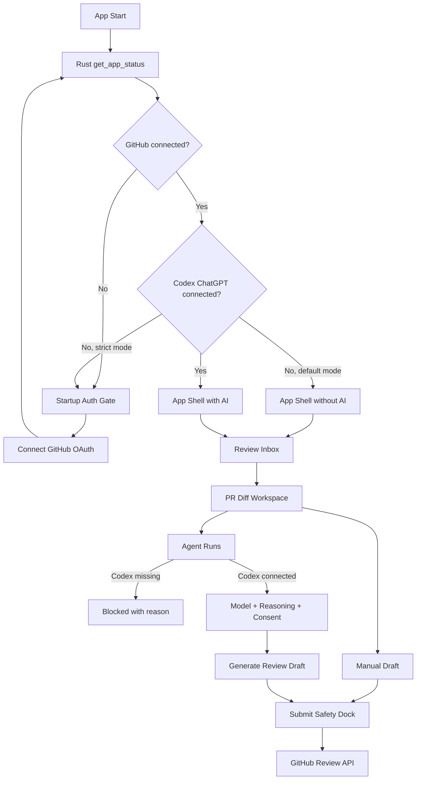
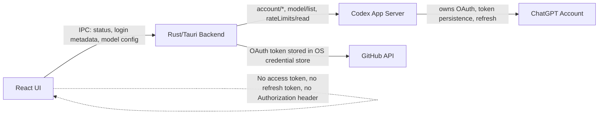
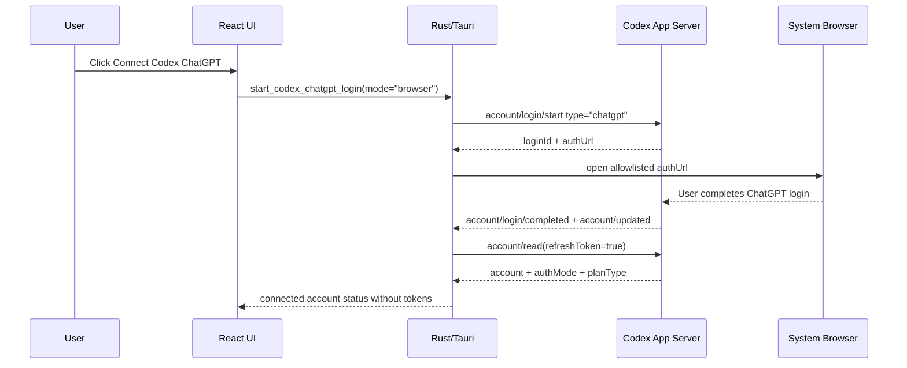
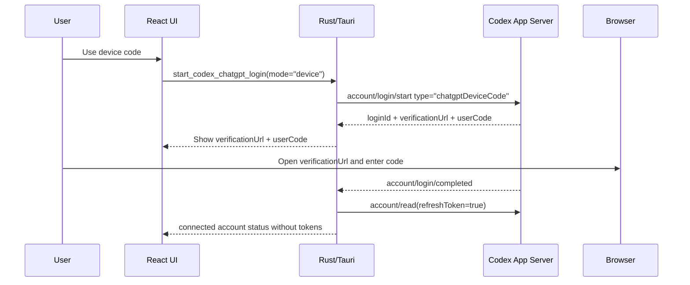
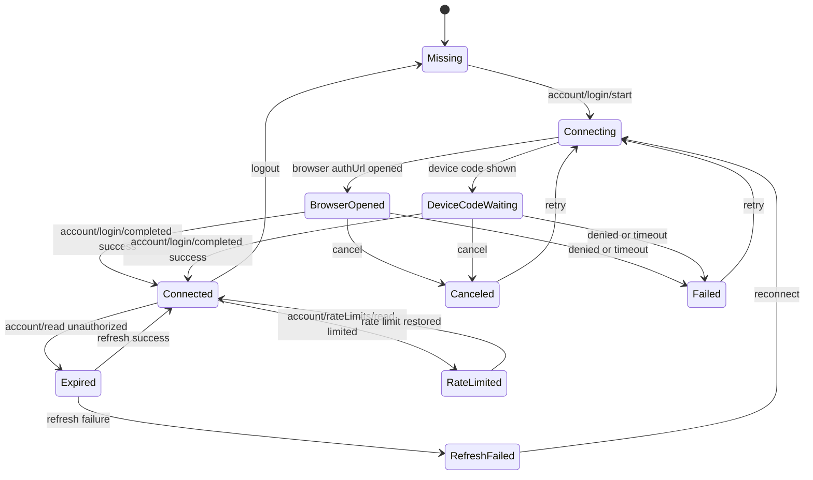
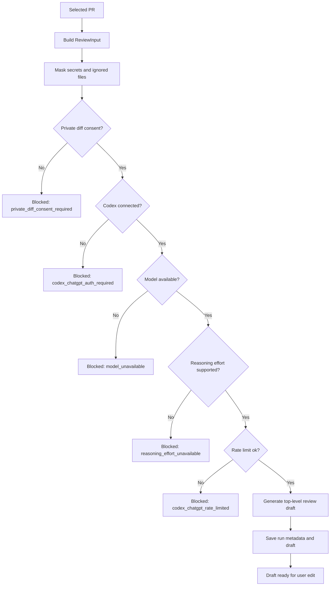

# ReviewDesk PRD 0.0.6

## 1. 문서 정보

- 제품명: ReviewDesk
- 문서명: Codex ChatGPT Managed Auth & Agent Capability Contract
- 버전: 0.0.6
- 작성일: 2026-05-16
- 상태: 0.0.6 구현 완료, 검증 문서 작성 완료
- 이전 기준: `docs/prd/prd-0.0.5.md`
- 핵심 결정: 0.0.6은 `GPT OAuth`라는 모호한 표현을 제거하고, AI 리뷰 실행 경로를 `Codex ChatGPT managed auth` 기반으로 재정의한다. ReviewDesk는 ChatGPT access token을 직접 소유하거나 갱신하지 않으며, Codex App Server의 account/auth/model/rate-limit 표면을 Rust/Tauri backend가 감싼다.

## 2. 한 줄 정의

ReviewDesk 0.0.6은 GitHub OAuth로 리뷰 workspace를 열고, Codex ChatGPT managed auth로 AI Agent Run을 활성화하며, 모델 선택, reasoning effort, plan/rate-limit 상태, private diff consent, run metadata를 하나의 실행 계약으로 묶는 Rust/Tauri 데스크톱 앱 버전이다.

## 3. 왜 0.0.6이 필요한가

0.0.5는 auth-first navigation과 기능별 화면 분리를 완성했지만, AI 연결은 아직 제품적으로 부정확하다.

현재 문제:

- `GPT/ChatGPT OAuth`가 UI에는 보이지만 실제로는 blocked stub이다.
- 사용자는 ChatGPT 구독 또는 Codex 계정으로 연결할 수 있다고 기대하지만, ReviewDesk가 어떤 공식 인증 경로를 사용하는지 명확하지 않다.
- 현재 상태 모델은 `has_chatgpt_token` 같은 boolean에 가깝고, `expired`, `reauth_required`, `plan_limited`, `model_unavailable`, `rate_limited`를 구분하지 못한다.
- 모델과 reasoning depth가 UI 옵션처럼 보이지만, 실제 account/model capability와 연결되어 있지 않다.
- Agent Run 버튼이 실제 generation command와 연결되지 않으면 `queued`처럼 보이는 거짓 진행 상태가 생길 수 있다.
- token boundary가 명확하지 않으면 ChatGPT access token, refresh token, raw OAuth response가 React/UI/report로 새어 나갈 위험이 있다.

0.0.6의 목표는 AI 품질 튜닝이 아니라, 공식 Codex 인증 방식에 맞는 제품 계약과 보안 경계를 만드는 것이다.

## 4. 에이전트 토론 결론

4개 에이전트가 0.0.5 문서, 검증 문서, 주요 Rust/Tauri/React 파일을 나누어 검토했다.

### 4.1 공통 판정

현 상태 그대로는 0.0.6 수용 기준에 `FAIL`이다.

이유:

- ChatGPT 연결 command가 실제 managed auth가 아니라 blocked stub이다.
- App status가 계정, plan, model, rate-limit 상태를 authoritative하게 표현하지 못한다.
- ReviewDesk가 ChatGPT raw token을 직접 저장하는 설계는 Codex managed auth와 충돌한다.
- Agent Run UI가 실제 generation command 결과와 묶이지 않으면 신뢰할 수 없다.
- screenshot 및 automated test matrix가 auth/model/plan/rate-limit 실패 상태를 충분히 검증하지 않는다.

### 4.2 PASS 조건

0.0.6은 아래 조건을 만족하면 `PASS`로 본다.

- GPT 연결 방식은 `Codex ChatGPT managed auth`로 고정한다.
- Browser flow는 `account/login/start`의 `type: "chatgpt"`로 시작한다.
- Device flow는 `account/login/start`의 `type: "chatgptDeviceCode"`로 시작한다.
- ReviewDesk는 ChatGPT access token, refresh token, raw OAuth response를 React에 전달하지 않는다.
- token persistence와 refresh 책임은 Codex App Server 또는 Codex managed auth 계층에 둔다.
- App status는 boolean이 아니라 account/auth/model/rate-limit/generation capability 상태를 반환한다.
- Agent Run은 실제 `generate_review_draft` command를 호출하고, 불가능하면 `queued`가 아니라 `blocked` 또는 `unavailable`을 표시한다.
- 모델 목록은 하드코딩보다 Codex App Server `model/list` 결과를 우선한다.
- 각 모델의 `supportedReasoningEfforts`만 선택 가능하다.
- GitHub만 연결된 상태에서도 Inbox, Diff, Manual Draft, Submit은 가능하고, AI Agent Run만 차단된다.
- Strict Auth Mode에서는 GitHub와 Codex ChatGPT가 모두 connected일 때만 App Shell에 진입한다.

## 5. 공식 근거

OpenAI 공식 문서 기준:

- Codex는 OpenAI 모델 사용 인증 방식으로 ChatGPT sign-in과 API key sign-in을 구분한다.
- Codex App Server의 `chatgpt` managed auth mode에서는 Codex가 ChatGPT OAuth flow, token persistence, refresh를 소유한다.
- Browser flow는 `type: "chatgpt"`로, device-code flow는 `type: "chatgptDeviceCode"`로 시작한다.
- `chatgptAuthTokens`는 host app이 이미 ChatGPT auth lifecycle을 소유하는 경우를 위한 experimental mode다.
- `account/read`, `account/updated`, `account/rateLimits/read`는 account, plan, auth mode, rate-limit 상태를 표현하는 공식 표면이다.
- Codex 모델은 계정과 plan에 따라 availability가 달라질 수 있으므로, ReviewDesk가 plan별 모델 권한을 하드코딩하지 않는다.

참고:

- OpenAI Codex Authentication: https://developers.openai.com/codex/auth#openai-authentication
- OpenAI Codex App Server auth modes: https://developers.openai.com/codex/app-server#authentication-modes
- OpenAI Codex App Server API overview: https://developers.openai.com/codex/app-server#api-overview-1
- OpenAI Codex model list: https://developers.openai.com/codex/app-server#list-models-modellist
- OpenAI Codex recommended models: https://developers.openai.com/codex/models#recommended-models

## 6. 제품 결정

### 6.1 GitHub는 App Shell hard gate

GitHub OAuth가 없으면 ReviewDesk의 실제 리뷰 workspace에 진입할 수 없다.

GitHub 미연결 상태에서 허용:

- Startup Auth Gate
- GitHub OAuth 연결
- Codex ChatGPT 연결 상태 설명
- 언어 설정
- 제한된 diagnostics

GitHub 미연결 상태에서 금지:

- Review Inbox
- repo picker
- PR Workspace
- Agent Runs
- Draft submit
- production sample PR data

### 6.2 Codex ChatGPT는 기본적으로 Agent Run gate

Codex ChatGPT 연결은 기본 설정에서 전체 앱 진입 조건이 아니라 AI 기능 사용 조건이다.

GitHub connected + Codex ChatGPT missing 상태에서 허용:

- repo 선택
- review requested/assigned PR queue 조회
- changed files/diff 읽기
- manual draft 작성
- GitHub top-level review submit

GitHub connected + Codex ChatGPT missing 상태에서 차단:

- AI review draft 생성
- Agent Run 시작
- model/reasoning 기반 실행
- Codex usage/rate-limit 기반 추천

UI 문구는 `Skip for now`가 아니라 `Continue without AI`를 사용한다.

### 6.3 Strict Auth Mode

Strict Auth Mode는 보안이 강한 개인/회사 환경을 위한 옵션이다.

동작:

- GitHub OAuth와 Codex ChatGPT managed auth가 모두 connected일 때만 App Shell 진입
- GitHub만 connected이면 Setup에 머무름
- disabled reason은 Setup, Settings, Agent Runs에서 같은 코드를 사용

기본값:

- GitHub hard gate
- Codex ChatGPT agent gate

### 6.4 API key는 기본 UX에서 제외

사용자의 요구는 API key 입력이 아니라 OAuth/구독 기반 연결이다.

0.0.6 정책:

- `apiKey` auth mode는 기본 UI, Setup, Settings, IPC allowlist에서 노출하지 않는다.
- API key fallback은 enterprise/debug 전용 별도 PRD에서 검토한다.
- `chatgptAuthTokens`는 experimental로 취급하고 P0/P1에서 제외한다.
- ChatGPT cookie/session scraping은 금지한다.

### 6.5 거짓 진행 상태 금지

AI 실행이 실제로 불가능한 상태를 `queued`, `running`, `ready`처럼 표시하지 않는다.

예:

- Codex App Server unavailable: `unsupported`
- ChatGPT auth missing: `codex_chatgpt_auth_required`
- login pending: `codex_chatgpt_login_pending`
- plan 제한: `codex_chatgpt_plan_limited`
- credits/rate limit: `codex_chatgpt_credits_depleted` 또는 `codex_chatgpt_rate_limited`
- 모델 사용 불가: `model_unavailable`
- reasoning effort 사용 불가: `reasoning_effort_unavailable`
- private diff 미동의: `private_diff_consent_required`

## 7. 전체 사용자 흐름



## 8. 인증 아키텍처

### 8.1 경계



React가 볼 수 있는 값:

- connection status
- login id
- verification URL
- device user code
- account display label
- redacted account id hash
- auth mode
- plan type if available
- rate-limit status
- model capability
- blocked reason

React가 볼 수 없는 값:

- ChatGPT access token
- ChatGPT refresh token
- GitHub access token
- `Authorization` header
- raw OAuth response
- raw Codex account payload에 포함될 수 있는 secret

### 8.2 Codex ChatGPT browser flow



### 8.3 Codex ChatGPT device flow



### 8.4 인증 상태 머신



## 9. 화면 요구사항

### 9.1 Setup

목적:

- 프로그램 시작 시 GitHub와 Codex ChatGPT 연결 상태를 먼저 해결한다.

필수:

- `GitHub OAuth` connection card
- `Codex ChatGPT` connection card
- UI language selector
- review language selector
- Strict Auth Mode 상태 표시
- GitHub connected 후 `Continue without AI`
- Codex ChatGPT browser flow CTA
- Codex ChatGPT device-code fallback CTA
- 연결 실패 시 raw payload 없는 blocked reason

GitHub card 문구:

```text
Connect GitHub to load review inbox, diffs, drafts, and submit reviews.
```

Codex ChatGPT card 문구:

```text
Connect ChatGPT through Codex to run AI review agents. GitHub review workspace remains available without AI.
```

수용 기준:

- GitHub token이 없으면 App Shell이 렌더링되지 않는다.
- GitHub connected + Codex missing이면 `Continue without AI`로 Inbox 진입이 가능하다.
- Strict Auth Mode에서는 Codex missing 상태에서 Inbox 진입이 차단된다.
- token-like 문자열이 화면에 보이지 않는다.

### 9.2 Review Inbox

0.0.6에서 Review Inbox의 핵심 UX는 0.0.5를 유지한다.

추가 요구:

- AI 상태 column은 `AI unavailable`, `Connect Codex`, `Model unavailable`, `Rate limited`, `Draft ready`처럼 capability 기반으로 표시한다.
- Codex missing은 PR queue 조회를 막지 않는다.
- PR row에서 Agent Run CTA가 disabled인 경우 같은 blocked reason을 tooltip/detail에 표시한다.

### 9.3 PR Diff Workspace

추가 요구:

- private repo diff를 Codex로 보낼지 명시적으로 동의받는다.
- 동의 snapshot은 Agent Run metadata에 저장한다.
- 동의하지 않아도 diff 읽기와 manual draft는 가능하다.
- 동의하지 않은 상태에서 Agent Run을 누르면 `private_diff_consent_required`로 차단한다.

### 9.4 Agent Runs

목적:

- PR context를 기반으로 AI review draft를 생성하는 실행 화면이다.

필수 run configuration:

- Model
- Reasoning effort
- ChatGPT plan
- rate-limit/credits status
- review language
- private diff consent
- selected files
- prompt version
- expected output: top-level review draft

상태:

- `not_configured`
- `blocked`
- `ready`
- `queued`
- `running`
- `draft_ready`
- `failed`
- `stale`

수용 기준:

- Codex missing이면 화면 접근은 가능하지만 Run 버튼만 disabled다.
- 모델 목록이 없으면 `model_list_unavailable`을 표시한다.
- unavailable model은 선택할 수 없다.
- unsupported reasoning effort는 선택할 수 없다.
- 실제 generation command를 호출하지 못한 경우 `queued`로 표시하지 않는다.
- 실패해도 기존 manual draft와 previous run history는 보존한다.

### 9.5 Drafts

추가 요구:

- draft가 어떤 Agent Run에서 생성됐는지 표시한다.
- draft metadata에 model, reasoning effort, review language, diff hash, prompt version을 표시한다.
- token, raw account id, Authorization header는 metadata에 포함하지 않는다.
- rerun은 기존 draft를 덮어쓰지 않고 새 run/draft로 쌓는다.

### 9.6 Settings

필수 connection details:

- GitHub connection status
- GitHub login
- GitHub scope/SSO/preflight status
- Codex ChatGPT account status
- Codex auth mode
- ChatGPT plan type if available
- last refreshed time
- model list sync status
- rate-limit status
- disconnect/reconnect action
- Strict Auth Mode toggle

수용 기준:

- Settings와 Setup은 같은 source of truth를 사용한다.
- disconnect 후 Agent Run 버튼과 model picker가 즉시 disabled 된다.
- plan unknown이면 `Plan unknown`으로 표시하고 추측하지 않는다.

## 10. 데이터 모델

### 10.1 AiConnectionStatusView

```ts
type AiConnectionStatus =
  | "missing"
  | "connecting"
  | "browser_opened"
  | "device_code_waiting"
  | "connected"
  | "expired"
  | "reauth_required"
  | "refresh_failed"
  | "unsupported"
  | "rate_limited";

interface AiConnectionStatusView {
  provider: "codex_chatgpt";
  status: AiConnectionStatus;
  authMode: "chatgpt" | null;
  account?: AiAccountView;
  planType?: string;
  lastRefreshedAt?: string;
  blockedReason?: AiBlockedReason;
}
```

### 10.2 AiAccountView

```ts
interface AiAccountView {
  accountIdHash: string;
  displayLabel?: string;
  workspaceName?: string;
  planType?: string;
}
```

### 10.3 AiModelView

```ts
type ReasoningEffort = "low" | "medium" | "high" | "xhigh";

interface AiModelView {
  id: string;
  displayName: string;
  isDefault: boolean;
  hidden: boolean;
  available: boolean;
  unavailableReason?: "plan_required" | "rate_limited" | "model_unavailable";
  supportedReasoningEfforts: ReasoningEffort[];
  defaultReasoningEffort: ReasoningEffort;
  inputModalities: string[];
  upgrade?: {
    requiredPlan?: string;
    message: string;
  };
}
```

### 10.4 AiRateLimitSnapshot

```ts
interface AiRateLimitSnapshot {
  status: "unknown" | "ok" | "rate_limited" | "credits_depleted";
  checkedAt: string;
  resetsAt?: string;
  blockedReason?: AiBlockedReason;
}
```

### 10.5 AgentRunRecord

```ts
interface AgentRunRecord {
  runId: string;
  pullRequestId: string;
  repoFullName: string;
  pullNumber: number;
  headSha: string;
  diffHash: string;
  selectedFiles: string[];
  provider: "codex_chatgpt";
  authMode: "chatgpt";
  planType?: string;
  modelId: string;
  reasoningEffort: ReasoningEffort;
  reviewLanguage: "en" | "ko";
  promptVersion: string;
  privateDiffConsentSnapshot: boolean;
  rateLimitSnapshot?: AiRateLimitSnapshot;
  status: "blocked" | "queued" | "running" | "draft_ready" | "failed" | "stale";
  blockedReason?: AiBlockedReason;
  startedAt: string;
  completedAt?: string;
}
```

### 10.6 AiBlockedReason

```ts
type AiBlockedReason =
  | "codex_chatgpt_auth_required"
  | "codex_chatgpt_login_pending"
  | "codex_chatgpt_expired"
  | "codex_chatgpt_refresh_failed"
  | "codex_chatgpt_unsupported"
  | "codex_chatgpt_plan_limited"
  | "codex_chatgpt_credits_depleted"
  | "codex_chatgpt_rate_limited"
  | "model_list_unavailable"
  | "model_unavailable"
  | "reasoning_effort_unavailable"
  | "private_diff_consent_required"
  | "generation_adapter_unavailable";
```

## 11. IPC 및 Rust command 요구사항

### 11.1 신규 또는 개편 commands

P0:

- `get_ai_connection_status`
- `start_codex_chatgpt_login`
- `cancel_codex_chatgpt_login`
- `read_codex_account`
- `list_ai_models`
- `select_ai_model`
- `generate_review_draft`

P1:

- `read_codex_rate_limits`
- `logout_codex_chatgpt`
- `refresh_ai_account_status`

### 11.2 command 계약

`start_codex_chatgpt_login`:

- 입력: `mode: "browser" | "device"`
- browser mode는 Codex App Server `account/login/start`에 `type: "chatgpt"`를 사용한다.
- device mode는 `type: "chatgptDeviceCode"`를 사용한다.
- 출력은 login metadata만 포함한다.
- token 또는 raw OAuth response를 반환하지 않는다.

`list_ai_models`:

- Codex App Server `model/list` 결과를 우선한다.
- `hidden=true` 모델은 기본 picker에서 숨긴다.
- unavailable 모델은 disabled reason과 함께 반환한다.
- app-server unavailable이면 fake model list 대신 `model_list_unavailable`을 반환한다.

`generate_review_draft`:

- UI의 `runAgent()`에서 실제로 호출한다.
- 실행 전 Rust가 account status, model availability, reasoning effort, private diff consent를 재검증한다.
- adapter unavailable이면 `generation_adapter_unavailable`로 blocked 결과를 반환한다.
- 성공 시 draft와 run metadata를 함께 저장한다.

### 11.3 external URL allowlist

허용:

- GitHub OAuth/device URLs
- Codex ChatGPT browser auth URL
- Codex ChatGPT device verification URL

요구:

- `https` scheme만 허용한다.
- host allowlist는 Rust에서 authoritative하게 검증한다.
- `auth.openai.com` 계열 device/browser URL을 필요한 범위만 명시적으로 허용한다.
- arbitrary external URL open은 금지한다.

## 12. AI Provider 전략

### 12.1 P0 provider

P0 provider는 `CodexChatGptProvider`다.

역할:

- account status 조회
- model capability 조회
- rate-limit 상태 조회
- review draft generation
- blocked reason normalization
- token redaction guarantee

### 12.2 Provider fallback

P0에서 API key fallback은 제공하지 않는다.

허용 fallback:

- manual draft
- no-AI workspace
- provider unavailable 상태 표시

금지 fallback:

- ChatGPT 웹 세션 scraping
- cookie 재사용
- 사용자가 붙여넣은 ChatGPT access token 저장
- plan별 model availability 하드코딩

### 12.3 모델 기본값

모델 기본값은 Codex App Server 응답을 우선한다.

공식 문서 기반 추천 UI copy:

- `gpt-5.5`: available이면 기본 추천
- `gpt-5.4`: `gpt-5.5`가 없을 때 안정적인 fallback
- `gpt-5.4-mini`: 빠른/lightweight 리뷰나 subagent 작업
- `gpt-5.3-codex-spark`: ChatGPT Pro에서 사용 가능할 때 near-instant iteration 용도

단, ReviewDesk는 계정별 availability를 추측하지 않는다. 모델 picker는 실제 capability 응답을 source of truth로 사용한다.

## 13. Agent Run 실행 계약



P0 출력:

- PR summary
- 주요 변경사항
- risk level
- findings
- test/QA checklist
- top-level review body draft
- suggested verdict
- confidence

P0 제외:

- GitHub inline comment 자동 제출
- streaming generation UI
- background job queue
- local checkout/test runner
- auto-submit

## 14. 보안 요구사항

### 14.1 Token boundary

ReviewDesk는 Codex ChatGPT managed auth에서 raw ChatGPT token을 소유하지 않는다.

금지:

- React payload에 `accessToken` 포함
- React payload에 `refreshToken` 포함
- rendered text에 `Authorization` 또는 `Bearer` 포함
- local report에 raw OAuth response 포함
- AgentRun metadata에 raw account id 또는 token 포함
- log에 credential 출력

허용:

- account id hash
- display label
- auth mode
- plan type
- capability status
- blocked reason

### 14.2 Private diff consent

private repo diff를 Codex provider로 보내기 전 동의를 받는다.

동의 scope:

- repo
- PR number
- head sha
- selected files
- provider
- model
- review language
- timestamp

동의하지 않아도 가능한 작업:

- diff 읽기
- local/manual draft 작성
- GitHub submit

동의가 필요한 작업:

- Codex Agent Run
- PR diff/context를 provider로 보내는 모든 작업

### 14.3 Audit log

Agent Run audit log에는 아래만 저장한다.

- run id
- PR ref
- head sha
- diff hash
- selected files
- provider
- model
- reasoning effort
- plan type if available
- rate-limit snapshot timestamp
- private diff consent snapshot
- prompt version
- status
- blocked reason

저장하지 않는 것:

- raw diff 전문을 audit log에 중복 저장
- access token
- refresh token
- Authorization header
- raw OAuth response

## 15. 상태 및 capability matrix

| 상태 | App Shell | Inbox | Diff | Manual Draft | Agent Run | Submit |
| --- | --- | --- | --- | --- | --- | --- |
| GitHub missing | 차단 | 차단 | 차단 | 차단 | 차단 | 차단 |
| GitHub expired | 제한 | 차단 | 차단 | 로컬 draft만 가능 | 차단 | 차단 |
| GitHub connected, Codex missing | 허용 | 허용 | 허용 | 허용 | 차단 | 허용 |
| GitHub connected, Codex connecting | 허용 | 허용 | 허용 | 허용 | 차단 | 허용 |
| GitHub connected, Codex connected | 허용 | 허용 | 허용 | 허용 | 허용 | 허용 |
| GitHub connected, Codex expired | 허용 | 허용 | 허용 | 허용 | 차단 | 허용 |
| GitHub connected, Codex refresh failed | 허용 | 허용 | 허용 | 허용 | 차단 | 허용 |
| GitHub connected, model unavailable | 허용 | 허용 | 허용 | 허용 | 차단 | 허용 |
| GitHub connected, rate limited | 허용 | 허용 | 허용 | 허용 | 차단 | 허용 |
| Strict Auth Mode + Codex missing | 차단 | 차단 | 차단 | 차단 | 차단 | 차단 |

## 16. 구현 단계

### Phase 1: 상태 계약 확장

- Rust `AppStatusView`에 AI account/model/rate-limit/generation capability 추가
- TypeScript mirror type 추가
- existing boolean 기반 `has_chatgpt_token` 의존 제거
- blocked reason enum 추가
- token redaction test 확장

### Phase 2: Codex ChatGPT login surface

- `start_codex_chatgpt_login` 추가
- browser/device mode 구분
- `cancel_codex_chatgpt_login` 추가
- `read_codex_account` 추가
- external URL allowlist 확장
- app-server unavailable 상태는 `unsupported`로 표시

### Phase 3: 모델 및 reasoning capability

- `list_ai_models` 추가
- hidden/unavailable/upgrade/default/reasoning effort 반영
- selected model/reasoning 저장
- unsupported selection 차단
- Settings와 Agent Runs에서 같은 model source 사용

### Phase 4: Agent Run command 연결

- UI `runAgent()`가 실제 `generate_review_draft` command 호출
- command가 실행 전 Rust에서 capability 재검증
- unavailable이면 blocked run record 저장
- 성공하면 draft와 run metadata 저장
- manual draft 보존

### Phase 5: 문서 및 검증

- `docs/verification/reviewdesk-tauri-0.0.6.md` 작성
- screenshot matrix 수행
- automated tests 통과
- PRD와 실제 구현 차이 정리

## 17. 수용 기준

P0 수용 기준:

- 앱 시작 시 GitHub와 Codex ChatGPT connection card가 보인다.
- GitHub 미연결이면 App Shell이 보이지 않는다.
- GitHub connected + Codex missing이면 `Continue without AI`로 Inbox에 진입할 수 있다.
- Strict Auth Mode에서는 Codex missing 상태에서 App Shell 진입이 차단된다.
- Codex connect browser flow는 token 없이 login metadata만 UI에 전달한다.
- Device-code fallback은 verification URL과 user code만 UI에 표시한다.
- 연결 성공 후 account status, auth mode, plan type if available이 Settings에 표시된다.
- 모델 picker는 `model/list` capability를 기준으로 enabled/disabled를 결정한다.
- unsupported reasoning effort는 선택할 수 없다.
- private diff consent 없이는 Agent Run이 시작되지 않는다.
- Agent Run은 실제 `generate_review_draft` command를 호출한다.
- 실제 adapter가 unavailable이면 `queued`가 아니라 `generation_adapter_unavailable`을 표시한다.
- generated draft는 editable이고, Submit은 여전히 사용자가 눌러야만 GitHub로 올라간다.
- React payload, rendered text, logs, local report, run metadata에 token-like secret이 없다.

P1 수용 기준:

- `read_codex_rate_limits`가 rate-limit/credits 상태를 UI에 표시한다.
- logout/disconnect 후 model picker와 Run 버튼이 즉시 disabled 된다.
- rate limited 상태와 auth failure 상태가 다른 copy와 blocked reason으로 표시된다.
- Settings에서 last refreshed와 reconnect action이 동작한다.

## 18. 테스트 계획

### 18.1 Rust unit tests

- managed auth state mapping
- token redaction serialization
- browser/device login metadata serialization
- refresh success/failure mapping
- model availability mapping
- reasoning effort validation
- private diff consent block
- run metadata persistence
- external URL allowlist
- IPC allowlist credential exposure

### 18.2 Frontend unit tests

- Setup connection card rendering
- GitHub-only `Continue without AI`
- Strict Auth Mode block
- browser/device flow view model
- model picker filtering
- unavailable model disabled reason
- reasoning effort disabled reason
- Agent Run blocked reason rendering
- Korean/English copy parity
- token-like string absence in rendered output

### 18.3 IPC contract tests

Fixture 기반 schema test:

- `account/read`
- `account/login/start` browser
- `account/login/start` device code
- `account/login/completed`
- `account/updated`
- `account/rateLimits/read`
- `model/list`
- `generate_review_draft` blocked
- `generate_review_draft` success

### 18.4 Screenshot matrix

Desktop: `1440x900`

Narrow: `390x844`

상태:

- missing both
- GitHub only
- Codex browser login pending
- Codex device login pending
- Codex connected
- Codex expired
- refresh failed
- plan unavailable
- model unavailable
- rate limited
- Agent blocked
- Agent running
- draft ready
- Settings connections
- English UI
- Korean UI

검증 포인트:

- token-like 문자열 없음
- 버튼 enabled/disabled 정확성
- 긴 model id가 레이아웃을 깨지 않음
- blocked reason이 겹치지 않음
- 한국어/영어 모두 overflow 없음

### 18.5 기본 검증 명령

```bash
cargo fmt --check
cargo test
npm test -- --run
npm run build
cargo check --manifest-path src-tauri/Cargo.toml
```

## 19. 비목표

0.0.6에서 하지 않는다.

- GitHub inline comment 자동 제출
- auto-submit
- 팀용 GitHub App mode
- Slack/Teams 알림
- local checkout/test runner
- streaming Agent Run UI
- background job queue
- 조직/workspace 계정 전환
- API key 기본 UX
- ChatGPT cookie/session scraping
- ReviewDesk 자체 ChatGPT token refresh 구현
- `chatgptAuthTokens` experimental mode
- plan별 모델 권한 하드코딩
- credits 잔액 추정
- OpenAI billing 화면 복제
- 모델 가격 표시

## 20. 리스크 및 대응

| 리스크 | 영향 | 대응 |
| --- | --- | --- |
| Codex App Server integration surface가 로컬 Tauri 앱에서 바로 사용 불가 | 실제 managed auth 연결 지연 | `unsupported` 상태를 명확히 표시하고, fake OAuth를 만들지 않는다. |
| ChatGPT plan/model availability가 계정마다 다름 | 모델 선택 실패 | `model/list` capability를 source of truth로 사용한다. |
| token이 React payload로 유출 | 보안 사고 | Rust serialization test와 rendered output token scan을 추가한다. |
| rate limit과 auth failure가 같은 오류처럼 보임 | 사용자가 복구 방법을 모름 | blocked reason을 auth/plan/rate/model로 분리한다. |
| Agent Run이 실제로 실행되지 않는데 running처럼 보임 | 제품 신뢰 하락 | unavailable이면 `blocked`로 저장하고, queued/running은 실제 command 이후에만 사용한다. |
| private diff를 provider로 보내는 동의가 모호함 | 회사 코드 보안 리스크 | repo/PR/head sha/model/provider 단위 consent snapshot을 저장한다. |

## 21. 다음 버전 후보

0.0.7 후보:

- 실제 Codex App Server provider end-to-end generation 완성
- streaming progress와 cancellation
- background agent queue
- draft quality scoring
- retry policy
- rate-limit-aware model downgrade suggestion

0.0.8 후보:

- inline comment mapper
- GitHub batch review API
- stale inline comment handling
- local checkout/test runner 실험

## 22. 최종 정리

ReviewDesk 0.0.6의 핵심은 “GPT 연결 버튼을 만드는 것”이 아니다.

핵심은 다음이다.

- GitHub OAuth는 리뷰 workspace 진입 조건이다.
- Codex ChatGPT managed auth는 AI Agent Run 실행 조건이다.
- ReviewDesk는 ChatGPT token을 직접 소유하지 않는다.
- 모델과 reasoning effort는 실제 account/model capability에 묶인다.
- AI 실행이 불가능하면 거짓 진행 상태를 보이지 않는다.
- private diff는 명시적 동의 후에만 provider로 보낸다.
- Submit은 계속 사용자가 직접 누르는 draft-first workflow다.

이 PRD를 기준으로 구현하면 0.0.5의 auth-first/multi-screen 구조 위에, 공식 Codex 인증 모델과 맞는 AI 실행 계약을 얹을 수 있다.
