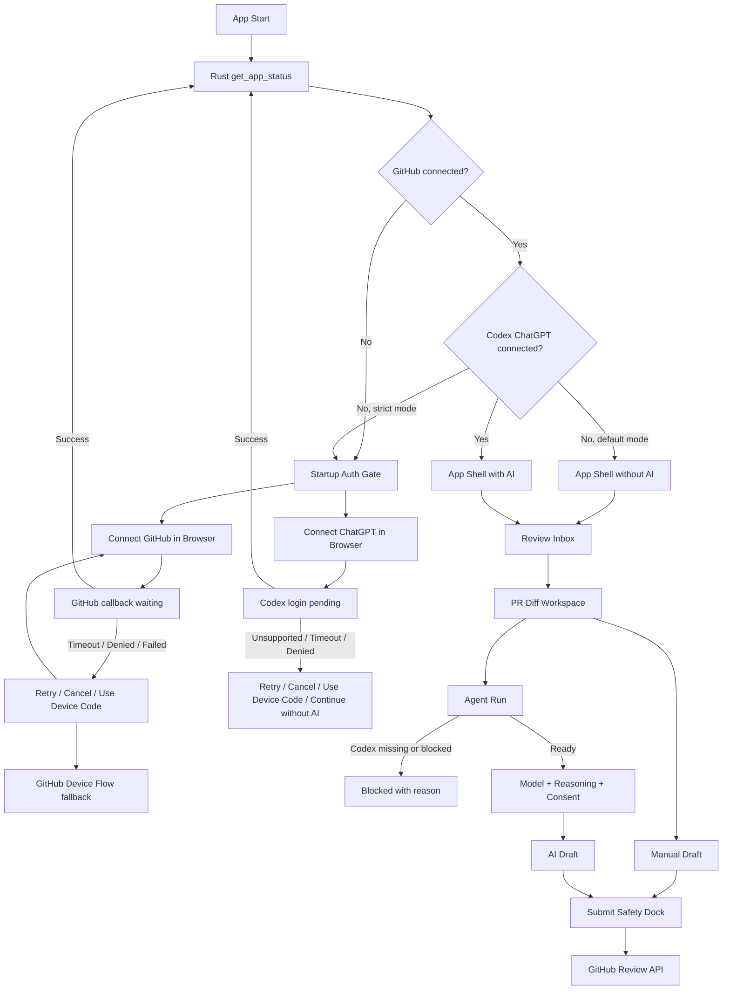
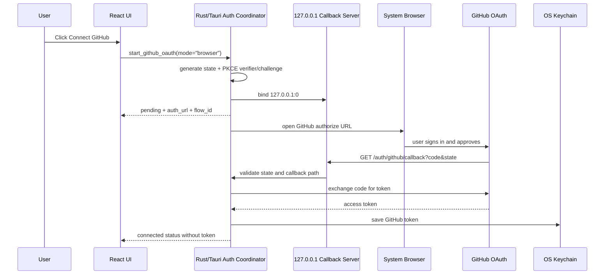
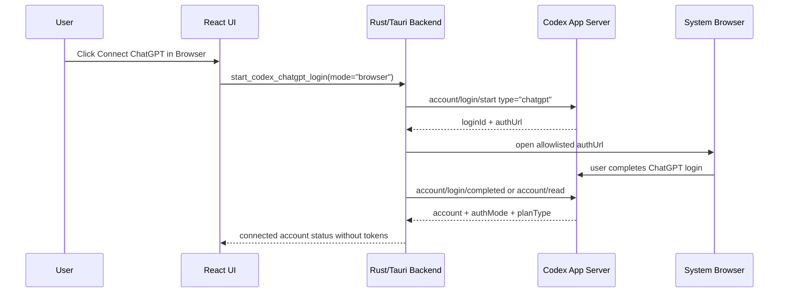
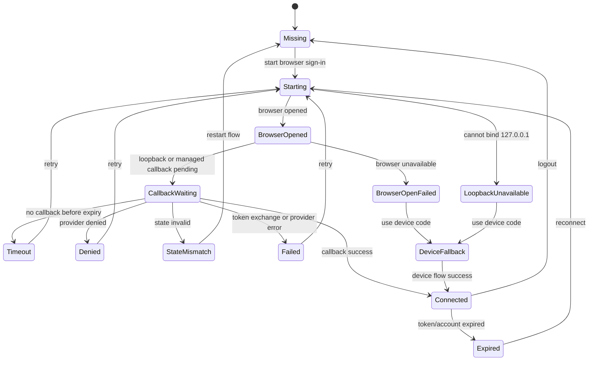
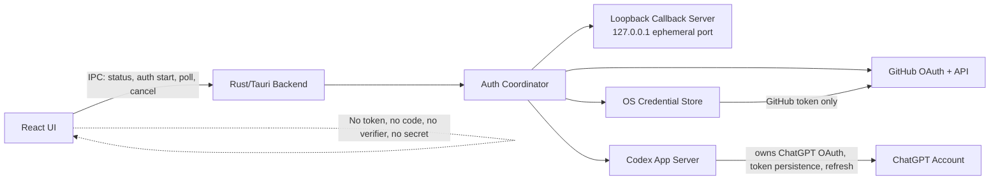

# ReviewDesk PRD 0.0.7

## 1. 문서 정보

- 제품명: ReviewDesk
- 문서명: Browser OAuth & Loopback Auth UX
- 버전: 0.0.7
- 작성일: 2026-05-17
- 상태: 0.0.7 구현 완료, 검증 문서 작성 완료
- 이전 기준: `docs/prd/prd-0.0.6.md`
- 핵심 결정: 0.0.7은 GitHub와 Codex ChatGPT 연결 UX를 모두 system browser sign-in 중심으로 통일한다. Device Flow는 더 이상 기본 인증 UX가 아니라 loopback callback이 실패하거나 사용할 수 없는 환경의 fallback이다.

## 2. 한 줄 정의

ReviewDesk 0.0.7은 앱 시작 시 GitHub와 Codex ChatGPT 연결을 브라우저 OAuth 방식으로 처리하고, 승인 후 `127.0.0.1` loopback callback 또는 Codex managed auth 상태 갱신을 통해 앱이 자동으로 connected 상태로 전환되는 Rust/Tauri 데스크톱 앱 버전이다.

## 3. 왜 0.0.7이 필요한가

0.0.6은 Codex ChatGPT managed auth 계약, token 미노출, model/reasoning capability, Agent Run blocked reason을 정의했다. 하지만 실제 사용자가 기대하는 인증 UX와 구현은 아직 어긋나 있다.

현재 문제:

- GitHub 연결 버튼은 Device Flow 중심이라 사용자가 GitHub 페이지에서 코드를 입력해야 한다.
- 사용자는 보통 "브라우저에서 승인하고 앱으로 돌아오는 OAuth"를 기대한다.
- Codex ChatGPT 연결도 browser sign-in처럼 보여야 하지만, 현재는 env 기반 placeholder 또는 unsupported 상태다.
- `Connect Codex ChatGPT`와 `Use device code`가 비슷한 수준으로 노출되어 fallback이 기본 경로처럼 보인다.
- OAuth pending, callback success, cancel, timeout, state mismatch, scope missing, SSO required 상태가 제품적으로 분리되어 있지 않다.
- GitHub browser OAuth를 넣을 때 client secret, PKCE, loopback listener, keychain 저장, React token 미노출 경계를 명확히 하지 않으면 보안 리스크가 커진다.

0.0.7의 목표는 "AI 리뷰 품질 개선"이 아니라, 앱 시작 인증 경험을 현대적인 데스크톱 앱 수준으로 고정하는 것이다.

## 4. 에이전트 검토 결론

4개 관점의 에이전트가 0.0.6 문서, 검증 문서, Rust/Tauri command, GitHub client, UI, 테스트를 검토했다.

### 4.1 Product / UX Agent

판정:

- 0.0.7은 `Browser OAuth first` 버전이어야 한다.
- GitHub와 Codex ChatGPT 모두 기본 CTA는 browser sign-in이어야 한다.
- Device Flow는 troubleshooting/fallback 영역으로 내려야 한다.
- `GPT OAuth` 같은 모호한 표현은 제거하고 `Codex ChatGPT` 또는 `ChatGPT via Codex`로 통일해야 한다.
- `Browser opened` 수준의 메시지는 부족하다. `callback_waiting`, `connected`, `timeout`, `denied`, `retry` 상태가 필요하다.

PRD 반영:

- 기본 인증 UX를 system browser sign-in으로 고정한다.
- `Continue without AI`는 GitHub connected + Codex missing 상태의 명시적 CTA로 유지한다.
- strict auth mode에서는 Codex missing/pending/failed 상태도 App Shell 진입을 차단한다.

### 4.2 Security / Auth Agent

판정:

- GitHub browser OAuth는 Authorization Code + PKCE + loopback callback을 기준으로 설계해야 한다.
- React는 OAuth code, state 원문, PKCE verifier, access token, refresh token, Authorization header를 절대 보지 않아야 한다.
- loopback listener는 `127.0.0.1` 또는 `[::1]`에만 bind하고 ephemeral port를 사용해야 한다.
- callback은 single-use이며 state mismatch, wrong path, duplicate callback, expired flow를 모두 거부해야 한다.
- Codex ChatGPT는 0.0.6의 managed auth boundary를 유지한다. ReviewDesk가 ChatGPT raw token lifecycle을 소유하면 안 된다.

PRD 반영:

- token boundary, loopback security, callback validation, local secret policy, test matrix를 P0로 올린다.
- `TokenKind::ChatGpt` 직접 저장 경로는 신규 기능에서 사용하지 않고 legacy cleanup 대상으로 둔다.

### 4.3 Rust / Tauri Agent

판정:

- 현재 `start_github_oauth`는 Device Flow만 시작한다.
- `src/github.rs`에는 authorization code flow와 token exchange helper가 없다.
- Tauri command allowlist/capability는 새 command가 생길 때마다 `allowed_ipc_commands()`, `build.rs`, `main.json`, `main.rs`를 함께 갱신해야 한다.
- loopback 구현은 Tauri broad HTTP/shell 권한을 열지 말고 Rust command 내부 `tokio::net::TcpListener`로 처리하는 편이 맞다.

PRD 반영:

- `browser_loopback`을 GitHub 기본 mode로 정의한다.
- 기존 Device Flow는 fallback으로 유지한다.
- `StartGitHubOAuthRequest`, `GitHubOAuthStartView`, `GitHubOAuthPollView`, 내부 flow enum을 PRD에 추가한다.
- `rand/getrandom`, `base64`, `url`, `tokio` 기반 구현 요구를 명시한다.

### 4.4 QA / Acceptance Agent

판정:

- 가장 큰 QA 갭은 GitHub browser OAuth lifecycle이다.
- 성공뿐 아니라 cancel, denied, timeout, expired, SSO required, scope missing, state mismatch, token redaction을 테스트해야 한다.
- Codex login도 connected/unsupported/pending/expired/rate limited/model unavailable이 각기 다른 UX로 검증되어야 한다.

PRD 반영:

- OAuth lifecycle test matrix를 P0로 추가한다.
- EN/KO copy, screenshot matrix, token-like rendered output scan을 수용 기준에 포함한다.

## 5. 공식 근거

### 5.1 GitHub OAuth

GitHub OAuth Apps는 web application flow와 device flow를 모두 지원한다.

- Web application flow는 `GET https://github.com/login/oauth/authorize`로 사용자를 GitHub에 보낸 뒤, GitHub가 callback URL로 `code`와 `state`를 돌려보내고, 앱이 `POST https://github.com/login/oauth/access_token`으로 token을 교환하는 방식이다.
- GitHub 문서는 `state`를 CSRF 방지용으로 강하게 권장하고, PKCE의 `code_challenge`와 `code_verifier`도 권장한다.
- GitHub는 데스크톱 native app을 위해 loopback redirect URL을 지원하며, `localhost`보다 literal `127.0.0.1` 또는 `::1` 사용을 권장한다.
- Device Flow는 headless app 또는 브라우저 접근이 어려운 환경에 적합하다.

참고:

- GitHub OAuth Apps authorization: https://docs.github.com/en/apps/oauth-apps/building-oauth-apps/authorizing-oauth-apps
- GitHub loopback redirect URLs: https://docs.github.com/en/apps/oauth-apps/building-oauth-apps/authorizing-oauth-apps#loopback-redirect-urls
- GitHub Device Flow: https://docs.github.com/en/apps/oauth-apps/building-oauth-apps/authorizing-oauth-apps#device-flow

### 5.2 OpenAI Codex / ChatGPT

OpenAI Codex 공식 문서 기준:

- Codex는 OpenAI 모델 사용 인증 방식으로 ChatGPT sign-in과 API key sign-in을 구분한다.
- Codex app, CLI, IDE Extension에서 ChatGPT로 sign-in하면 브라우저 창을 열어 로그인 flow를 완료한다.
- ChatGPT sign-in은 ChatGPT workspace permission, RBAC, retention, residency 정책을 따른다.
- API key sign-in은 OpenAI Platform organization 정책과 billing을 따른다.
- Codex App Server의 `model/list`는 사용 가능한 모델과 `supportedReasoningEfforts`, `defaultReasoningEffort`, hidden 여부, input modality를 제공한다.

참고:

- OpenAI Codex Authentication: https://developers.openai.com/codex/auth#openai-authentication
- OpenAI Codex App Server: https://developers.openai.com/codex/app-server
- OpenAI Codex model list: https://developers.openai.com/codex/app-server#list-models-modellist

## 6. 제품 결정

### 6.1 인증 UX 원칙

기본 원칙:

- 사용자는 코드 복사/붙여넣기 없이 브라우저에서 승인하고 앱으로 돌아와야 한다.
- GitHub와 Codex ChatGPT의 기본 CTA는 모두 browser sign-in이다.
- Device Flow는 fallback이다.
- 인증 성공은 앱이 자동 감지해야 한다.
- 인증 실패는 원인별 복구 CTA를 제공해야 한다.
- 인증 중에도 token-like 문자열은 UI, logs, report, draft metadata에 노출하지 않는다.

### 6.2 GitHub는 App Shell hard gate

GitHub 미연결 상태에서는 ReviewDesk의 실제 리뷰 workspace에 진입할 수 없다.

GitHub 미연결 상태에서 허용:

- Startup Auth Gate
- GitHub browser sign-in
- Codex ChatGPT 연결 상태 설명
- 언어 설정
- diagnostics

GitHub 미연결 상태에서 금지:

- Review Inbox
- repository picker
- PR Diff Workspace
- Agent Runs
- Draft submit
- production sample PR data

### 6.3 Codex ChatGPT는 기본적으로 Agent Run gate

기본 모드:

- GitHub connected + Codex missing 상태에서도 Inbox, Diff, Manual Draft, Submit은 허용한다.
- Codex missing/pending/expired/rate limited/model unavailable 상태에서는 Agent Run만 차단한다.
- Setup에는 `Continue without AI`를 명시적으로 제공한다.

Strict Auth Mode:

- GitHub와 Codex ChatGPT가 모두 `connected`일 때만 App Shell 진입을 허용한다.
- Codex missing/pending/failed/expired/rate_limited 상태는 Setup에 머무른다.

### 6.4 Device Flow는 fallback

Device Flow를 사용할 수 있는 경우:

- loopback listener bind 실패
- system browser open 실패
- 기업 프록시/브라우저 정책으로 callback이 차단됨
- 사용자가 명시적으로 `Use device code instead` 선택
- GitHub OAuth App이 browser callback 설정을 아직 충족하지 못함
- Codex App Server가 device-code metadata만 제공함

Device Flow를 기본 CTA로 노출하지 않는다.

### 6.5 API key는 기본 UX에서 제외

0.0.7은 사용자의 요구에 맞춰 OAuth/ChatGPT subscription 기반 UX를 고정한다.

제외:

- API key 입력 UI
- ChatGPT access token paste
- ChatGPT cookie/session scraping
- `chatgptAuthTokens` 일반 사용자 UX
- React bundle에 OAuth secret 포함

API key와 enterprise token은 별도 PRD에서 다룬다.

## 7. 사용자 흐름

### 7.1 전체 흐름



### 7.2 GitHub Browser OAuth



### 7.3 Codex ChatGPT Browser Sign-In



### 7.4 인증 상태 머신



## 8. 인증 아키텍처

### 8.1 경계



React가 볼 수 있는 값:

- provider
- connection status
- flow id
- mode
- auth URL
- verification URL
- device user code
- account display label
- account id hash
- auth mode
- plan type
- model capability
- blocked reason

React가 볼 수 없는 값:

- GitHub access token
- ChatGPT access token
- ChatGPT refresh token
- OAuth authorization code
- PKCE verifier
- raw `state`
- client secret
- Authorization header
- raw OAuth response
- raw callback query

### 8.2 GitHub client secret 정책

GitHub 공식 web application flow는 token exchange에 `client_secret`을 요구한다. 동시에 데스크톱 앱에 secret을 하드코딩하거나 React bundle에 넣는 것은 금지한다.

0.0.7 정책:

- `client_secret`은 앱 바이너리, React bundle, repo, docs 예시 값, crash report, log에 포함하지 않는다.
- Rust backend는 PKCE를 항상 사용한다.
- P0 local personal mode에서는 사용자가 직접 제공한 `REVIEWDESK_GITHUB_CLIENT_SECRET` 또는 OS keychain secret을 허용할 수 있다. 이 모드는 배포용이 아니다.
- 구현 시작 시 GitHub OAuth App이 PKCE-only token exchange를 허용하는지 먼저 검증한다. 허용되지 않으면 local personal secret, Device Flow fallback, 또는 broker/GitHub App 전략 중 하나를 명시적으로 선택해야 한다.
- 배포용 앱은 GitHub OAuth broker 또는 GitHub App 기반 전환을 별도 PRD에서 설계해야 한다.
- 안전한 secret 경로가 없으면 browser OAuth를 connected로 위장하지 않고 Device Flow fallback을 제공한다.

### 8.3 Loopback callback 보안

필수:

- bind address는 `127.0.0.1` 또는 `[::1]`만 허용한다.
- port는 OS가 배정한 ephemeral port를 사용한다.
- `0.0.0.0`, LAN IP, public interface bind는 금지한다.
- callback path는 provider별 고정 prefix와 flow id 또는 random path segment로 제한한다.
- callback은 `GET`만 허용한다.
- `state`는 cryptographic random value여야 한다.
- PKCE verifier는 cryptographic random value여야 한다.
- state, verifier, authorization code는 single-use다.
- success, denied, timeout, cancel 이후 listener를 종료한다.
- duplicate callback은 실패 처리한다.
- state mismatch는 보안 오류로 표시하고 token exchange를 시도하지 않는다.

## 9. 화면 요구사항

### 9.1 Startup Auth Gate

목적:

- 앱 시작 시 GitHub와 Codex ChatGPT 연결 상태를 명확히 보여주고, 사용자가 브라우저 인증을 완료하면 자동으로 다음 화면으로 이동한다.

필수 UI:

- GitHub connection card
- Codex ChatGPT connection card
- browser sign-in primary CTA
- pending state
- cancel/retry
- fallback device code action
- `Continue without AI` CTA
- UI language selector
- review language selector
- Strict Auth Mode indicator

카피 원칙:

- `Connect GitHub in Browser`
- `Connect ChatGPT in Browser`
- `Use device code instead`
- `Continue without AI`
- `Waiting for browser sign-in...`
- `You can close the browser window after authorization completes.`

금지:

- `GPT OAuth`
- `Paste token`
- `Enter API key`
- raw OAuth error payload 표시

### 9.2 Review Inbox

추가 요구:

- GitHub connected 이후에만 repository picker와 review queue를 표시한다.
- Codex missing은 PR queue 조회를 막지 않는다.
- AI 상태 column은 capability 기반으로 표시한다.

상태 예:

- `Connect ChatGPT`
- `ChatGPT pending`
- `Rate limited`
- `Model unavailable`
- `Draft ready`
- `Manual only`

### 9.3 Agent Runs

Agent Run 버튼은 아래 조건을 모두 통과해야 enabled 된다.

- GitHub connected
- Codex ChatGPT connected
- model list available
- selected model available
- selected reasoning effort supported
- rate limit ok
- private diff consent accepted
- generation adapter available

실제 실행할 수 없으면 `queued`나 `running`으로 표시하지 않는다.

### 9.4 Settings

필수:

- GitHub account status
- GitHub login
- GitHub OAuth mode
- GitHub scope status
- GitHub SSO status
- Codex ChatGPT account status
- Codex auth mode
- ChatGPT workspace label
- plan type if available
- model sync status
- rate-limit status
- reconnect
- logout
- fallback diagnostics

Settings와 Startup Auth Gate는 같은 source of truth를 사용한다.

## 10. 상태와 blocked reason

### 10.1 GitHubAuthStatus

```ts
type GitHubAuthStatus =
  | "missing"
  | "starting"
  | "browser_opened"
  | "callback_waiting"
  | "device_code_waiting"
  | "connected"
  | "expired"
  | "scope_missing"
  | "sso_required"
  | "cancelled"
  | "denied"
  | "timeout"
  | "failed";
```

### 10.2 OAuthBlockedReason

```ts
type OAuthBlockedReason =
  | "browser_open_failed"
  | "loopback_port_unavailable"
  | "loopback_callback_timeout"
  | "loopback_callback_denied"
  | "loopback_callback_state_mismatch"
  | "loopback_callback_origin_invalid"
  | "github_client_id_missing"
  | "github_secret_unavailable"
  | "github_scope_missing"
  | "github_sso_required"
  | "github_token_expired"
  | "codex_app_server_transport_unavailable"
  | "codex_chatgpt_auth_required"
  | "codex_chatgpt_login_pending"
  | "codex_chatgpt_expired"
  | "codex_chatgpt_refresh_failed"
  | "codex_chatgpt_unsupported"
  | "codex_chatgpt_plan_limited"
  | "codex_chatgpt_rate_limited"
  | "codex_chatgpt_credits_depleted"
  | "model_list_unavailable"
  | "model_unavailable"
  | "reasoning_effort_unavailable"
  | "private_diff_consent_required"
  | "generation_adapter_unavailable";
```

### 10.3 GitHubOAuthStartView

```ts
interface StartGitHubOAuthRequest {
  mode?: "browser" | "device";
  clientId?: string | null;
}

interface GitHubOAuthStartView {
  flowId: string;
  mode: "browser" | "device";
  status: GitHubAuthStatus;
  authUrl?: string;
  redirectUri?: string;
  verificationUri?: string;
  userCode?: string;
  expiresIn?: number;
  interval?: number;
  disabledReason?: OAuthBlockedReason;
}
```

### 10.4 GitHubOAuthPollView

```ts
interface GitHubOAuthPollView {
  flowId: string;
  mode: "browser" | "device";
  status: GitHubAuthStatus;
  accountLogin?: string;
  disabledReason?: OAuthBlockedReason;
}
```

### 10.5 내부 Rust flow model

```rust
enum GitHubAuthMode {
    BrowserLoopback,
    Device,
}

enum GitHubFlowState {
    Pending,
    BrowserOpened,
    CallbackWaiting,
    DeviceCodeWaiting,
    Authorized,
    Denied(String),
    Expired,
    Cancelled,
    Failed(String),
}

struct GitHubOAuthFlow {
    flow_id: String,
    mode: GitHubAuthMode,
    client_id: String,
    redirect_uri: Option<String>,
    state_hash: Option<String>,
    pkce_verifier: Option<String>,
    expires_at: DateTime<Utc>,
    status: GitHubFlowState,
}
```

## 11. Tauri command surface

### 11.1 GitHub commands

P0 command:

- `start_github_oauth`
- `poll_github_oauth`
- `cancel_github_oauth`
- `logout_github`
- `refresh_github_auth_status`

정책:

- `start_github_oauth`의 기본 mode는 `browser`다.
- `mode="device"`는 fallback으로만 사용한다.
- command 결과에 token/code/verifier/secret을 넣지 않는다.
- 새 command는 반드시 `allowed_ipc_commands()`, `src-tauri/build.rs`, `src-tauri/capabilities/main.json`, `src-tauri/src/main.rs`에 동시 반영한다.

### 11.2 Codex commands

유지:

- `start_codex_chatgpt_login`
- `cancel_codex_chatgpt_login`
- `read_codex_account`
- `list_ai_models`
- `select_ai_model`
- `read_codex_rate_limits`
- `logout_codex_chatgpt`
- `refresh_ai_account_status`

추가 후보:

- `poll_codex_chatgpt_login`

정책:

- `start_chatgpt_oauth` / `poll_chatgpt_oauth` legacy stub은 제거하거나 compatibility wrapper로 낮춘다.
- UI는 `start_codex_chatgpt_login(mode="browser")`를 사용한다.
- Codex App Server transport가 없으면 `codex_app_server_transport_unavailable`로 표시한다.

## 12. 구현 단계

### Phase 1: GitHub Browser OAuth Core

- PKCE verifier/challenge 생성
- OAuth state 생성
- authorize URL 생성
- token exchange helper 추가
- mock GitHub OAuth tests 추가

### Phase 2: Loopback Callback Server

- `127.0.0.1:0` listener 생성
- callback path 검증
- state 검증
- authorization code 교환
- Keychain 저장
- timeout/cancel/duplicate callback 처리

### Phase 3: Tauri Command Integration

- `start_github_oauth(mode="browser")`
- `poll_github_oauth`
- `cancel_github_oauth`
- `logout_github`
- capability/manifest/allowlist 갱신

### Phase 4: Startup Auth Gate UX

- GitHub browser sign-in primary CTA
- Codex browser sign-in primary CTA
- Device Flow fallback을 secondary action으로 이동
- pending/callback waiting/timeout/denied/state mismatch UI 추가
- `Continue without AI` CTA 명확화
- EN/KO i18n copy 갱신

### Phase 5: Codex UX 정리

- `GPT` 단독 표기 제거
- Codex App Server unavailable과 unsupported 구분
- browser login pending state 추가
- model/rate-limit/account status refresh 정리

### Phase 6: Verification

- Rust tests
- frontend tests
- Tauri capability tests
- screenshot matrix
- manual GitHub OAuth smoke test

## 13. 테스트 매트릭스

| 영역 | 시나리오 | 기대 결과 | 검증 |
| --- | --- | --- | --- |
| Startup | GitHub missing + Codex missing | Startup Auth Gate 표시, App Shell 차단 | Rust + frontend + screenshot |
| Startup | GitHub connected + Codex missing | default mode에서 Inbox/Diff/Manual Draft/Submit 허용, Agent Run 차단 | Rust + frontend |
| Startup | Strict Auth Mode + Codex missing | Setup에 머무름 | Rust + frontend |
| GitHub OAuth | browser start success | GitHub authorize URL open, callback waiting 표시, token 미노출 | Rust + frontend |
| GitHub OAuth | callback success | GitHub connected, keychain 저장, Inbox 진입 | Rust integration |
| GitHub OAuth | user cancel | `cancelled`, retry CTA, token 미저장 | Rust + frontend |
| GitHub OAuth | denied/error | raw payload 없이 denied 표시 | Rust + frontend |
| GitHub OAuth | timeout | spinner 해제, retry/device fallback 표시 | Rust + frontend |
| GitHub OAuth | state mismatch | token exchange 금지, 보안 오류 표시 | Rust security |
| GitHub OAuth | duplicate callback | 실패 처리, token overwrite 금지 | Rust security |
| GitHub OAuth | scope missing | queue/submit capability별 blocked reason 표시 | Rust + UI |
| GitHub OAuth | SSO required | Settings/Submit preflight에 SSO 상태 표시 | Rust + UI |
| GitHub OAuth | PKCE-only feasibility | token exchange가 secret 없이 가능한지 확인하고, 불가능하면 safe fallback 선택 | manual + Rust smoke |
| Codex | transport unavailable | fake success 금지, GitHub-only workflow 유지 | Rust + frontend |
| Codex | browser pending | Agent Run disabled, cancel/retry 가능 | frontend |
| Codex | connected | model list sync, Agent Run 재평가 | Rust + frontend |
| Codex | expired/reauth required | reconnect CTA, manual workflow 유지 | Rust + frontend |
| Codex | rate limited | auth failure와 다른 copy, reset time 표시 | Rust + frontend |
| Model | hidden model | 기본 picker에서 제외 | frontend |
| Model | unavailable model | 선택 불가, reason 표시 | Rust + frontend |
| Reasoning | unsupported effort | 선택 불가, Run blocked | Rust + frontend |
| Security | token redaction | UI/report/run metadata에 token-like 문자열 없음 | Rust + frontend scan |
| Tauri | command capability | 모든 safe command에 `allow-*` 존재, broad 권한 없음 | `tauri_shell_tests` |
| Screenshot | EN/KO narrow/desktop | copy overflow 없음 | Browser screenshot |

## 14. 보안 체크리스트

- GitHub token은 OS keychain에만 저장한다.
- ChatGPT/Codex raw token은 ReviewDesk가 저장하지 않는다.
- OAuth state/verifier/code는 React에 전달하지 않는다.
- callback query를 log/report/UI에 출력하지 않는다.
- `client_secret`은 repo/binary/React/log에 포함하지 않는다.
- loopback listener는 `127.0.0.1` 또는 `[::1]`만 사용한다.
- callback은 single-use다.
- state mismatch에서 token exchange를 시도하지 않는다.
- Device Flow fallback도 token을 UI에 반환하지 않는다.
- Secret masker는 `gho_`, `ghu_`, `ghs_`, `ghr_`, `Bearer`, `client_secret`, OAuth code-like payload를 마스킹한다.
- Tauri broad `fs:`, `shell:`, `http:`, `process:` 권한을 열지 않는다.

## 15. 수용 기준

P0:

- GitHub 기본 연결 CTA는 browser sign-in이다.
- Codex ChatGPT 기본 연결 CTA는 browser sign-in이다.
- Device Flow는 fallback으로만 보인다.
- GitHub browser OAuth는 `127.0.0.1` loopback callback으로 connected 상태를 자동 감지한다.
- Codex browser login은 Codex App Server managed auth 상태를 source of truth로 사용한다.
- GitHub connected + Codex missing 기본 모드에서 Inbox/Diff/Manual Draft/Submit은 가능하고 Agent Run만 차단된다.
- Strict Auth Mode에서는 GitHub와 Codex ChatGPT가 모두 connected일 때만 App Shell에 진입한다.
- browser sign-in pending 중 중복 start를 막고 cancel/retry를 제공한다.
- callback timeout/denied/state mismatch는 각각 다른 blocked reason을 표시한다.
- token/code/verifier/secret/raw OAuth payload는 React/UI/report/run metadata에 노출되지 않는다.
- 실제 generation을 시작할 수 없으면 `queued`가 아니라 blocked reason을 표시한다.

P1:

- GitHub SSO required와 scope missing을 Settings와 Submit preflight에서 같은 source of truth로 표시한다.
- 사용자가 브라우저 로그인을 완료했는데 앱이 갱신되지 않을 때 `Refresh status`를 제공한다.
- Codex App Server transport unavailable과 unsupported 상태를 구분한다.
- screenshot matrix에 browser pending, callback success, timeout, denied, device fallback, Codex connected, Codex expired, Codex rate limited가 포함된다.
- 배포용 GitHub OAuth broker 또는 GitHub App 전환 전략을 별도 PRD 후보로 정리한다.

## 16. 비범위

- GitHub inline comment submit
- auto-submit
- Slack/Linear 알림
- local checkout/test runner
- ChatGPT cookie/session scraping
- API key 기본 UX
- 배포용 OAuth broker 구현
- GitHub App 전환
- Codex App Server 자체 구현
- streaming Agent Run

## 17. 남은 리스크

| 리스크 | 영향 | 대응 |
| --- | --- | --- |
| GitHub web flow token exchange가 배포형 desktop public client와 충돌 | browser UX 구현 지연 | P0 local personal mode와 Device fallback, P1 broker/GitHub App 검토 |
| loopback callback이 기업 보안 정책에서 차단 | 인증 실패 | Device Flow fallback과 명확한 diagnostics |
| Codex App Server transport가 독립 Tauri 앱에서 바로 연결되지 않음 | Codex browser login이 unsupported로 보일 수 있음 | fake success 금지, GitHub-only workflow 유지 |
| OAuth pending 상태가 길어짐 | 사용자가 멈춘 것으로 오해 | timeout, cancel, retry, refresh status 제공 |
| token-like 문자열이 UI/debug에 노출 | 보안 사고 | serialization/redaction/render scan 테스트 |

## 18. 최종 판정

0.0.7은 `GitHub Device Flow를 조금 고치는 버전`이 아니다.

0.0.7은 ReviewDesk의 인증 시작 경험을 현대적인 데스크톱 앱 방식으로 재정의하는 버전이다.

핵심은 다음이다.

- GitHub는 browser OAuth + loopback callback이 기본이다.
- Codex ChatGPT도 browser sign-in이 기본이다.
- Device Flow는 fallback이다.
- React는 token/code/verifier/secret을 보지 않는다.
- Rust/Tauri backend가 인증 state, callback, token 저장, capability를 책임진다.
- 인증 실패는 원인별로 복구 가능한 상태를 보여준다.

## 19. 구현 및 검증 결과

0.0.7 구현은 완료되었다.

반영된 핵심 구현:

- GitHub browser OAuth + loopback callback 기반 시작 흐름
- GitHub Device Flow fallback 유지
- Tauri command/capability/build manifest 갱신
- OAuth secret/code/verifier/token redaction 보강
- startup auth gate의 browser sign-in CTA, fallback CTA, `Continue without AI` UX 정리
- EN/KO 문구 및 version metadata `0.0.7` 반영

검증 문서:

- `docs/verification/reviewdesk-tauri-0.0.7.md`

검증 판정:

- `cargo fmt --check` 통과
- `npm test -- --run` 통과
- `npm run build` 통과
- `cargo test` 통과
- `cargo check --manifest-path src-tauri/Cargo.toml` 통과

남은 수동 확인:

- 실제 GitHub OAuth E2E는 `REVIEWDESK_GITHUB_CLIENT_ID` 설정과 사용자 승인 과정이 필요하다.
- Codex ChatGPT는 공식 Codex managed-auth transport가 연결되지 않은 환경에서 fake success를 만들지 않고 blocked/unsupported로 표시한다.
