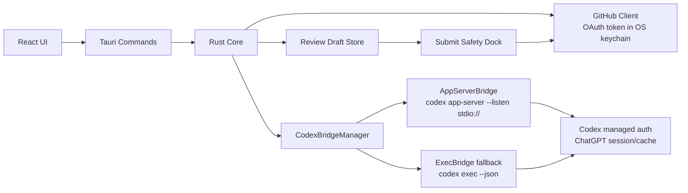
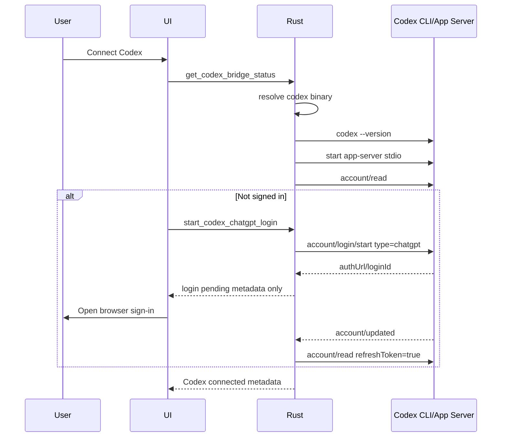
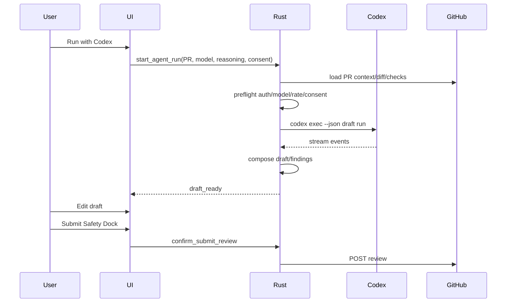

# ReviewDesk PRD 0.0.8

## 1. 문서 정보

- 제품명: ReviewDesk
- 문서명: Codex Managed Auth Bridge & Agent Run Execution
- 버전: 0.0.8
- 작성일: 2026-05-17
- 상태: Implemented and verified
- 이전 기준: `docs/prd/prd-0.0.7.md`
- 핵심 결정: 0.0.8은 ReviewDesk가 ChatGPT OAuth를 직접 구현하지 않고, Codex CLI/App Server의 managed auth와 generation surface를 bridge로 연결한다.
- 구현 결과: Codex app-server stdio bridge로 account/model/rate-limit/login을 연결했고, Agent Run draft generation은 `codex exec --json` 실행 경로로 연결했다.

## 2. 한 줄 정의

ReviewDesk 0.0.8은 GitHub로 가져온 PR context를 Codex managed auth 기반 Agent Run으로 전달해 AI review draft를 생성하되, ChatGPT token과 Codex auth cache는 ReviewDesk가 절대 소유하지 않는 Rust/Tauri 데스크톱 앱 버전이다.

## 3. 왜 0.0.8이 필요한가

0.0.7은 GitHub browser OAuth와 loopback callback 기반의 인증 UX를 구현했다.

하지만 AI 실행 경로는 아직 실제 Codex/ChatGPT managed auth와 연결되어 있지 않다.

현재 문제:

- `start_codex_chatgpt_login`은 env 기반 placeholder에 가깝다.
- `read_codex_account`, `list_ai_models`, `read_codex_rate_limits`는 실제 Codex App Server가 아니라 환경변수/하드코딩 상태를 본다.
- `generate_review_draft`는 실제 Codex generation이 아니라 mock/blocking provider 경로를 사용한다.
- UI가 `ChatGPT OAuth`를 ReviewDesk가 직접 제공하는 것처럼 보일 수 있다.
- 사용자는 ChatGPT 구독으로 Codex를 연결하고 싶어 하지만, ReviewDesk가 ChatGPT token을 직접 받아오는 방식은 공식 일반 제품 경로가 아니다.

0.0.8의 목표는 AI 품질 튜닝이 아니라, Codex managed auth와 실제 Agent Run 실행 경로를 제품 계약으로 고정하는 것이다.

구현 완료 기준:

- `src/codex_bridge.rs`에 Codex bridge boundary를 분리했다.
- `codex app-server --listen stdio://`로 account/model/rate-limit/login metadata를 조회한다.
- `codex exec --json --ephemeral --sandbox read-only`로 Agent Run draft를 생성한다.
- ReviewDesk는 ChatGPT token, Codex token, `~/.codex/auth.json` 원문을 읽거나 저장하지 않는다.
- 검증 문서는 `docs/verification/reviewdesk-tauri-0.0.8.md`에 기록했다.

## 4. 공식 근거

OpenAI Codex 공식 문서 기준:

- Codex는 OpenAI 모델 사용 인증 방식으로 `Sign in with ChatGPT`와 `Sign in with an API key`를 구분한다.
- Codex Cloud는 ChatGPT sign-in을 요구하고, Codex CLI/IDE Extension은 ChatGPT sign-in과 API key sign-in을 모두 지원한다.
- Codex login 정보는 로컬 `~/.codex/auth.json` 또는 OS credential store에 캐시될 수 있다.
- ChatGPT sign-in 세션은 Codex가 사용 중 token refresh를 처리한다.
- `codex login`은 ChatGPT OAuth, device auth, API key stdin을 지원한다.
- `codex app-server`는 local development/debugging용 experimental surface이며 `stdio://`, `unix://`, `ws://IP:PORT` listener를 지원한다.
- `codex exec --json`은 non-interactive execution의 JSONL event stream을 제공한다.

참고:

- Codex Authentication: https://developers.openai.com/codex/auth
- Codex CLI Reference: https://developers.openai.com/codex/cli/reference
- Codex App Server: https://developers.openai.com/codex/cli/reference#codex-app-server
- Codex Non-interactive Mode: https://developers.openai.com/codex/noninteractive

## 5. 에이전트 검토 결론

4개 관점의 에이전트가 0.0.8 방향을 검토했다.

### 5.1 Product / UX Agent

판정:

- 0.0.8은 `ChatGPT OAuth 구현`이 아니라 `Codex Bridge 연결` PRD여야 한다.
- UI 용어는 `Connect ChatGPT OAuth`보다 `Connect Codex`, `Sign in with Codex`, `Codex login required`가 맞다.
- Codex는 기본 모드에서 App Shell gate가 아니라 Agent Run gate다.
- GitHub connected + Codex missing 상태에서는 Inbox, Diff, Manual Draft, Submit을 계속 허용한다.
- Strict Auth Mode에서만 Codex missing 상태로 App Shell 진입을 막는다.

PRD 반영:

- Setup/Settings/Agent Runs에 Codex bridge 상태를 명확히 표시한다.
- `Continue without AI`는 유지한다.
- fake success, hardcoded model list, raw stdout/stderr dump를 금지한다.

### 5.2 Security / Auth Agent

판정:

- ReviewDesk는 ChatGPT OAuth access token, refresh token, API key, Codex access token을 직접 소유하지 않는다.
- `~/.codex/auth.json`은 Codex private storage이며 ReviewDesk는 열람, 복사, 수정, 삭제하지 않는다.
- `chatgptAuthTokens`는 host app이 ChatGPT auth lifecycle을 직접 소유할 때의 experimental mode이므로 0.0.8 목표와 충돌한다.
- process spawning은 shell 없이 absolute binary + fixed args + env allowlist로 제한해야 한다.

PRD 반영:

- token boundary, `auth.json` 금지, process spawn 정책, prompt/diff 전송 동의, log redaction을 P0로 올린다.

### 5.3 Rust / Tauri Agent

판정:

- P0 기본 경로는 `codex app-server --listen stdio://` JSON-RPC bridge다.
- `codex exec --json`은 0.0.8에서 단발 draft generation 실행 경로로 사용한다.
- `codex login status/login`은 제품 source of truth라기보다 로컬 진단/복구용으로 사용한다.
- `commands.rs`가 커졌으므로 Codex bridge는 별도 module로 분리해야 한다.

PRD 반영:

- `CodexBridge` trait, `AppServerBridge`, `ExecBridge`, `CodexBridgeManager`를 정의한다.
- Tauri command는 얇게 유지하고 process/RPC/parser/model mapping은 bridge module이 소유한다.

### 5.4 QA / Acceptance Agent

판정:

- `authMode=chatgpt`만 ChatGPT 구독 기반 AI review 실행 가능 상태로 인정한다.
- `authMode=apikey`, `chatgptAuthTokens`는 기본 UX에서 차단하고 별도 사유를 표시한다.
- `account/read`, `account/updated`, `model/list`, `rateLimits/read`, generation stream 실패를 독립적으로 검증해야 한다.
- 실제 ChatGPT 로그인은 manual E2E, CI는 fake JSON-RPC app-server fixture로 검증해야 한다.

PRD 반영:

- Codex runtime, account state, model list, rate limit, generation, security, UX gate, regression test matrix를 추가한다.

## 6. 제품 결정

### 6.1 Codex는 AI Agent Run gate

기본 모드:

- GitHub missing: App Shell 차단
- GitHub connected + Codex missing: App Shell 허용, Agent Run만 차단
- GitHub connected + Codex connected: Agent Run preflight 통과 시 AI draft 생성 가능

Strict Auth Mode:

- GitHub와 Codex ChatGPT가 모두 connected일 때만 App Shell 진입

### 6.2 ReviewDesk는 ChatGPT OAuth provider가 아니다

ReviewDesk가 하지 않는 것:

- ChatGPT OAuth URL 직접 생성
- ChatGPT access token 수신
- ChatGPT refresh token 저장
- ChatGPT token refresh 구현
- `~/.codex/auth.json` 직접 읽기
- ChatGPT cookie/session scraping
- API key 입력을 기본 UX로 제공
- `chatgptAuthTokens` 일반 사용자 UX 제공

ReviewDesk가 하는 것:

- Codex CLI/App Server 설치/버전/상태 확인
- Codex App Server account/model/rate-limit metadata 조회
- PR context를 Codex Agent Run 입력으로 전달
- Codex 결과를 ReviewDesk draft로 변환
- Submit Safety Dock을 통해 사용자가 직접 GitHub review 제출

### 6.3 authMode 정책

| authMode | 0.0.8 처리 |
| --- | --- |
| `chatgpt` | AI review 실행 가능 후보 |
| `apikey` | 기본 UX에서 차단, `ChatGPT sign-in required` 표시 |
| `chatgptAuthTokens` | 금지, ReviewDesk가 token lifecycle을 직접 소유하지 않음 |
| unknown/null | Agent Run 차단 |

## 7. 시스템 아키텍처



### 7.1 기본 경로: AppServerBridge

P0 기본 경로는 `codex app-server --listen stdio://`다.

역할:

- Codex account 상태 조회
- ChatGPT login start/pending/completed 감지
- model list 조회
- rate-limit snapshot 조회
- Agent Run thread/turn 시작
- streamed event 수신
- cancellation/interrupt 처리

0.0.8 구현 메모:

- account/model/rate-limit/login은 app-server stdio JSON-RPC를 사용한다.
- 앱 생명주기 전체에 걸친 long-lived app-server process pool은 아직 두지 않았다.
- generation streaming은 현재 `codex exec --json` 경로를 사용하며, app-server `thread/start` + `turn/start` streaming 전환은 다음 버전의 교체 가능한 내부 구현으로 남긴다.

### 7.2 fallback 경로: ExecBridge

0.0.8 generation 경로는 `codex exec --json --ephemeral --sandbox read-only`다.

역할:

- app-server가 불가할 때 단발 AI draft 생성
- JSONL event stream 파싱
- output schema 기반 draft 변환

제약:

- account/model/rate-limit UX는 app-server를 사용하므로 fake model list를 쓰지 않는다.
- desktop streaming/cancel UX가 제한된다.
- `codex login status`는 사람이 읽는 출력이므로 제품 상태 source of truth로 과신하지 않는다.

### 7.3 금지 경로

- non-loopback WebSocket app-server 기본 노출
- Tauri broad `shell`, `process`, `http`, `websocket`, `fs` permission 추가
- shell 문자열 기반 process 실행
- ReviewDesk가 Codex auth cache 파일을 열람하는 방식

## 8. 주요 사용자 흐름

### 8.1 Codex 연결



### 8.2 AI Review 실행



## 9. 화면 요구사항

### 9.1 Startup Auth Gate

GitHub card:

- 0.0.7 browser OAuth 상태 유지

Codex card:

- `codex_cli_missing`
- `codex_version_unsupported`
- `codex_login_required`
- `codex_login_pending`
- `codex_connected`
- `codex_auth_mode_unsupported`
- `codex_app_server_unavailable`
- `codex_exec_unavailable`

CTA:

- `Connect Codex`
- `Refresh Codex status`
- `Choose Codex binary`
- `Use Codex CLI login`
- `Continue without AI`

### 9.2 Settings > Connections

표시 항목:

- Codex binary path
- Codex CLI version
- bridge transport: `app-server`, `exec`, `unavailable`
- initialized 여부
- authMode
- account label / workspace / plan type, 제공되는 경우
- last checked time
- model list sync status
- rate-limit status

### 9.3 Agent Runs

실행 전:

- selected PR
- transmitted diff scope
- selected model
- reasoning effort
- private diff consent
- blocked reason

실행 중:

- run id
- bridge mode
- cancellable progress
- sanitized event summary

완료:

- AI draft
- findings/checklist
- confidence if available
- run metadata
- Submit Safety Dock 연결

### 9.4 Diagnostics

보여줄 수 있는 정보:

- `codex --version`
- `codex login status`의 sanitized summary
- app-server startup status
- account/model/rate-limit query status
- JSON parser error category
- process exit code

보여주면 안 되는 정보:

- raw `~/.codex/auth.json`
- raw token
- raw OAuth response
- raw auth URL query
- raw app-server transcript
- raw diff/prompt unless user explicitly exports diagnostics and redaction passes

## 10. Codex Bridge 계약

### 10.1 CodexBridge trait

```rust
trait CodexBridge {
    async fn status(&self) -> CodexBridgeStatus;
    async fn start_login(&self, mode: CodexLoginMode) -> Result<CodexLoginStart>;
    async fn read_account(&self, refresh: bool) -> Result<CodexAccountStatus>;
    async fn list_models(&self) -> Result<Vec<CodexModel>>;
    async fn read_rate_limits(&self) -> Result<CodexRateLimitSnapshot>;
    async fn start_agent_run(&self, input: CodexReviewInput) -> Result<CodexRunId>;
    async fn read_agent_run(&self, run_id: CodexRunId) -> Result<CodexRunView>;
    async fn cancel_agent_run(&self, run_id: CodexRunId) -> Result<CodexRunView>;
}
```

### 10.2 Tauri commands

P0:

| Command | 역할 | 위험도 |
| --- | --- | --- |
| `get_codex_bridge_status` | codex binary/version/transport 상태 조회 | read-only |
| `start_codex_chatgpt_login` | Codex ChatGPT login 시작 | opens external |
| `poll_codex_chatgpt_login` | login 완료/실패 상태 확인 | read-only |
| `cancel_codex_chatgpt_login` | pending login 취소 | writes local |
| `read_codex_account` | Codex account metadata 조회 | read-only |
| `list_ai_models` | Codex model capability 조회 | read-only |
| `read_codex_rate_limits` | rate limit 조회 | read-only |
| `refresh_ai_account_status` | account/model/rate-limit refresh | read-only |
| `logout_codex_chatgpt` | Codex logout 요청 | writes local |
| `start_agent_run` | AI review run 시작 | writes local |
| `read_agent_run` | run 상태/draft 조회 | read-only |
| `cancel_agent_run` | run 중단 | writes local |

호환 wrapper:

- `generate_review_draft`는 내부적으로 `start_agent_run` 후 completion까지 기다리는 wrapper로 유지할 수 있다.

### 10.3 Status model

```ts
type CodexBridgeTransport = "app_server_stdio" | "exec_json" | "unavailable";

type CodexBlockedReason =
  | "codex_cli_missing"
  | "codex_version_unsupported"
  | "codex_app_server_unavailable"
  | "codex_app_server_handshake_failed"
  | "codex_login_required"
  | "codex_login_pending"
  | "codex_auth_mode_unsupported"
  | "codex_model_list_unavailable"
  | "codex_rate_limited"
  | "codex_credits_depleted"
  | "codex_generation_failed"
  | "codex_generation_interrupted"
  | "codex_tool_use_not_allowed"
  | "private_diff_consent_required";
```

## 11. Process 관리

P0 요구:

- `tokio::process::Command`로 직접 실행한다.
- shell 문자열 실행 금지.
- absolute Codex binary path를 resolve하고 version probe를 수행한다.
- child process env는 allowlist 방식으로 전달한다.
- GitHub token, OpenAI API key, arbitrary `*_TOKEN`은 기본 전달하지 않는다.
- stdout/stderr는 동시에 drain한다.
- stderr는 bounded buffer + secret masking 후 diagnostics에만 사용한다.
- app-server는 앱 생명주기당 하나만 유지한다.
- startup timeout: 10초
- account/model/rate-limit request timeout: 30초
- generation timeout: PRD 구현 시 config로 두되 기본 10분 이하
- cancel grace: 3-5초 후 kill
- app 종료 시 child cleanup

## 12. JSON-RPC / JSONL 파싱

AppServerBridge:

- newline-delimited JSON-RPC
- `id`가 있으면 response/server request
- `method`만 있으면 notification
- pending map: `id -> oneshot`
- notification event bus
- unknown method는 safe error
- command/file approval request는 0.0.8에서 decline
- `account/chatgptAuthTokens/refresh` 요청은 unsupported

ExecBridge:

- `codex exec --json` stdout JSONL stream
- `thread.started`, `turn.started`, `item.*`, `turn.completed`, `turn.failed`, `error` 파싱
- unknown event는 `Raw(Value)`로 보존하되 UI/log에는 sanitized summary만 노출

## 13. Model / Reasoning 정책

- model list source of truth는 Codex App Server `model/list`.
- hardcoded GPT model list는 제거한다.
- `hidden=true` 모델은 기본 picker에서 숨긴다.
- `available=false` 모델은 선택 불가.
- `upgrade` 또는 unavailable reason은 disabled explanation으로 표시.
- `supportedReasoningEfforts`만 선택 가능.
- `defaultReasoningEffort`를 기본값으로 사용.
- `minimal`, `low`, `medium`, `high`, `xhigh`를 지원하거나 future-proof string enum으로 확장한다.
- selected model이 사라지면 자동 실행하지 않고 `model_unavailable`로 차단한다.

## 14. Prompt / Diff 전송 동의

Agent Run 전에 사용자에게 명시해야 할 전송 범위:

- PR metadata
- selected files / selected hunks
- changed file summary
- existing comments/checks summary
- ReviewDesk review prompt
- selected model/reasoning
- repo rule config 중 필요한 부분

private repo 정책:

- 명시 동의 전 Codex 전송 금지
- 동의 snapshot 저장
- snapshot key: repo, PR number, head sha, diff hash, account hash, authMode, model, transmitted scope, timestamp
- scope/model/account/authMode 변경 시 재동의

## 15. Security Boundary

ReviewDesk가 절대 저장/표시하지 않는 것:

- ChatGPT access token
- ChatGPT refresh token
- Codex access token
- OpenAI API key
- `~/.codex/auth.json` 원문
- Authorization header
- raw OAuth response
- raw auth URL query
- raw app-server transcript

ReviewDesk가 저장할 수 있는 것:

- account id hash
- display label
- workspace label
- authMode
- model id
- reasoning effort
- run id
- diff hash
- consent snapshot
- sanitized blocked reason
- generated draft

## 16. 비범위

0.0.8에서 하지 않는다.

- ReviewDesk 자체 ChatGPT OAuth 구현
- ChatGPT cookie/session scraping
- ChatGPT token paste/import
- API key 기본 UX
- `~/.codex/auth.json` 읽기/수정/삭제
- GitHub inline comment submit
- auto-submit
- background queue
- local command/file-change approval 자동 승인
- non-loopback app-server WebSocket production 사용

## 17. 테스트 매트릭스

| 영역 | 시나리오 | 기대 결과 |
| --- | --- | --- |
| Codex runtime | codex 없음 | `codex_cli_missing`, install/select binary CTA |
| Codex runtime | version unsupported | `codex_version_unsupported` |
| App Server | startup 실패 | exec fallback 또는 `codex_app_server_unavailable` |
| App Server | handshake 실패 | retry/diagnostics, token 미노출 |
| Account | `authMode=chatgpt` | AI Run preflight 후보 |
| Account | `authMode=apikey` | `codex_auth_mode_unsupported` |
| Account | `chatgptAuthTokens` | 차단 |
| Login | browser success | account refresh 후 connected |
| Login | cancel/timeout/error | pending 해제, retry CTA |
| Model | hidden model | picker에서 제외 |
| Model | unavailable model | 선택 불가 |
| Reasoning | unsupported effort | Run 차단 |
| Rate limit | limited/credits depleted | queued 금지, reset time 표시 |
| Generation | private diff without consent | 전송 차단 |
| Generation | stream interrupted | partial draft ready 금지 |
| Generation | tool/file approval request | decline/block |
| Security | token-like output | UI/log/report/run 저장 차단 또는 redaction |
| Tauri | command permission | allowlist/capability 동기화 |

## 18. 로컬 개발 검증

사전 확인:

```bash
codex --version
codex login status
codex app-server --help
codex exec --help
```

로그인이 필요하면:

```bash
codex login
```

device fallback:

```bash
codex login --device-auth
```

자동 검증:

```bash
cargo fmt --check
cargo test
npm test -- --run
npm run build
cargo check --manifest-path src-tauri/Cargo.toml
```

신규 targeted tests:

- `codex_app_server_bridge_tests`
- `codex_auth_state_tests`
- `codex_generation_stream_tests`
- `codex_process_tests`
- `security_redaction_tests`
- `tauri_shell_tests`

수동 E2E:

1. `codex login status`가 `Logged in using ChatGPT`인지 확인
2. `REVIEWDESK_GITHUB_CLIENT_ID`가 설정되어 있는지 확인
3. `npm run desktop`
4. GitHub 연결
   - browser OAuth URL이 열려야 한다.
   - 인증 완료 후 UI는 `poll_github_oauth`와 `refresh_github_auth_status`로 connected 상태를 갱신해야 한다.
   - `github_client_id_missing`이 보이면 GitHub OAuth App client id가 설정되지 않은 것이다.
5. PR 선택
6. private diff consent
7. `Run with Codex`
   - Codex 로그인은 ReviewDesk 자체 ChatGPT OAuth가 아니라 Codex managed auth flow로 시작한다.
   - 인증 완료 후 UI는 `poll_codex_chatgpt_login`과 `refresh_ai_account_status`로 connected 상태를 갱신해야 한다.
8. draft 생성 확인
9. Submit Safety Dock 확인
10. 실제 GitHub 제출은 사용자 확인 후만 수행

## 19. 구현 단계

### Phase 1: Codex Bridge Foundation

- Codex binary resolver
- version probe
- `CodexBridgeStatusView`
- process spawn 정책
- Tauri commands/capability 추가
- diagnostics UI

### Phase 2: AppServerBridge

- `codex app-server --listen stdio://`: 구현됨
- initialize handshake: 구현됨
- JSON-RPC parser: 구현됨
- request id correlation: 구현됨
- notification routing: tolerant parser 수준 구현
- timeout/cancel/child cleanup: one-shot process timeout 구현

### Phase 3: Account / Model / Rate-limit

- account read/updated
- login start/poll/cancel
- model list mapping
- reasoning effort mapping
- rate-limit snapshot
- hardcoded model list 제거

### Phase 4: Agent Run Execution

- ReviewInput to Codex prompt: 구현됨
- thread/start + turn/start: 다음 버전 long-lived app-server streaming 전환 후보
- `codex exec --json` stream parser: 구현됨
- draft composer: 구현됨
- run metadata: 구현됨
- cancel/read agent run command: 구현됨
- exec fallback 실험: 제품 경로로 연결됨

### Phase 5: Security / QA

- token redaction
- no `auth.json` access static test
- process env allowlist
- private diff consent snapshot
- fake app-server fixtures
- screenshot/UX matrix
- verification doc

## 20. 수용 기준

P0:

- ReviewDesk는 직접 ChatGPT OAuth를 구현하지 않는다.
- ReviewDesk는 `~/.codex/auth.json`을 읽지 않는다.
- Codex App Server stdio bridge가 account/model/rate-limit/login source of truth다.
- GitHub connected + Codex missing 기본 모드에서 App Shell은 계속 사용 가능하다.
- Strict Auth Mode는 GitHub + Codex connected를 모두 요구한다.
- `authMode=chatgpt`만 Agent Run 가능 후보로 인정한다.
- `model/list`가 없으면 hardcoded selector를 보여주지 않는다.
- private diff는 명시 동의 전 Codex로 전송하지 않는다.
- Agent Run은 Codex output을 ReviewDesk draft로 저장할 뿐 GitHub에 자동 제출하지 않는다.
- UI/IPC/log/report/run metadata에 token-like 문자열이 노출되지 않는다.
- Tauri broad shell/process/http/fs/websocket 권한을 열지 않는다.

P1:

- long-lived app-server `thread/start` + `turn/start` streaming 지원
- `Choose Codex binary`
- detailed diagnostics export
- app-server schema compatibility check
- model capability cache
- rate-limit updated notification handling

## 21. 남은 리스크

| 리스크 | 영향 | 대응 |
| --- | --- | --- |
| Codex App Server가 experimental | API 변경 가능 | bridge abstraction, schema/version check |
| ChatGPT login 상태를 직접 제어하지 않음 | UX가 Codex CLI에 의존 | diagnostics와 clear recovery CTA |
| `codex exec` 출력 구조 변경 | fallback 취약 | JSONL parser tolerant design |
| private diff가 ChatGPT/Codex로 전송됨 | 회사 코드 보안 리스크 | explicit consent, masking, denylist |
| app-server process leak | 리소스/보안 문제 | lifecycle cleanup, timeout, kill grace |
| model/rate-limit source unavailable | Agent Run 혼란 | fake selector 금지, blocked reason |
| generation이 app-server turn이 아닌 exec JSONL 경로 | streaming/cancel 세밀도 제한 | bridge 내부 구현 교체로 long-lived app-server turn lifecycle 전환 |

## 22. 최종 판정

0.0.8은 `ChatGPT OAuth 버튼을 고치는 버전`이 아니다.

0.0.8은 ReviewDesk의 AI 실행 경계를 Codex managed auth 위로 옮기는 버전이다.

핵심은 다음이다.

- GitHub는 ReviewDesk가 직접 OAuth token을 관리한다.
- ChatGPT/Codex는 Codex가 managed auth를 관리한다.
- ReviewDesk는 Codex를 process/RPC bridge로 호출한다.
- ReviewDesk는 PR context와 draft workflow를 관리한다.
- AI 결과는 반드시 draft-first, user-submit workflow를 거친다.
- token boundary와 private diff consent가 제품의 핵심 안전장치다.
