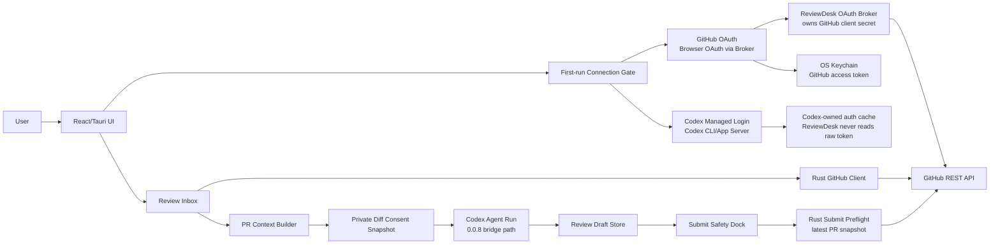
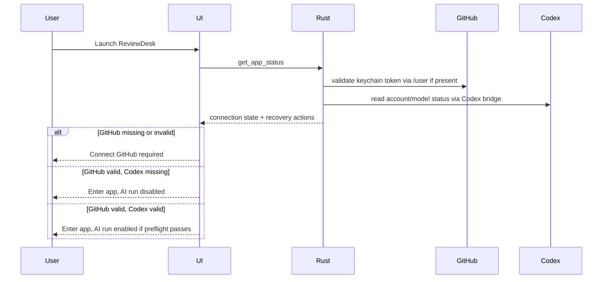
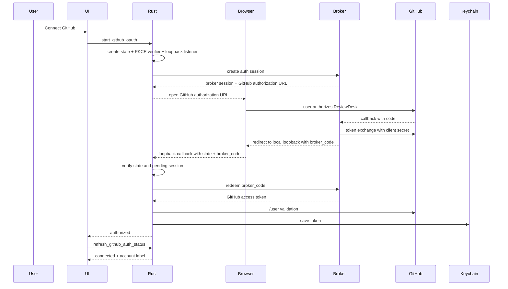
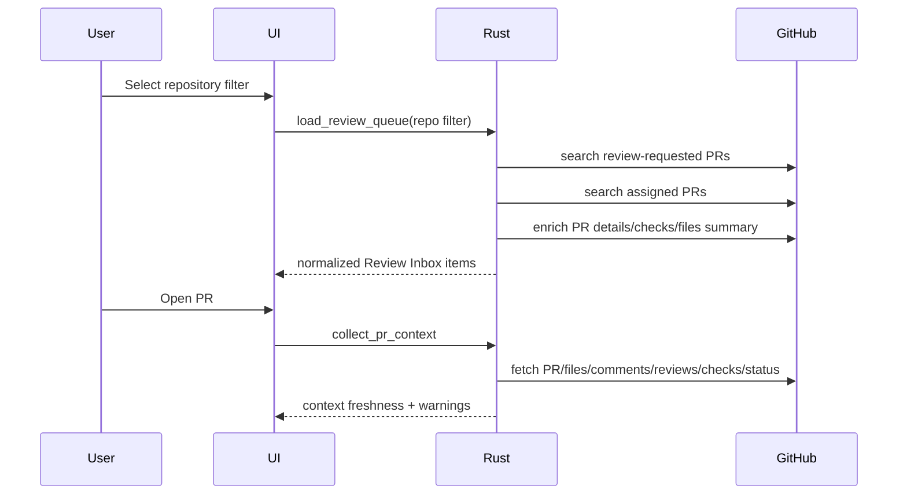
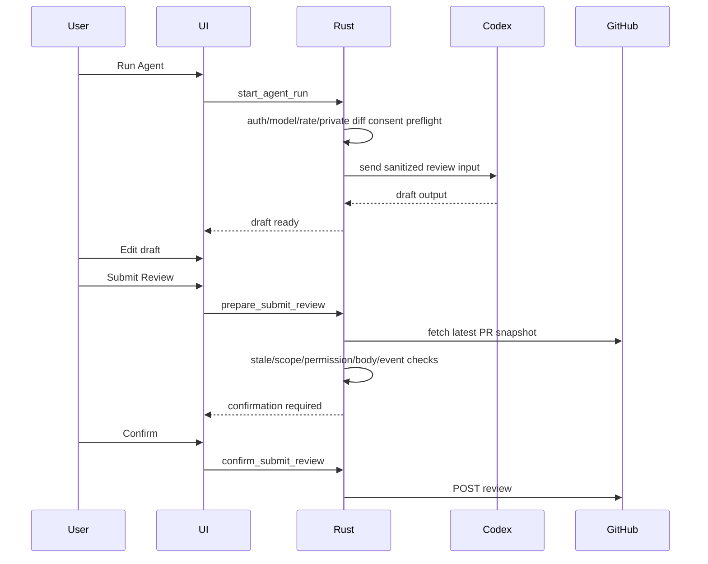

# ReviewDesk PRD 0.0.9

## 1. 문서 정보

- 제품명: ReviewDesk
- 문서명: Release-Ready Connections & GitHub Review Workflow
- 버전: 0.0.9
- 작성일: 2026-05-17
- 상태: Implemented and verification passed
- 이전 기준: `docs/prd/prd-0.0.8.md`
- 핵심 결정: 0.0.9는 AI 실행 고도화보다 먼저 GitHub/Codex 연결 신뢰성, GitHub Review Inbox, PR context freshness, Submit Safety Dock preflight를 릴리즈 가능한 수준으로 안정화한다. GitHub browser OAuth UX는 desktop app에 client secret을 넣지 않기 위해 ReviewDesk OAuth Broker를 통해 제공한다.

## 1.1 구현 결과

0.0.9 구현 완료 항목:

- GitHub browser OAuth를 HTTPS broker redirect + loopback `broker_code` redeem 흐름으로 변경했다.
- keychain token 존재가 아니라 GitHub `/user` 검증 결과로 GitHub connected 상태를 판정한다.
- repo list와 review-requested/assigned Review Inbox query를 0.0.9 계약에 맞게 정규화하고 pagination을 적용했다.
- PR context view를 `pr`, `files`, `conversation`, `ci`, `freshness`, `diff_hash`, `context_hash`, `ai_input` 중심의 typed payload로 확장했다.
- stale 상태와 submit preflight 차단 사유를 release reason code로 정규화했다.
- Submit Safety Dock에서 preflight 후 `confirm_submit_review`를 호출해 최신 PR snapshot 기준으로 top-level GitHub review를 제출하도록 연결했다.
- React UI 타입, demo payload, i18n key inventory, Tauri bundle metadata, setup/security 문서를 0.0.9 기준으로 갱신했다.

검증 결과는 `docs/verification/reviewdesk-tauri-0.0.9.md`에 기록했다.

## 2. 한 줄 정의

ReviewDesk 0.0.9는 GitHub/Codex 연결 상태를 사용자가 신뢰할 수 있는 제품 경험으로 안정화하고, 실제 GitHub repo/PR queue/context/stale/submit preflight를 하나의 안전한 리뷰 워크플로우로 묶는 Rust/Tauri 데스크톱 앱 버전이다.

## 3. 왜 0.0.9가 필요한가

0.0.8은 ReviewDesk가 ChatGPT OAuth를 직접 구현하지 않고 Codex CLI/App Server managed auth를 bridge로 사용하는 경계를 확정했다. 또한 GitHub OAuth 후 PR context를 Codex Agent Run으로 전달해 draft를 만들 수 있는 실행 경로를 열었다.

하지만 실제 사용 관점에서는 아직 다음 문제가 남아 있다.

- GitHub OAuth 인증이 완료되어도 UI가 즉시 connected 상태로 보이지 않으면 사용자는 실패로 인식한다.
- GitHub browser OAuth, GitHub device flow, Codex managed login의 차이가 명확히 설명되지 않으면 사용자가 어떤 인증을 끝낸 것인지 알기 어렵다.
- GitHub OAuth App web flow는 token exchange에 client secret이 필요하므로 desktop app 단독으로 browser OAuth를 안전하게 기본 제공할 수 없다.
- keychain에 token이 존재한다는 사실과 GitHub API에서 실제로 유효한 token이라는 사실이 분리되어 있지 않다.
- repo 선택, review-requested/assigned PR queue, CI 상태, changed files, stale 여부가 하나의 신뢰 가능한 Review Inbox로 묶여 있지 않다.
- PR context에 `patch` 누락, 대형 diff, comments/reviews/checks 요약 누락이 있으면 AI가 실제보다 많은 맥락을 봤다고 오판할 수 있다.
- Submit Safety Dock은 head SHA/stale/permission/scope/SSO 문제를 제출 직전에 확실히 차단해야 한다.
- 실제 GitHub OAuth, 실제 Codex account/model, 실제 public/private PR, packaged app 기준 E2E 검증이 아직 릴리즈 게이트가 아니다.

0.0.9의 목표는 새 AI 기능을 늘리는 것이 아니라, 사용자가 매일 켜서 쓸 수 있는 연결/리뷰/제출 흐름을 단단히 만드는 것이다.

## 4. 에이전트 토론 결론

0.0.9 방향은 5개 관점의 에이전트 토론 결과를 종합해 결정했다.

### 4.1 Product / UX Agent

판정:

- 첫 실행 연결 UX와 실패 복구가 최우선이다.
- `github_client_id_missing`, `codex_chatgpt_auth_required`, `model_list_unavailable` 같은 내부 상태 문자열은 사용자에게 그대로 보이면 안 된다.
- GitHub 연결과 Codex 연결은 목적과 소유 주체가 다르므로 first-run, Settings, Agent Run에서 같은 언어로 설명되어야 한다.

PRD 반영:

- First-run Connection Gate를 P0로 둔다.
- 모든 연결 상태는 "현재 상태, 사용자가 할 수 있는 다음 행동, 실패 이유"를 함께 보여준다.
- GitHub는 ReviewDesk OAuth, Codex는 Codex managed login이라고 명확히 구분한다.

### 4.2 Auth / Security Agent

판정:

- GitHub `client_secret`은 데스크톱 앱 번들, UI 입력, 로그, diagnostics에 포함되면 안 된다.
- keychain entry 존재만으로 connected로 판정하면 안 된다.
- token-like 문자열은 UI, log, report, draft, diagnostics export 전체에서 redaction되어야 한다.
- private diff consent는 repo/PR/head SHA/diff hash/account/model/scope 기준 snapshot이어야 한다.

PRD 반영:

- GitHub OAuth는 ReviewDesk OAuth Broker가 client secret을 소유하는 browser OAuth를 기본 UX로 한다.
- device flow는 broker를 사용할 수 없는 개발/복구 fallback으로 둔다.
- GitHub token state를 `missing`, `present_unverified`, `valid`, `invalid_or_revoked`, `github_scope_insufficient`, `github_sso_required`, `keychain_unavailable`로 분리한다.
- private diff consent snapshot contract를 P0로 정의한다.

### 4.3 GitHub Workflow Agent

판정:

- 다음 제품 가치는 GitHub Review Inbox와 submit safety를 실제 GitHub workflow 수준으로 끌어올리는 것이다.
- repo picker, review-requested/assigned queue, PR context integrity, CI/check rollup, stale detection, submit preflight가 같은 계약을 공유해야 한다.
- inline comments, auto-submit, background queue는 아직 이르다.

PRD 반영:

- Review Inbox를 첫 화면의 중심 작업 공간으로 둔다.
- queue item은 review reason, CI rollup, changed files, draft 여부, updated time을 포함한다.
- submit preflight는 UI가 아니라 Rust core가 최신 GitHub snapshot을 다시 가져와 결정한다.

### 4.4 AI / Codex Agent

판정:

- long-lived Codex app-server Agent Run lifecycle, streaming, real cancel은 중요하다.
- 다만 현재 병목은 AI panel의 화려함이 아니라 연결, PR context, consent, submit safety의 신뢰성이다.
- Agent Run 고도화는 0.1.0 후보로 두는 것이 현실적이다.

PRD 반영:

- 0.0.9에서 Codex는 기존 0.0.8 boundary를 유지한다.
- model/reasoning 선택과 private diff consent는 submit/review workflow의 preflight와 일관되게 연결한다.
- long-lived app-server turn lifecycle은 P1/future로 명시한다.

### 4.5 QA / Release Agent

판정:

- 자동 단위/계약 테스트는 충분히 늘었지만, 실제 OAuth와 packaged app E2E 검증이 릴리즈 기준으로 묶여 있지 않다.
- 0.0.9는 기능 PRD이면서 동시에 release-grade verification PRD여야 한다.

PRD 반영:

- dev Tauri와 packaged app에서 GitHub OAuth, Codex status/model, public/private PR happy path를 검증한다.
- token-like 문자열이 로그/문서/저장물에 남지 않는지 자동/수동 검증한다.
- broad Tauri permission 추가는 릴리즈 차단 조건으로 둔다.

## 5. 제품 결정

### 5.1 0.0.9의 중심은 Review Inbox 안정화

ReviewDesk의 실제 사용자 흐름은 다음 순서다.

1. 앱을 실행한다.
2. GitHub와 Codex 연결 상태를 확인한다.
3. GitHub에서 repo를 선택한다.
4. 내가 reviewer로 요청되었거나 assigned 된 열린 PR을 본다.
5. PR context와 diff/CI/comments를 확인한다.
6. 필요하면 Codex Agent Run으로 review draft를 만든다.
7. 사용자가 draft를 수정한다.
8. Submit Safety Dock에서 최종 확인 후 GitHub review를 제출한다.

0.0.9는 이 흐름을 제품의 기본 골격으로 고정한다.

### 5.2 GitHub는 앱 진입 gate, Codex는 AI 실행 gate

기본 모드:

- GitHub missing: App Shell 진입 차단
- GitHub connected + Codex missing: App Shell 진입 허용, Review Inbox/Manual Draft/Submit 가능, AI Agent Run만 차단
- GitHub connected + Codex connected: Agent Run preflight 통과 시 AI draft 생성 가능

Strict Auth Mode:

- GitHub와 Codex가 모두 connected일 때만 App Shell 진입
- 0.0.9에서는 설정 가능 정책으로만 문서화하고 기본값으로 켜지 않는다.

### 5.3 ChatGPT/Codex OAuth 경계 유지

ReviewDesk가 하지 않는 것:

- ChatGPT OAuth URL 직접 생성
- ChatGPT access token 수신
- ChatGPT refresh token 저장
- ChatGPT token refresh 구현
- `~/.codex/auth.json` 직접 읽기
- ChatGPT cookie/session scraping
- API key 입력을 기본 UX로 제공

ReviewDesk가 하는 것:

- Codex CLI/App Server 설치/버전/상태 확인
- Codex managed login 시작 및 상태 polling
- Codex account/model/rate-limit metadata 조회
- 사용자가 선택한 model/reasoning을 Agent Run snapshot에 저장
- Codex 결과를 ReviewDesk draft로 변환

## 6. 시스템 아키텍처



## 7. 핵심 사용자 흐름

### 7.1 앱 시작과 연결 확인



### 7.2 GitHub OAuth



### 7.3 Review Inbox에서 PR 선택



### 7.4 Draft 생성과 제출



## 8. First-run Connection Gate

### 8.1 요구사항

첫 실행 화면은 다음을 보여준다.

- GitHub 연결 상태
- Codex 연결 상태
- 각 연결의 목적
- 각 연결 실패 시 다음 행동
- "AI 없이 계속하기" 가능 여부

GitHub card:

- 앱 사용을 위한 필수 연결
- browser OAuth via ReviewDesk OAuth Broker 기본
- device flow fallback
- 연결 후 account label 표시
- token 유효성 검증 상태 표시

Codex card:

- AI review draft 생성을 위한 선택 연결
- Codex CLI/App Server managed login 사용
- ChatGPT token은 ReviewDesk가 직접 다루지 않는다는 설명
- 모델/추론 깊이 선택은 Codex 연결 후 가능

### 8.2 상태 모델

GitHub states:

| State | 의미 | 사용자 메시지 방향 |
| --- | --- | --- |
| `missing` | token 없음 | GitHub 연결 필요 |
| `browser_oauth_pending` | browser OAuth 진행 중 | 브라우저 인증 완료 대기 |
| `device_oauth_pending` | device flow 진행 중 | GitHub device code 입력 대기 |
| `present_unverified` | keychain token 존재, 아직 검증 안 됨 | 연결 확인 중 |
| `valid` | `/user` 검증 성공 | 연결됨 |
| `invalid_or_revoked` | token 폐기/만료 | 다시 연결 필요 |
| `github_scope_insufficient` | scope 부족 | 권한 재승인 필요 |
| `github_sso_required` | org SSO 승인 필요 | GitHub에서 SSO 승인 필요 |
| `keychain_unavailable` | OS keychain 접근 실패 | 로컬 credential 저장소 확인 필요 |
| `github_rate_limited` | GitHub API rate limit | 잠시 후 재시도 |

Codex states:

| State | 의미 | 사용자 메시지 방향 |
| --- | --- | --- |
| `codex_cli_missing` | Codex CLI 없음 | Codex 설치/경로 선택 필요 |
| `codex_app_server_unavailable` | app-server 연결 실패 | Codex 상태 새로고침 또는 CLI login 사용 |
| `codex_login_required` | 로그인 필요 | Codex 로그인 시작 |
| `codex_login_pending` | 로그인 진행 중 | 브라우저 인증 완료 대기 |
| `codex_connected` | ChatGPT authMode 연결됨 | AI review 가능 후보 |
| `codex_auth_mode_unsupported` | API key/unknown mode | ChatGPT sign-in 필요 |
| `codex_model_list_unavailable` | 모델 목록 조회 실패 | 모델 새로고침 필요 |
| `codex_rate_limited` | rate limit/credit 문제 | reset time 확인 |

### 8.3 UX 수용 기준

- 내부 상태 문자열을 그대로 표시하지 않는다.
- 각 card에는 status, explanation, primary CTA, secondary CTA가 있다.
- GitHub OAuth callback 완료 후 앱 focus/visibility 변경이나 polling으로 connected가 자동 갱신된다.
- Codex login 완료 후 account/model/rate-limit이 자동 갱신된다.
- 사용자가 연결 창을 닫아도 앱은 pending/timeout/retry 상태를 명확히 보여준다.
- 모든 문구는 한국어/영어 i18n key를 가진다.

## 9. GitHub OAuth 안정화

### 9.1 기본 방식

0.0.9의 기본 GitHub 인증 UX는 browser OAuth다. 단, GitHub OAuth App client secret은 desktop app이 아니라 ReviewDesk OAuth Broker가 소유한다.

정책:

- desktop app은 broker public base URL과 GitHub OAuth App client id만 알 수 있다.
- GitHub `client_secret`은 데스크톱 앱 번들, UI 입력, local config, log, diagnostics에 저장하거나 표시하지 않는다.
- broker는 GitHub OAuth App web flow의 token exchange를 수행하고, desktop app에는 one-time broker code redemption으로 token을 전달한다.
- browser OAuth는 high-entropy `state`, PKCE verifier/challenge, loopback redirect URI, broker session id에 묶인다.
- device flow는 broker 사용 불가, callback 제한, 기업 보안 환경, 개발 환경용 fallback이다.
- 0.0.9 release gate는 broker-backed browser OAuth와 device flow fallback을 모두 검증한다.

### 9.2 Browser OAuth request binding

desktop app은 `start_github_oauth`에서 다음 값을 생성하고 memory-only pending state로 보관한다.

- `state`: 128-bit 이상 entropy
- PKCE `code_verifier`
- PKCE `code_challenge`
- loopback redirect URI
- broker session id
- requested scope set
- createdAt/expiresAt

검증 규칙:

- loopback callback의 `state`가 pending state와 다르면 즉시 거부한다.
- state mismatch, expired session, duplicate callback, unknown broker code는 token exchange/redeem을 시도하지 않는다.
- OAuth callback raw query는 log/diagnostics/UI에 저장하지 않는다.
- 성공, 실패, timeout, cancel 이후 pending state와 PKCE verifier는 메모리에서 해제한다.
- broker code는 1회성이고 기본 TTL은 60초다.
- broker token redemption은 HTTPS로만 허용한다.

### 9.3 device flow fallback

device flow 요구사항:

- GitHub OAuth App에서 device flow가 활성화되어 있어야 한다.
- user code, verification URL, 만료 시간, polling interval을 UI에 표시한다.
- `authorization_pending`, `slow_down`, `expired_token`, `access_denied`를 구분한다.
- device code/user code/access token은 diagnostics/export에 포함하지 않는다.
- 성공 즉시 token은 keychain으로 이동하고 pending state는 해제한다.

### 9.4 OAuth broker 계약

0.0.9에서 broker는 browser OAuth UX를 안전하게 제공하기 위한 P0 구성요소다. ReviewDesk는 여전히 Rust/Tauri desktop-first 제품이며, broker는 OAuth secret 보호만 담당한다.

broker가 소유하는 것:

- GitHub OAuth App client secret
- GitHub OAuth callback endpoint
- authorization code token exchange
- one-time broker code 발급/폐기
- sanitized auth failure reason

broker가 저장하면 안 되는 것:

- 장기 보관 GitHub access token
- raw private repo diff
- Codex/ChatGPT token
- desktop local keychain data

desktop app이 소유하는 것:

- broker session id
- OAuth pending state
- broker code redemption
- GitHub token OS keychain 저장
- GitHub `/user` 검증

### 9.5 GitHub OAuth scope policy

0.0.9 기본 요청 scope:

| Mode | Scope | 용도 |
| --- | --- | --- |
| Public-only diagnostic | `read:user public_repo` | public repo queue/context/submit 검증 |
| Default work mode | `read:user repo` | private repo review queue, context, top-level review submit |
| Org/team extension | `read:user repo read:org` | team review request, org/team metadata, SSO 진단 |

정책:

- 0.0.9의 기본 제품 모드는 `read:user repo`다.
- 사용자가 public-only mode를 선택하면 private repo는 명확히 비활성화한다.
- team review request는 0.0.9 P1이며, `read:org` 없이 direct user review request만 처리한다.
- scope 변경이 필요하면 reauthorization을 요구한다.
- token 검증 시 실제 granted scopes를 저장된 requested scope와 비교해 `github_scope_insufficient`를 판정한다.

## 10. Keychain / Token Validity

### 10.1 원칙

keychain에 token이 있다는 사실은 connected가 아니다. connected는 GitHub API 검증까지 통과한 상태다.

### 10.2 검증 계약

앱 시작, focus 복귀, 수동 refresh, OAuth 완료 후 다음을 수행한다.

1. keychain에서 GitHub token 존재 여부 확인
2. 존재하면 `/user` 또는 동등한 lightweight endpoint로 검증
3. 필요한 경우 selected repo 접근 검증
4. scope/SSO/rate-limit 오류를 normalized state로 변환
5. UI에 account label과 last checked time 표시

### 10.3 logout

- keychain delete 성공과 no-entry는 모두 logout 성공으로 본다.
- keychain delete 실패는 `keychain_unavailable` 또는 `credential_delete_failed`로 표시한다.
- logout 후 in-memory token, pending OAuth state, repo cache는 해제한다.

### 10.4 GitHub permission / error matrix

| Operation | Endpoint | Required capability | Normalized failures |
| --- | --- | --- | --- |
| Account validation | `GET /user` | valid OAuth token | `github_auth_required`, `github_rate_limited`, `github_network_error` |
| Repo listing | `GET /user/repos` | `public_repo` for public, `repo` for private | `github_scope_insufficient`, `github_sso_required`, `github_rate_limited` |
| Repo validation | `GET /repos/{owner}/{repo}` | repo read access | `repo_not_found_or_no_access`, `github_sso_required` |
| Queue search | `GET /search/issues` | repo visibility and search access | `github_search_incomplete`, `github_search_rate_limited`, `github_scope_insufficient` |
| PR detail | `GET /repos/{owner}/{repo}/pulls/{number}` | pull request read | `pr_not_found_or_no_access`, `github_sso_required` |
| PR files | `GET /repos/{owner}/{repo}/pulls/{number}/files` | contents/pull request read | `github_scope_insufficient`, `partial_fetch` |
| Comments/reviews | PR issue comments, review comments, reviews endpoints | pull request read | `partial_fetch`, `github_rate_limited` |
| Checks/status | check runs and combined status endpoints | checks/status read through repo scope | `ci_unavailable`, `github_scope_insufficient` |
| Submit review | `POST /repos/{owner}/{repo}/pulls/{number}/reviews` | review write permission on repo | `github_scope_insufficient`, `github_sso_required`, `review_permission_denied`, `validation_failed` |

HTTP mapping:

- 401: `github_auth_required`
- 403 with SAML/SSO indication: `github_sso_required`
- 403 with rate limit headers: `github_rate_limited`
- 403 with secondary rate limit message: `github_secondary_rate_limited`
- 403 without write permission: `review_permission_denied`
- 404: operation-specific `*_not_found_or_no_access`
- 422: `validation_failed`
- 5xx/network/timeout: `github_network_error`

## 11. Review Inbox

### 11.1 목적

Review Inbox는 ReviewDesk의 기본 작업 화면이다. 카드/배지 나열이 아니라 리뷰어가 오늘 처리해야 할 PR list를 중심으로 구성한다.

### 11.2 Repo 선택

repo picker 요구사항:

- `All accessible repositories`
- `Selected repositories`
- owner/org filter
- private/public 표시
- recently used repo
- search
- repo 접근 실패 사유 표시

저장 정책:

- repo selection preference는 로컬에 저장할 수 있다.
- GitHub token, raw permission response, private repo diff는 preference에 저장하지 않는다.

### 11.3 Repo API contract

repo listing:

- endpoint: `GET /user/repos`
- query: `visibility=all`, `affiliation=owner,collaborator,organization_member`, `sort=updated`, `per_page=100`, `page=N`
- pagination: `Link` header가 끝날 때까지 또는 configured max page까지 조회
- owner/org filter: `owner.login` 기준 client-side filter
- selected repo validation: `GET /repos/{owner}/{repo}`로 접근 가능 여부와 private/public 상태를 확인
- selected repo permission hint: repo response의 `permissions` field를 우선 사용하고, 없거나 불명확하면 submit preflight에서 실제 review API 권한으로 최종 판단

repo error mapping:

| HTTP / Condition | Normalized error |
| --- | --- |
| 401 | `github_auth_required` |
| 403 missing scope | `github_scope_insufficient` |
| 403 SAML/SSO | `github_sso_required` |
| 403 primary rate limit | `github_rate_limited` |
| 403 secondary rate limit | `github_secondary_rate_limited` |
| 404 selected repo | `repo_not_found_or_no_access` |
| network/timeout | `github_network_error` |

### 11.4 Queue 조회

queue source:

- review requested PRs
- assigned PRs
- open PRs only
- selected repo filter 적용
- team review requests are out of scope in 0.0.9

exact search queries:

- all repos direct review request: `is:pr is:open archived:false user-review-requested:@me`
- all repos assigned: `is:pr is:open archived:false assignee:@me`
- selected repo direct review request: `repo:{owner}/{repo} is:pr is:open archived:false user-review-requested:@me`
- selected repo assigned: `repo:{owner}/{repo} is:pr is:open archived:false assignee:@me`

Search API request:

- endpoint: `GET /search/issues`
- `sort=updated`
- `order=desc`
- `per_page=100`
- `page=N`

pagination:

- review-requested query and assigned query are paginated independently.
- each query iterates `GET /search/issues` pages until `Link` exhaustion or configured max page.
- default max page is 5 per query in 0.0.9 to avoid Search API abuse.
- if one query succeeds and the other fails, queue state is `partial` and rows from the successful query remain visible.
- if a later page fails after earlier pages succeeded, queue state is `partial` and the failed query/page is recorded in diagnostics.
- if both queries fail before any result, queue state is `error`.
- if `incomplete_results=true` on any page, queue state is `partial` with `github_search_incomplete`.

정규화:

- Search API result는 issue 형태이므로 PR detail은 `pull_request.url` 또는 `GET /repos/{owner}/{repo}/pulls/{number}`로 보강한다.
- de-dupe key는 `owner/repo#number`이며, GitHub `node_id`가 있으면 보조 식별자로 저장한다.
- 같은 PR이 review-requested와 assigned 양쪽에 있으면 reason은 `both`다.
- `incomplete_results=true`면 queue state는 `partial`이며 UI는 "일부 결과만 표시됨" warning과 refresh CTA를 보여준다.
- sorting은 `updated_at desc`를 기본으로 하며, risk/CI 우선 정렬은 P1이다.

queue item fields:

- owner/repo
- PR number
- title
- author
- review reason: `review_requested`, `assigned`, `both`
- draft 여부
- changed files count
- additions/deletions
- CI rollup
- last updated
- last synced
- risk hint
- draft status
- stale status

### 11.5 Queue empty/error states

empty state는 다음을 구분한다.

- 실제로 review queue가 비어 있음
- repo filter 때문에 결과가 없음
- GitHub auth 필요
- GitHub scope 부족
- GitHub SSO 승인 필요
- GitHub rate limit
- GitHub 네트워크 오류
- GitHub Search API 지연/불완전 결과

## 12. PR Context Integrity

### 12.1 Context contract

`collect_pr_context`는 typed Tauri IPC response를 반환한다.

```ts
type PullRequestContextView = {
  pr: {
    owner: string;
    repo: string;
    number: number;
    title: string;
    body?: string;
    author: string;
    url: string;
    state: "open" | "closed";
    draft: boolean;
    merged: boolean;
    baseBranch: string;
    headBranch: string;
    baseSha?: string;
    headSha: string;
    labels: string[];
    updatedAt: string;
  };
  files: ChangedFileContext[];
  conversation: ConversationSummary;
  ci: CiRollup;
  freshness: StaleStatus;
  patchCoverage: "complete" | "partial" | "missing";
  diffHash: string;
  contextHash: string;
  collectedAt: string;
  warnings: ContextWarning[];
  aiInput: ReviewInputPreview;
};

type ChangedFileContext = {
  path: string;
  status: "added" | "modified" | "removed" | "renamed" | "copied" | "changed" | "unchanged";
  previousPath?: string;
  additions: number;
  deletions: number;
  changes: number;
  patchCoverage: "available" | "missing" | "truncated";
  patchBytes: number;
  patchHash?: string;
  isGenerated: boolean;
  isIgnoredByReviewdesk: boolean;
  aiIncluded: boolean;
  uiOnlyReason?: string;
};

type ConversationSummary = {
  issueCommentCount: number;
  reviewCommentCount: number;
  reviewCount: number;
  summaries: Array<{
    kind: "issue_comment" | "review" | "review_comment";
    author: string;
    createdAt: string;
    updatedAt?: string;
    bodySummary: string;
    unresolved: "yes" | "no" | "unknown";
    aiIncluded: boolean;
  }>;
  truncated: boolean;
};

type CiRollup = {
  state: "success" | "pending" | "failure" | "cancelled" | "skipped" | "neutral" | "unknown";
  source: "checks" | "statuses" | "both" | "checks_partial" | "unavailable";
  failingNames: string[];
  pendingCount: number;
  latestCompletedAt?: string;
  warnings: string[];
};

type ContextWarning =
  | "patch_unavailable"
  | "patch_truncated"
  | "partial_fetch"
  | "unresolved_unknown"
  | "context_stale"
  | "ci_unavailable";

type ReviewInputPreview = {
  transmittedScope: "metadata_only" | "summary_only" | "selected_patches" | "full_allowed_context";
  includedFileCount: number;
  excludedFileCount: number;
  totalPatchBytes: number;
  redactionPassed: boolean;
  privateDiffConsentRequired: boolean;
};
```

pagination and size policy:

- PR files endpoint is read with `per_page=100` and paginated until exhausted or max file limit.
- 0.0.9 default max file limit is 300 files per PR for AI input; UI may show additional file metadata as `uiOnly`.
- per-file patch AI input limit defaults to 256 KiB.
- total patch AI input limit defaults to 1 MiB.
- files over limit are marked `truncated` and summarized by metadata only.
- pagination failures produce `partial_fetch` warning and block Agent Run unless the user chooses Manual Draft.

hash canonicalization:

- `diffHash`: SHA-256 over sorted file entries: path, previousPath, status, additions, deletions, patch coverage, normalized LF patch content or a sentinel for missing/truncated patch.
- `contextHash`: SHA-256 over PR metadata, `diffHash`, conversation summary ids/timestamps, CI rollup source ids, and ReviewDesk context builder version.
- raw access tokens, OAuth callback query, and account display labels are never included in hashes.

AI input vs UI-only:

- AI input may include PR metadata, selected file patches after redaction, file summaries, CI rollup, conversation summaries, repo rules, model/reasoning, and context warnings.
- UI-only metadata includes GitHub avatar URLs, raw browser URLs, local selection state, submit confirmation ids, and unredacted diagnostics.
- raw comments and raw patches that exceed policy limits are not sent to Codex.

### 12.2 Patch 누락 처리

GitHub API에서 patch가 없거나 너무 큰 경우:

- `patch_unavailable` 또는 `patch_truncated`를 명시한다.
- AI input에는 "이 파일의 전체 diff를 보지 못했다"는 metadata를 포함한다.
- 해당 파일에서 확신 높은 line-specific finding을 만들지 않는다.
- 필요하면 summary-level question으로 강등한다.

### 12.3 Existing conversation

AI input에 포함 가능한 conversation:

- 기존 review summary
- unresolved 가능성이 있는 recent review comments
- author reply 요약
- CI failure comments 요약

정책:

- raw comment 전체를 무제한 전송하지 않는다.
- 민감정보 마스킹 후 필요한 범위만 전송한다.
- unresolved 여부를 GitHub API에서 확정할 수 없으면 `unresolved_unknown`으로 표시한다.

## 13. PR Detail UX

### 13.1 Layout

PR Detail 화면은 다음 영역으로 나눈다.

- Header: owner/repo, PR number, title, author, draft/open/merged state, base/head branch, head SHA short, GitHub open button
- Freshness strip: `fresh`, `unknown`, `head_changed`, `diff_changed`, `context_changed`, `pr_closed`, `pr_merged`
- Review focus summary: risk hint, changed files count, additions/deletions, CI rollup
- File/diff coverage panel: file list, patch coverage, missing/truncated warnings, generated/ignored markers
- Conversation panel: previous reviews, review comments, issue comments, unresolved unknown marker
- Agent panel: Run Agent CTA, blocked reason, model/reasoning snapshot, private diff consent state
- Manual Draft panel: editable top-level review body, available even when Codex is missing
- Submit Safety Dock: fixed bottom/right dock for final verdict and submit preflight

### 13.2 States and CTAs

| State | PR Detail behavior | Primary CTA | Secondary CTA |
| --- | --- | --- | --- |
| `fresh` | full context usable | Run Agent | Refresh context |
| `unknown` | latest state could not be verified | Refresh context | Continue manual draft |
| `head_changed` | existing draft/context stale | Refresh context | View old draft |
| `diff_changed` | AI input stale | Regenerate context | Continue manual draft |
| `context_changed` | comments/checks changed | Refresh context | Run with warning if safe |
| `pr_closed` | review submission unavailable | Open on GitHub | Dismiss |
| `pr_merged` | review submission unavailable | Open on GitHub | Dismiss |

Patch coverage warnings are separate from `StaleStatus`.

| Patch warning | PR Detail behavior | Primary CTA | Secondary CTA |
| --- | --- | --- | --- |
| `patch_unavailable` | incomplete diff | Manual draft | Run summary-only if allowed |
| `patch_truncated` | partial diff | Review files | Run with warning |

정책:

- stale or incomplete context never appears as an empty failure state.
- Run Agent CTA is disabled when required context is stale or consent is invalid.
- Manual Draft remains available unless PR is closed/merged and submit is impossible.
- Submit Dock remains visible only when there is an editable draft body.

## 14. CI / Checks Rollup

### 14.1 Normalized CI state

GitHub Checks API와 Status API를 합쳐 다음 state로 정규화한다.

| State | 의미 |
| --- | --- |
| `success` | 모든 확인된 check/status 성공 |
| `pending` | 실행 중 또는 queued |
| `failure` | 실패한 check/status 있음 |
| `cancelled` | 취소된 check 있음 |
| `skipped` | skip만 확인됨 |
| `neutral` | neutral conclusion |
| `unknown` | 조회 실패 또는 check 없음 |

### 14.2 Deterministic rollup algorithm

endpoints:

- check runs: `GET /repos/{owner}/{repo}/commits/{ref}/check-runs?per_page=100&page=N`
- combined statuses: `GET /repos/{owner}/{repo}/commits/{ref}/status`

pagination:

- check runs are paginated by `Link` header until exhausted or max page.
- if check run pagination fails after partial data, source is `checks_partial` and normalized state is at least `unknown` with warning.

mapping:

| GitHub source value | Normalized state |
| --- | --- |
| check status `queued`, `in_progress`, `waiting`, `requested`, `pending` | `pending` |
| check conclusion `success` | `success` |
| check conclusion `failure`, `startup_failure` | `failure` |
| check conclusion `timed_out`, `action_required`, `stale` | `failure` |
| check conclusion `cancelled` | `cancelled` |
| check conclusion `skipped` | `skipped` |
| check conclusion `neutral` | `neutral` |
| status state `error`, `failure` | `failure` |
| status state `pending` | `pending` |
| status state `success` | `success` |
| endpoint unavailable/permission denied/no data | `unknown` |

priority order:

1. `failure`
2. `cancelled`
3. `pending`
4. `success`
5. `neutral`
6. `skipped`
7. `unknown`

If all sources are unavailable, state is `unknown`. If any source reports failure-like state, rollup is `failure` regardless of other successes.

### 14.3 표시 항목

- rollup state
- failing check names
- pending check count
- latest completed time
- source: checks, statuses, both, unavailable

정책:

- CI failure는 기본적으로 Agent Run을 차단하지 않고 warning으로 표시한다.
- Submit 전에는 CI failure 상태를 Safety Dock에서 다시 보여준다.
- required check 구분은 P1이다.

## 15. Stale Detection

### 15.1 StaleStatus enum

```ts
type StaleStatus =
  | "fresh"
  | "unknown"
  | "head_changed"
  | "diff_changed"
  | "context_changed"
  | "pr_closed"
  | "pr_merged";
```

### 15.2 Comparison contract

stale detection compares the saved snapshot against the latest GitHub state fetched by Rust core.

- `fresh`: head SHA, diff hash, context hash, PR state all match latest known state
- `unknown`: latest state could not be fetched or verified
- `head_changed`: current PR head SHA differs from snapshot head SHA
- `diff_changed`: head SHA may match, but file list/patch hash changed
- `context_changed`: comments/reviews/check rollup changed after snapshot
- `pr_closed`: PR is closed and not merged
- `pr_merged`: PR is merged

### 15.3 Block/warn behavior

| Area | fresh | unknown | head_changed | diff_changed | context_changed | pr_closed | pr_merged |
| --- | --- | --- | --- | --- | --- | --- | --- |
| Queue | normal | warning | stale badge | stale badge | updated badge | closed badge | merged badge |
| PR Detail | normal | refresh warning | refresh required | refresh required | refresh suggested | submit disabled | submit disabled |
| Agent Run | allowed | blocked until refresh | blocked | blocked | warn or refresh | blocked | blocked |
| Manual Draft | allowed | allowed | allowed with stale marker | allowed with stale marker | allowed | read-only | read-only |
| Submit | allowed after preflight | blocked | blocked | blocked | warning unless body based on stale context | blocked | blocked |

## 16. Private Diff Consent

### 16.1 전송 전 동의

private repo diff 또는 민감할 수 있는 context를 Codex에 전송하기 전 사용자가 명시적으로 동의해야 한다.

동의 화면에는 다음을 보여준다.

- repo
- PR number
- head SHA short
- files count
- transmitted scope
- selected model
- reasoning effort
- Codex account label/hash
- "ReviewDesk는 ChatGPT/Codex token을 직접 저장하지 않음" 설명

### 16.2 Consent snapshot key

동의 snapshot은 다음으로 구성한다.

- owner/repo
- PR number
- head SHA
- diff hash
- context hash
- account hash
- auth mode
- selected model
- reasoning effort
- transmitted scope
- timestamp

다음이 바뀌면 재동의가 필요하다.

- head SHA
- diff hash
- context hash
- account
- auth mode
- model
- reasoning effort
- transmitted scope

## 17. Agent Run Preflight

### 17.1 목적

Agent Run은 GitHub/Codex/consent/context가 모두 실행 가능한 상태인지 확인한 뒤 시작해야 한다.

### 17.2 Preflight checks

- GitHub token valid
- selected PR still open
- context snapshot exists
- Codex connected with `authMode=chatgpt`
- selected model available
- selected reasoning effort supported
- rate limit usable
- private diff consent valid
- transmitted scope non-empty
- prompt/diff redaction passed

### 17.3 Blocked reason

blocked reason은 UI, run metadata, diagnostics에서 같은 enum을 사용한다.

| Reason | i18n key | Severity | Primary CTA | Secondary CTA | Retryable | Manual Draft | Submit |
| --- | --- | --- | --- | --- | --- | --- | --- |
| `github_auth_required` | `agent.blocked.githubAuthRequired` | error | Connect GitHub | Open settings | yes | no | no |
| `github_scope_insufficient` | `agent.blocked.githubScopeInsufficient` | error | Reauthorize GitHub | View required scopes | yes | yes | no |
| `github_sso_required` | `agent.blocked.githubSsoRequired` | error | Open GitHub SSO | Refresh status | yes | yes | no |
| `context_snapshot_missing` | `agent.blocked.contextSnapshotMissing` | error | Collect context | Continue manual draft | yes | yes | no |
| `transmitted_scope_empty` | `agent.blocked.transmittedScopeEmpty` | error | Select files/scope | Continue manual draft | yes | yes | yes |
| `pr_closed` | `agent.blocked.prClosed` | error | Open on GitHub | Dismiss | no | read-only | no |
| `pr_merged` | `agent.blocked.prMerged` | error | Open on GitHub | Dismiss | no | read-only | no |
| `pr_head_changed` | `agent.blocked.prHeadChanged` | error | Refresh context | View stale draft | yes | yes, stale marker | no |
| `diff_changed` | `agent.blocked.diffChanged` | error | Regenerate context | Continue manual draft | yes | yes, stale marker | no |
| `context_changed` | `agent.blocked.contextChanged` | warning | Refresh context | Continue with warning | yes | yes | yes after preflight |
| `codex_login_required` | `agent.blocked.codexLoginRequired` | error | Connect Codex | Continue manual draft | yes | yes | yes |
| `codex_auth_mode_unsupported` | `agent.blocked.codexAuthModeUnsupported` | error | Sign in with ChatGPT | Open Codex docs | yes | yes | yes |
| `model_unavailable` | `agent.blocked.modelUnavailable` | error | Choose model | Refresh models | yes | yes | yes |
| `reasoning_effort_unsupported` | `agent.blocked.reasoningUnsupported` | error | Choose reasoning | Reset to default | yes | yes | yes |
| `private_diff_consent_required` | `agent.blocked.privateDiffConsentRequired` | error | Review consent | Use manual draft | yes | yes | yes |
| `redaction_failed` | `agent.blocked.redactionFailed` | error | Review excluded files | Open diagnostics | yes | yes | no |
| `github_rate_limited` | `agent.blocked.githubRateLimited` | warning | Wait until reset | Continue manual draft | yes | yes | yes |

## 18. Submit Safety Dock

### 18.1 목적

Submit Safety Dock은 사용자가 최종 draft를 GitHub에 올리기 전 마지막 안전 장치다.

### 18.2 Supported verdict

0.0.9는 top-level review만 지원한다.

- `COMMENT`
- `APPROVE`
- `REQUEST_CHANGES`

inline comment 제출은 비범위다.

### 18.3 Dock UI states

Before preflight:

- verdict selector: `COMMENT`, `APPROVE`, `REQUEST_CHANGES`
- body editor state: empty, dirty, saved, stale
- selected account/repo/PR/head SHA short
- "Prepare submit" primary button
- "Refresh context" secondary button
- CI/stale warnings if already known

After successful preflight:

- confirmation summary: event, repo, PR number, head SHA comparison, account label, body length
- CI warning section
- stale warning section
- confirmation TTL countdown
- "Confirm submit" primary button
- "Edit draft" secondary button
- "Refresh preflight" secondary button

Blocking error state:

- primary error message
- normalized reason
- safe next action
- confirm button disabled
- body remains editable unless PR closed/merged

Button rules:

- body empty: prepare disabled
- body changed after prepare: confirm disabled and prepare required again
- TTL expired: confirm disabled and prepare required again
- account changed: confirm disabled and prepare required again
- head SHA changed: confirm disabled and context refresh required
- CI failure: confirm allowed with warning unless stale or permission error also exists

### 18.4 prepare_submit_review

`prepare_submit_review`는 Rust core가 소유한다.

요구사항:

- 최신 PR snapshot을 GitHub에서 다시 조회한다.
- frontend-supplied stale/auth/permission booleans를 신뢰하지 않는다.
- head SHA가 draft 생성 당시와 같은지 확인한다.
- PR이 open인지 확인한다.
- body가 비어 있지 않은지 확인한다.
- event가 허용된 값인지 확인한다.
- GitHub token/scope/SSO 상태를 확인한다.
- current GitHub account를 다시 확인한다.
- CI warning과 stale warning을 UI에 반환한다.
- confirmation id를 생성한다.

confirmation id binding:

- owner/repo
- PR number
- head SHA
- event
- body hash
- current GitHub account hash
- timestamp

TTL:

- 기본 5분
- TTL 만료 시 다시 prepare 필요

### 18.5 confirm_submit_review

`confirm_submit_review`는 prepare에서 받은 confirmation id만 허용한다.

요구사항:

- confirmation id를 1회성으로 소비한다.
- submit 직전 최신 PR snapshot을 다시 조회한다.
- submit 직전 current GitHub account와 permission/scope/SSO 상태를 다시 확인한다.
- TTL, body hash, event, head SHA, account hash를 다시 검증한다.
- GitHub Review API 호출은 `POST /repos/{owner}/{repo}/pulls/{pull_number}/reviews`를 사용한다.
- request body에는 `commit_id=headSha`, `event`, `body`를 포함한다.
- inline comments array는 0.0.9에서 보내지 않는다.

차단 조건:

- confirmation id 없음
- confirmation id 만료
- body hash 변경
- head SHA 변경
- PR closed/merged
- account 변경
- scope/SSO 문제
- GitHub API submit 실패

## 19. Storage / Data Model 변경

### 19.1 Local preference

저장 가능:

- selected repo filters
- recent repos
- last selected PR
- selected model
- selected reasoning effort
- language preference
- strict auth mode preference

저장 금지:

- GitHub access token
- GitHub OAuth code/verifier
- GitHub client secret
- raw OAuth response
- Codex token
- raw Codex auth cache
- raw app-server transcript

### 19.2 Review context snapshot

```ts
type ReviewContextSnapshot = {
  owner: string;
  repo: string;
  number: number;
  headSha: string;
  baseSha?: string;
  contextHash: string;
  diffHash: string;
  patchCoverage: "complete" | "partial" | "missing";
  ciState: "success" | "pending" | "failure" | "cancelled" | "skipped" | "neutral" | "unknown";
  collectedAt: string;
};
```

### 19.3 Submit confirmation

```ts
type SubmitConfirmation = {
  confirmationId: string;
  owner: string;
  repo: string;
  number: number;
  headSha: string;
  event: "COMMENT" | "APPROVE" | "REQUEST_CHANGES";
  bodyHash: string;
  accountHash: string;
  expiresAt: string;
  warnings: string[];
};
```

## 20. Security / Privacy

### 20.1 Redaction 대상

다음은 UI, log, diagnostics, report, draft, run metadata에 원문으로 남으면 안 된다.

- `access_token`
- `refresh_token`
- `client_secret`
- `Authorization`
- `Bearer ...`
- `gho_...`
- `ghp_...`
- `github_pat_...`
- OpenAI/API key 형태 문자열
- `chatgptAuthTokens`
- `auth.json`
- raw OAuth callback query
- raw app-server transcript

### 20.2 Process / permission policy

- broad Tauri `fs`, `shell`, `process`, `http`, `websocket` permission 추가 금지
- GitHub token은 Codex child process env로 전달하지 않음
- arbitrary `*_TOKEN`, `*_SECRET`, `*_KEY` env는 Codex child process로 전달하지 않음
- diagnostics export는 redaction 이후에만 생성 가능

### 20.3 Secret scanning gate

0.0.9 release verification은 source, built bundle, logs, diagnostics export, draft/report storage, verification docs를 대상으로 secret scan을 수행한다.

scan targets:

- repository source except dependency/build cache allowlist
- `dist/`
- `src-tauri/target/release/bundle/`
- app runtime logs
- diagnostics export sample
- `.reviewdesk` draft/report sample
- `docs/verification/reviewdesk-tauri-0.0.9.md`

deny patterns:

- `client_secret`
- `Authorization`
- `Bearer `
- `gho_`
- `ghp_`
- `github_pat_`
- `sk-`
- `access_token`
- `refresh_token`
- `chatgptAuthTokens`
- `auth.json`

allowlist:

- PRD/security policy examples that intentionally list denied key names
- unit test fixtures that use fake values and are marked with `ALLOW_FAKE_SECRET_PATTERN`
- lockfile dependency text that is not a credential

example command shape:

```bash
rg -n "client_secret|Authorization|Bearer |gho_|ghp_|github_pat_|sk-|access_token|refresh_token|chatgptAuthTokens|auth\\.json" \
  docs src src-tauri ui tests dist .reviewdesk
```

The verification document must record findings, allowlist decisions, and remediation.

### 20.4 사용자가 공유한 secret 취급

개발 중 실수로 GitHub client secret이 터미널, 대화, log에 노출될 수 있다. 0.0.9 제품 요구사항은 이런 secret을 앱이 요구하지 않는 구조로 가는 것이다.

운영 원칙:

- 이미 노출된 secret은 폐기/재발급한다.
- 앱 실행 문서에는 client id 설정만 기본 경로로 설명한다.
- client secret이 필요한 배포 모델은 broker 도입 PRD에서 별도로 다룬다.

## 21. i18n

0.0.9에서 추가되는 모든 사용자 문구는 한국어/영어를 지원한다.

범위:

- First-run Connection Gate
- GitHub OAuth 상태/오류
- Codex 상태/오류
- Review Inbox empty/error states
- Private diff consent
- Agent Run blocked reason
- Submit Safety Dock warning/error
- diagnostics summary

정책:

- UI에 raw enum을 그대로 표시하지 않는다.
- i18n key 누락 시 테스트가 실패해야 한다.
- 한국어 문구는 정중하지만 과장하지 않는다.
- 영어 문구는 짧고 action-oriented하게 작성한다.

### 21.1 Required key inventory

i18n contract test는 다음 enum/key inventory를 전부 순회한다.

- GitHub states: `missing`, `browser_oauth_pending`, `device_oauth_pending`, `present_unverified`, `valid`, `invalid_or_revoked`, `github_scope_insufficient`, `github_sso_required`, `keychain_unavailable`, `credential_delete_failed`, `github_rate_limited`
- Codex states: `codex_cli_missing`, `codex_app_server_unavailable`, `codex_login_required`, `codex_login_pending`, `codex_connected`, `codex_auth_mode_unsupported`, `codex_model_list_unavailable`, `codex_rate_limited`
- Review Inbox empty/error states: `empty_queue`, `empty_filter`, `github_auth_required`, `github_scope_insufficient`, `github_sso_required`, `github_rate_limited`, `github_secondary_rate_limited`, `github_network_error`, `github_search_incomplete`, `github_search_rate_limited`, `repo_not_found_or_no_access`, `pr_not_found_or_no_access`
- PR context warnings: `patch_unavailable`, `patch_truncated`, `partial_fetch`, `unresolved_unknown`, `context_stale`, `ci_unavailable`
- Stale statuses: `fresh`, `unknown`, `head_changed`, `diff_changed`, `context_changed`, `pr_closed`, `pr_merged`
- Agent blocked reasons listed in section 17.3
- Submit Dock warnings/errors: `body_empty`, `body_changed_after_prepare`, `confirmation_expired`, `account_changed`, `head_changed`, `pr_closed`, `pr_merged`, `ci_failure`, `github_auth_required`, `github_scope_insufficient`, `github_sso_required`, `github_rate_limited`, `github_secondary_rate_limited`, `github_network_error`, `review_permission_denied`, `validation_failed`
- Diagnostics summaries: `codex_bridge_unavailable`, `github_broker_unavailable`, `keychain_unavailable`, `secret_scan_failed`, `packaged_app_not_verified`
- Consent messages: `private_diff_consent_required`, `consent_snapshot_changed`, `consent_scope_changed`, `consent_model_changed`

Test failure conditions:

- translation returns the raw key
- translation returns the raw enum
- Korean or English locale is missing
- CTA label is missing for a state that requires action
- severity is missing for error/warning states

## 22. 비범위

0.0.9에서 하지 않는다.

- GitHub inline comment submit
- 자동 review submit
- background polling/notification
- long-lived Codex app-server `thread/start` + `turn/start` streaming lifecycle 전환
- 실제 Agent Run streaming panel 고도화
- real cancel/interrupt의 완전 구현
- GitHub App 기반 팀 모드
- Slack/Telegram 알림
- local repo checkout/test execution
- required checks 완전 인식
- unresolved thread GraphQL 완전 동기화

## 23. Acceptance Criteria

### 23.1 Connection

- 앱 시작 시 GitHub/Codex 연결 상태가 각각 표시된다.
- GitHub token이 keychain에 있어도 `/user` 검증 실패 시 connected로 보이지 않는다.
- GitHub broker-backed browser OAuth 완료 후 UI가 자동으로 connected 상태로 갱신된다.
- GitHub device flow는 fallback으로 동작하고 pending/expired/denied/slow_down 상태를 구분한다.
- GitHub OAuth pending state는 high-entropy state와 PKCE verifier에 묶이고 callback state mismatch를 거부한다.
- Codex connected는 `authMode=chatgpt`일 때만 AI 실행 가능 후보로 표시된다.
- Codex missing 상태에서도 GitHub Review Inbox와 manual draft flow는 사용할 수 있다.

### 23.2 Review Inbox

- repo picker에서 all/selected/recent repo를 선택할 수 있다.
- review-requested PR과 assigned PR이 하나의 queue에 중복 제거되어 표시된다.
- 각 PR은 review reason, CI rollup, changed files count, draft 여부, updated time을 표시한다.
- empty state와 error state가 원인별로 구분된다.

### 23.3 Context / Consent

- PR context snapshot에는 head SHA, diff hash, context hash, patch coverage, CI state가 포함된다.
- patch가 없거나 truncated인 파일은 UI와 AI input metadata에 명시된다.
- private diff는 consent snapshot이 현재 PR/context/model/account와 일치할 때만 Codex로 전송된다.
- head SHA, diff hash, model, reasoning, account가 바뀌면 재동의가 필요하다.

### 23.4 Agent Run

- Agent Run 전 preflight가 GitHub, Codex, model, reasoning, rate, consent, redaction 상태를 확인한다.
- blocked reason은 사용자 문구와 diagnostics에서 같은 원인으로 추적 가능하다.
- raw diff/prompt/token-like 문자열은 run metadata에 저장되지 않는다.

### 23.5 Submit

- Submit 전 `prepare_submit_review`가 GitHub 최신 PR snapshot을 다시 조회한다.
- head SHA가 바뀐 PR은 submit이 차단된다.
- confirmation id는 body hash, event, head SHA, account, TTL에 묶인다.
- `COMMENT`, `APPROVE`, `REQUEST_CHANGES` top-level review 제출을 지원한다.
- inline comment는 UI에 제출 기능으로 노출하지 않는다.

### 23.6 Security / Release

- GitHub `client_secret`은 앱 번들, UI, local config, log, diagnostics에 포함되지 않는다.
- GitHub `client_secret`은 ReviewDesk OAuth Broker에만 존재한다.
- token-like 문자열은 UI/log/report/draft/diagnostics에 원문으로 남지 않는다.
- broad Tauri permission 추가는 테스트에서 차단된다.
- dev app과 packaged app에서 GitHub OAuth, Codex status, PR happy path가 검증된다.

## 24. 구현 단계 제안

### Phase 1: Connection trust model

- GitHub token validation state 확장
- ReviewDesk OAuth Broker session/start/redeem contract 구현
- First-run Connection Gate 문구와 CTA 정리
- focus/visibility/manual refresh 상태 갱신 보강
- GitHub/Codex i18n key 정리

### Phase 2: Review Inbox

- repo picker preference
- review-requested/assigned queue normalization
- queue enrichment: CI, changed files, draft, updated time
- empty/error state 분리

### Phase 3: Context / Consent

- PR context snapshot hash/diff hash/patch coverage 추가
- private diff consent snapshot 강화
- patch unavailable/truncated UI와 AI input metadata 추가

### Phase 4: Submit Safety

- server-owned prepare/confirm submit contract 강화
- confirmation id binding/TTL/body hash
- stale/scope/SSO/permission 차단

### Phase 5: Release verification

- dev/manual E2E checklist
- packaged app smoke test
- secret grep/redaction verification
- PRD/verification 문서 최신화

## 25. Release Matrix

| 영역 | 시나리오 | 검증 방식 | 필수 증거 | Priority |
| --- | --- | --- | --- | --- |
| GitHub Auth | broker-backed browser OAuth success | manual + packaged | callback screenshot/log, connected status, keychain persistence | P0 |
| GitHub Auth | device flow success/expired/denied/slow_down | manual | state transition notes | P0 |
| GitHub Auth | revoked token in keychain | automated fixture + manual | connected false, re-login CTA | P0 |
| GitHub Auth | scope insufficient / SSO required | fixture + manual if available | normalized error, i18n message | P0 |
| GitHub Auth | state mismatch / expired pending session | automated | token not redeemed, pending cleanup | P0 |
| Codex Auth | `authMode=chatgpt` | automated + manual | model list and run enabled candidate | P0 |
| Codex Auth | Codex missing manual draft flow | manual | Inbox/manual draft usable, Agent Run blocked | P0 |
| Codex Auth | `authMode=apikey` / unsupported | automated | Agent Run blocked, ChatGPT sign-in CTA | P0 |
| Codex Auth | rate-limited/model-list-unavailable | fixture | blocked/warning reason | P0 |
| Review Inbox | review-requested + assigned duplicate | automated fixture | single row, reason `both` | P0 |
| Review Inbox | search `incomplete_results=true` | fixture | partial queue warning | P0 |
| Review Inbox | repo filter empty/rate limited | fixture | correct empty/error state | P1 |
| Context | public PR happy path | manual + fixture | context hash, diff hash, patch coverage | P0 |
| Context | private PR consent path | manual | consent snapshot and no pre-consent Codex send | P0 |
| Context | patch missing/truncated | fixture | warning + AI metadata | P0 |
| CI | check/status rollup all mappings | automated fixture | deterministic normalized state | P0 |
| Consent | head SHA/diff/model/account changed | automated | 재동의 요구 | P0 |
| Agent Run | redaction failed | fixture | execution blocked | P0 |
| Submit | `COMMENT` top-level review | manual on test PR | GitHub review id | P0 |
| Submit | `APPROVE` top-level review | manual on test PR | GitHub review id or documented permission block | P0 |
| Submit | `REQUEST_CHANGES` top-level review | manual on test PR | GitHub review id or documented permission block | P0 |
| Submit | stale head SHA | fixture + manual if possible | submit blocked | P0 |
| Submit | confirmation TTL/body/account changed | automated | confirm blocked and consumed rules verified | P0 |
| Submit | scope/SSO/permission failure | fixture | normalized submit error | P0 |
| Security | token-like output | automated scan + manual | scan result and allowlist decisions | P0 |
| Packaging | packaged OAuth + keychain + Codex | packaged manual | installed app evidence | P0 |
| Packaging | packaged secret scan | automated/manual | bundle scan output | P0 |
| Tauri | broad permission added | automated | test failure if broad permission exists | P0 |
| i18n | missing/raw key or raw enum | automated | KO/EN key coverage test | P0 |

## 26. 수동 E2E 체크리스트

사전 조건:

```bash
codex --version
codex login status
```

개발 실행:

```bash
REVIEWDESK_OAUTH_BROKER_URL=<broker-url> npm run desktop
```

happy path 검증:

1. 앱 시작 시 GitHub/Codex 연결 card가 보인다.
2. GitHub 연결 버튼을 누르면 브라우저 OAuth가 열린다.
3. 인증 완료 페이지가 열린 뒤 앱 UI가 connected로 갱신된다.
4. repo picker에서 repo를 선택한다.
5. review-requested/assigned PR queue를 불러온다.
6. PR을 열고 context snapshot, CI rollup, patch coverage를 확인한다.
7. private repo라면 consent 전 Agent Run이 차단된다.
8. consent 후 Agent Run을 실행해 draft를 생성한다.
9. draft를 수정한다.
10. Submit Safety Dock에서 `COMMENT` 제출 preflight를 확인한다.
11. head SHA가 바뀐 경우 submit이 차단되는지 확인한다.
12. 로그와 저장된 draft/report에서 token-like 문자열이 없는지 확인한다.

negative path 검증:

1. device flow expired/denied/slow_down 상태가 각각 다른 문구와 CTA를 보이는지 확인한다.
2. keychain에 폐기된 token이 있을 때 connected로 보이지 않는지 확인한다.
3. scope insufficient 상태가 권한 재승인 CTA로 이어지는지 확인한다.
4. SSO required 상태가 GitHub SSO 승인 안내로 이어지는지 확인한다.
5. Codex `authMode=apikey` 또는 unsupported 상태에서 Agent Run이 차단되는지 확인한다.
6. model unavailable 상태에서 model 선택/refresh CTA가 보이는지 확인한다.
7. stale head SHA에서 Agent Run과 Submit이 차단되는지 확인한다.
8. confirmation TTL 만료 후 confirm이 차단되는지 확인한다.
9. prepare 후 body를 수정하면 confirm이 차단되고 prepare를 다시 요구하는지 확인한다.
10. prepare 후 account가 바뀌면 confirm이 차단되는지 확인한다.
11. `COMMENT`, `APPROVE`, `REQUEST_CHANGES` 각각 top-level review 제출 또는 permission block을 기록한다.

packaged app 검증:

- build command: `npm run build && cargo tauri build`
- expected artifact path: `src-tauri/target/release/bundle/`
- install/launch: generated `.app` 또는 installer artifact를 실행한다.
- keychain persistence: GitHub 연결 후 앱 종료/재시작 시 connected 검증이 유지되는지 확인한다.
- loopback callback: broker browser OAuth 완료 후 local callback이 동작하는지 확인한다.
- Codex discovery: packaged app에서 `codex` binary path를 찾거나 복구 CTA를 표시하는지 확인한다.
- restart recovery: 앱 재시작 후 repo selection, selected model, auth state가 복구되는지 확인한다.
- version/icon/metadata: `src-tauri/tauri.conf.json` version이 `0.0.9`, bundle active, icon metadata가 release gate를 만족하는지 확인한다.
- pass/fail evidence: screenshot path, command output summary, artifact path, known limitations를 `docs/verification/reviewdesk-tauri-0.0.9.md`에 기록한다.

## 27. 문서 최신화 요구

0.0.9 구현 완료 시 다음 문서를 갱신한다.

- `docs/prd/prd-0.0.9.md`
- `docs/verification/reviewdesk-tauri-0.0.9.md`
- `docs/setup/reviewdesk-desktop-runbook.md`: `npm run desktop`, broker URL, packaged app 실행법
- `docs/setup/github-oauth.md`: ReviewDesk OAuth Broker, device flow fallback, required scopes
- `docs/setup/codex-managed-login.md`: Codex managed auth, model/reasoning 선택, unsupported auth mode
- `docs/security/oauth-secret-policy.md`: client id/client secret 정책, broker 책임, secret rotation
- `src-tauri/tauri.conf.json`: version `0.0.9`, bundle active/icon metadata release gate

문서가 없으면 구현 PR에서 생성해야 하며, verification 문서에 생성/갱신 여부를 기록한다.

## 28. 다음 버전 후보

0.1.0 후보:

- long-lived Codex app-server Agent Run lifecycle
- `thread/start` + `turn/start` event streaming
- real cancel/interrupt
- persistent run event log
- Agent Run panel 고도화
- partial output recovery

0.1.1 후보:

- GitHub inline comment preview/submit
- diff line mapper
- outdated comment handling
- review thread context 고도화

0.1.2 후보:

- background polling
- desktop notification
- stale queue auto refresh
- repo rule config 자동 로딩

## 29. 최종 판정 기준

0.0.9는 다음 문장이 참일 때 완료로 본다.

> 사용자는 앱을 켠 뒤 GitHub와 Codex 연결 상태를 명확히 이해하고, GitHub repo에서 자신에게 요청/할당된 PR을 확인하고, 신뢰 가능한 PR context로 draft를 만든 뒤, Submit Safety Dock이 최신 GitHub 상태를 확인한 후에만 top-level review를 제출할 수 있다.
