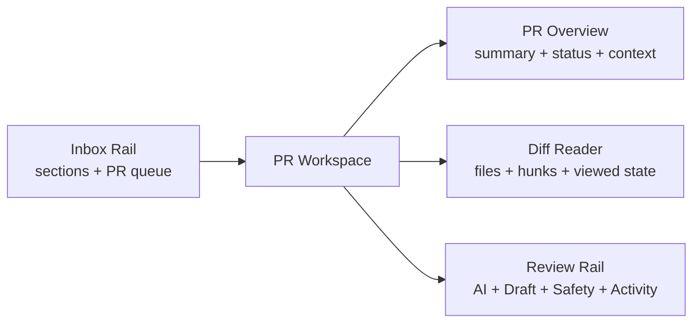
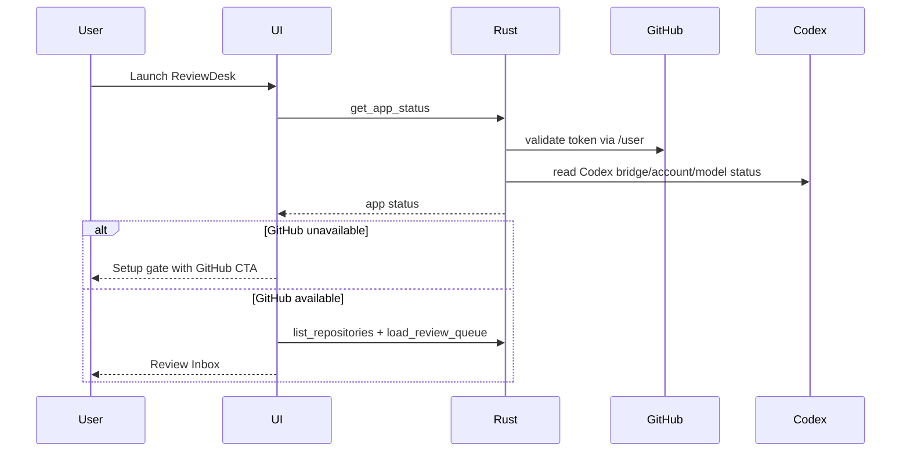
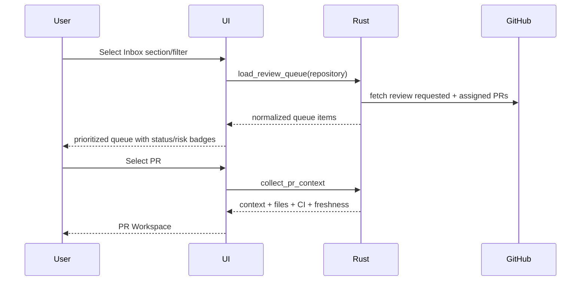
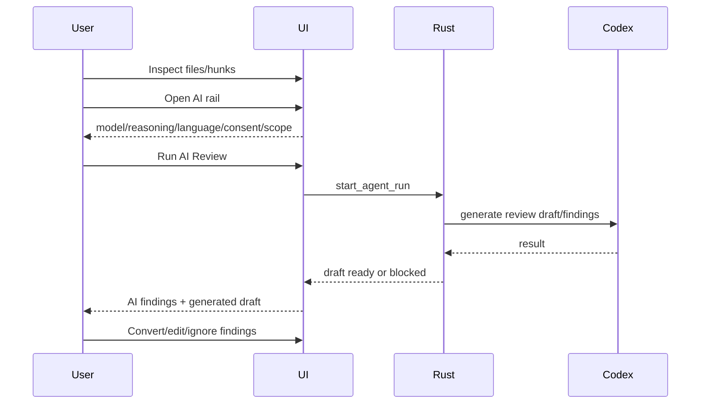
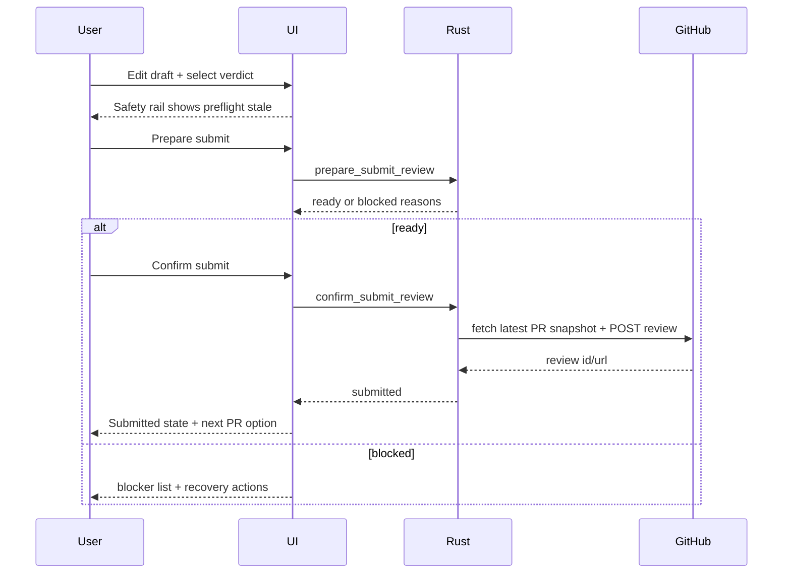

# ReviewDesk PRD 0.1.0

## 1. 문서 정보

- 제품명: ReviewDesk
- 문서명: PR-Centric Review Shell & Daily Review UX
- 버전: 0.1.0
- 작성일: 2026-05-17
- 상태: Implemented and verified
- 이전 기준: `docs/prd/prd-0.0.9.md`
- 핵심 결정: 0.1.0은 기존 `Inbox`, `Workspace`, `Agent Runs`, `Drafts`, `Submit Safety Dock`을 별도 화면으로 분리하던 구조를 PR 중심의 통합 리뷰 워크스페이스로 재구성한다. 사용자는 앱을 켜면 우선순위가 정리된 Review Inbox에서 시작하고, PR을 열면 diff, context, AI review, draft, submit safety를 한 화면 안에서 끊김 없이 처리한다.

### 1.1 구현 결과

0.1.0 구현은 PRD의 P0 범위를 IPC command shape 변경 없이 완료했다.

완료된 P0 항목:

- App shell을 `Review Inbox + PR Workspace + Review Rail` 3-zone 구조로 재구성했다.
- top-level navigation은 `Inbox`, `Settings` 중심으로 축소했고, AI/Draft/Safety는 선택된 PR의 review rail panel로 이동했다.
- GitHub missing 상태는 Setup gate로 유지하고, GitHub connected 상태에서는 Inbox 중심 shell로 진입한다.
- Inbox section은 `Needs review`, `Blocked`, `Drafts`, `Recently reviewed`로 구성하고 PR card에 CI, stale, file count, draft/session state, risk badge를 표시한다.
- PR Workspace는 overview, changed file list, selected file diff, selected PR identity, file viewed session state를 한 화면에서 유지한다.
- Diff reader는 unified patch를 hunk 단위로 파싱해 line number, add/delete/context styling, hunk navigation, file status/no patch state를 제공한다.
- Review rail은 `Summary`, `AI`, `Draft`, `Safety`, `Activity` panel을 제공하고 기존 `start_agent_run`, `prepare_submit_review`, `confirm_submit_review` IPC를 재사용한다.
- Draft body/verdict/explicit confirmation 변경은 submit preflight를 stale 처리해 confirm submit을 막는다.
- Queue/context/agent/submit loading, blocked, failed, empty state를 분리해 사용자가 복구 action을 볼 수 있게 했다.
- P0 command entry는 실제 동작에 맞게 search/filter copy로 정리했고 unsupported command를 광고하지 않는다.
- 신규 visible copy는 영어/한국어 i18n key parity를 유지한다.
- desktop narrow width에서 hard failure가 나지 않도록 window/body 최소 폭을 800px 기준으로 낮췄다.
- in-app browser 검증을 위해 `?reviewdesk_demo=1` demo fallback을 추가했다.

의도적으로 후속 범위로 남긴 항목:

- true command palette, keyboard-first review flow, split/unified toggle, hide viewed files, persisted draft/viewed state는 P1이다.
- inline comments, suggested changes, batch review comments, comment thread resolution, large PR guided walkthrough, multi-agent review comparison은 P2이다.
- GitHub OAuth, Codex auth boundary, GitHub submit API contract, auto-submit/auto-merge는 0.1.0 non-goal로 유지했다.

검증 결과는 `docs/verification/reviewdesk-tauri-0.1.0.md`에 기록했다.

## 2. 한 줄 정의

ReviewDesk 0.1.0은 GitHub PR 리뷰를 매일 처리하는 사용자를 위해 Review Inbox와 PR Workspace를 재설계하고, AI를 별도 목적지가 아니라 선택된 PR 안의 보조 리뷰 레일로 통합하는 Rust/Tauri 데스크톱 앱 버전이다.

## 3. 왜 0.1.0이 필요한가

0.0.9는 GitHub/Codex 연결, Review Inbox, PR context, stale/preflight, GitHub review submit을 릴리즈 가능한 계약으로 안정화했다.

하지만 실제 daily-use UI 관점에서는 아직 다음 문제가 남아 있다.

- `Workspace`, `Agent Runs`, `Drafts`가 peer navigation으로 분리되어 있어 사용자가 PR 맥락을 잃는다.
- Command bar placeholder는 `/run-agent`, `/submit`을 암시하지만 실제 동작은 queue filter에 가깝다.
- PR을 선택한 뒤 AI 실행, draft 수정, submit readiness 확인이 각각 다른 화면/위치에 흩어져 있다.
- diff는 raw `<pre>` 중심이라 line number, hunk navigation, viewed state, add/delete 시각 구분, comment anchor 같은 review-grade affordance가 부족하다.
- queue는 PR 목록을 보여주지만 urgent/risky/blocked/returned 상태를 적극적으로 정리해 주지 않는다.
- loading/error/pending 상태가 빈 화면처럼 보이는 곳이 있어 사용자는 네트워크 실패와 실제 empty state를 구분하기 어렵다.
- Submit Safety Dock은 항상 보이지만 선택된 PR의 제출 가능성을 즉시 이해시키는 contextual command center로는 부족하다.

0.1.0의 목표는 새로운 backend capability를 늘리는 것이 아니라, 0.0.9에서 확보한 연결/컨텍스트/제출 계약을 사용자가 매일 쓰기 좋은 리뷰 제품 경험으로 재배치하는 것이다.

## 4. 리서치와 에이전트 토론 결론

0.1.0 방향은 4개 관점의 에이전트 토론과 최신 PR 리뷰/생산성 앱 패턴 조사를 종합해 결정했다.

### 4.1 Product Workflow Agent

판정:

- 첫 화면은 가능한 한 Review Inbox여야 한다.
- GitHub가 없을 때만 setup gate가 app shell 진입을 막는다.
- 선택한 PR을 중심으로 diff, AI, draft, safety를 유지해야 한다.
- AI는 제품의 중심 객체가 아니라 선택된 PR을 도와주는 assistant lane이어야 한다.

PRD 반영:

- App shell은 `Review Inbox + PR Workspace` 중심으로 재구성한다.
- `Agent Runs`와 `Drafts`는 top-level nav에서 내려 PR workspace의 right rail 또는 bottom panel로 들어간다.
- PR context identity, head SHA, freshness, CI, draft state, submit readiness는 workspace 전역에서 계속 보인다.

### 4.2 Interaction / Visual Systems Agent

판정:

- 현재 command bar는 실제 기능보다 많은 기대를 만든다.
- diff reader는 professional review tool로 쓰기에 너무 raw하다.
- loading/error state를 empty state로 흡수하면 신뢰가 떨어진다.
- React UI의 fixed grid와 `min-width: 1024px`는 좁은 화면 UX를 사실상 막는다.

PRD 반영:

- Command bar는 P0에서 정확한 search/filter로 정리하고, P1에서 command palette로 확장한다.
- diff reader는 line number, add/delete coloring, file status, hunk jump를 P0로 둔다.
- queue/context/auth/agent/submit에 명시적 loading/error/retry state를 추가한다.
- responsive는 0.1.0에서 narrow mode 기초를 잡되, mobile-first app은 non-goal로 둔다.

### 4.3 Competitive Research Agent

판정:

- Graphite는 PR Inbox를 email client처럼 다루고, `Needs your review`, `Returned to you`, `Waiting for review` 같은 queue section을 제공한다.
- GitHub는 Files changed 화면에서 overview/comments/merge status/alerts를 docked panel로 붙여 탭 전환 없이 context를 보게 하는 방향이다.
- Linear는 모든 주요 action을 button, shortcut, context menu, command menu로 접근 가능하게 만든다.
- GitLab/GitHub는 final review outcome을 `Comment`, `Approve`, `Request changes`로 명확히 유지한다.
- CodeRabbit류 AI review 제품은 flat file list가 아니라 PR change story, guided walkthrough, AI findings lane으로 이동하고 있다.

PRD 반영:

- Inbox는 단순 list가 아니라 triage surface다.
- PR Workspace는 `Overview + Diff + Review Rail` 3-zone 구조를 기본으로 한다.
- AI output은 human review draft와 섞지 않고, 명확히 labeled/dismissible/convertible state로 보여준다.
- submit은 explicit safety confirmation을 유지한다.

참고:

- GitHub Changelog, docked PR Files changed panels: https://github.blog/changelog/2026-03-19-view-code-and-comments-side-by-side-in-pull-request-files-changed-page/
- Graphite PR Inbox: https://graphite.com/docs/use-pr-inbox
- Graphite PR page overview: https://graphite.com/docs/pr-page-overview
- Linear command/action model: https://linear.app/docs/conceptual-model
- GitLab merge request reviews: https://docs.gitlab.com/user/project/merge_requests/reviews/
- GitHub PR review docs: https://docs.github.com/en/pull-requests/collaborating-with-pull-requests/reviewing-changes-in-pull-requests/about-pull-request-reviews
- Windsurf Quick Review: https://docs.windsurf.com/windsurf/quick-review
- CodeRabbit changelog, Change Stack: https://docs.coderabbit.ai/changelog

### 4.4 Technical Feasibility Agent

판정:

- React/Tauri boundary는 명확하지만 `App.tsx`에 workflow state가 많이 몰려 있다.
- 0.1.0은 auth/submit/backend IPC shape를 바꾸지 않는 UI-first release가 안전하다.
- `confirm_submit_review`, OAuth, Codex Agent Run backend 변경은 regression risk가 크므로 UI shell 정리와 분리해야 한다.
- reducer/state machine 도입은 가치가 있지만 기존 behavior 보존 테스트가 먼저 필요하다.

PRD 반영:

- P0는 IPC shape 변경 없는 UI shell 재구성이다.
- 상태 관리는 `App.tsx`에서 바로 큰 rewrite를 하기보다 view-model/helper 추출과 component extraction부터 진행한다.
- backend-affecting 변경은 P1/P2 또는 별도 PRD로 분리한다.

## 5. 제품 결정

### 5.1 0.1.0의 중심은 PR-Centric Review Shell

0.1.0의 기본 제품 흐름:

1. 앱을 실행한다.
2. GitHub 연결이 유효하면 Review Inbox로 진입한다.
3. Inbox는 내가 지금 봐야 할 PR을 section과 priority metadata로 정리한다.
4. 사용자가 PR을 선택하면 PR Workspace가 열린다.
5. PR Workspace는 overview, file tree, diff reader, review rail을 한 화면에서 제공한다.
6. review rail에서 AI run, findings, draft composer, submit safety를 전환한다.
7. 사용자는 diff를 읽고, 필요하면 AI review를 실행하고, draft를 수정한다.
8. safety preflight를 확인하고 GitHub review를 제출한다.
9. 제출 후 다음 review candidate로 이동할 수 있다.

### 5.2 Top-level navigation 재정의

0.0.9 top-level nav:

- Inbox
- Workspace
- Agent Runs
- Drafts
- Settings

0.1.0 top-level nav:

- Inbox
- Settings

조건부/보조 진입:

- PR Workspace는 Inbox selection에 의해 열리는 primary workspace다.
- Agent, Draft, Submit Safety는 PR Workspace 내부의 review rail panel이다.
- Setup은 GitHub app shell gate가 필요할 때만 full-screen으로 표시한다.

결정 이유:

- Agent/Draft/Submit은 독립 destination이 아니라 선택된 PR에 종속된 작업이다.
- top-level nav가 적을수록 사용자는 "어디로 가야 하지?" 대신 "어떤 PR을 봐야 하지?"에 집중한다.
- Settings는 연결/언어/diagnostics 같은 app-level state를 다루므로 top-level에 남긴다.

### 5.3 GitHub gate와 Codex gate 유지

0.1.0에서도 0.0.9의 auth boundary는 유지한다.

기본 모드:

- GitHub missing: App Shell 진입 차단, Setup 표시
- GitHub connected + Codex missing: App Shell 진입 허용, AI review rail만 차단
- GitHub connected + Codex connected: AI review rail 실행 가능 후보

Strict Auth Mode:

- GitHub와 Codex가 모두 connected일 때만 App Shell 진입
- 기본값은 off

### 5.4 AI는 assistant lane

AI review는 다음 방식으로 표시한다.

- 선택된 PR과 head SHA/context hash에 묶인다.
- 모델, reasoning effort, review language, private diff consent snapshot을 명시한다.
- 실행 전 included/excluded file count를 보여준다.
- 실행 중 progress, cancel/retry 상태를 보여준다.
- 결과는 `AI findings`와 `Generated draft`로 구분한다.
- 사용자는 AI finding을 human draft comment로 변환하거나 무시할 수 있다.
- AI가 만든 텍스트는 submit 전까지 사람이 편집/확인해야 한다.

금지:

- AI finding을 사람의 review comment처럼 섞어 표시하지 않는다.
- AI-generated draft를 사용자가 확인하지 않은 상태로 auto-submit하지 않는다.
- AI run 실패를 silent empty state로 처리하지 않는다.

## 6. 정보 구조

### 6.1 App Shell

App Shell 구성:

- Top bar
  - app identity
  - current repo/PR search or command entry
  - GitHub/Codex compact status
  - selected model/review language compact status
- Left Inbox rail
  - section list
  - repo filter
  - queue search/filter
  - PR cards
- Main workspace
  - empty/selection/loading/error state
  - selected PR overview and diff
- Right review rail
  - Summary
  - AI
  - Draft
  - Safety
  - Activity

### 6.2 Inbox sections

P0 sections:

- `Needs review`: 내가 reviewer로 요청되었거나 assigned 된 열린 PR
- `Blocked`: CI failure, stale context, missing patch, closed/merged risk, auth/scope issue 등 바로 제출 불가한 PR
- `Drafts`: 로컬 draft 또는 AI draft가 있는 PR
- `Recently reviewed`: 방금 제출했거나 completed state인 PR

P1 sections:

- `Returned to you`: 이전에 changes requested 했고 author가 새 commit을 올린 PR
- `Waiting`: 내가 comment/changes를 남긴 뒤 author response를 기다리는 PR
- `Large/Risky`: file count, deletion/addition, generated files, migrations, auth/payment/security path 기준 risk bucket

Queue card는 다음 정보를 표시한다.

- repo + PR number
- title
- author
- review reason: requested, assigned, code owner, mentioned
- CI rollup
- changed files count
- updated age
- draft/AI run state
- freshness/stale badge
- risk badges

### 6.3 PR Workspace zones

PR Workspace는 3-zone 구조다.



#### Overview zone

위치:

- PR workspace 상단 또는 diff 위 sticky header

표시 정보:

- repo/name + PR number
- title
- author
- head SHA short
- base/head branch
- additions/deletions/file count
- CI rollup
- freshness
- patch coverage
- AI input coverage
- linked issue/preview URL은 P1

역할:

- 사용자가 raw diff를 읽기 전에 "무엇을 확인해야 하는지" 빠르게 파악한다.
- stale, CI failure, missing patch 같은 review risk를 먼저 드러낸다.

#### Diff zone

P0 diff reader 요구사항:

- file tree 또는 changed file list
- selected file diff
- line number
- add/delete/context line visual treatment
- hunk header
- hunk jump
- file status badge: modified, added, deleted, renamed, binary/no patch
- mark file viewed local state
- current selected file path sticky display

P1 diff reader 요구사항:

- unified/split toggle
- hide viewed files
- changed since last review
- inline comment draft anchors
- suggested change composer
- per-hunk AI explanation

#### Review rail

Review rail panels:

- `Summary`: status, checks, freshness, patch coverage, selected scope
- `AI`: model/reasoning/language/consent/run/finding list
- `Draft`: verdict, explicit confirmation, editable body
- `Safety`: preflight status, blockers, prepare/confirm actions
- `Activity`: comments/reviews/check updates, P1

Review rail behavior:

- rail width is stable.
- selected panel persists while switching files.
- if AI is blocked, rail shows why and next action.
- if no PR selected, rail shows no target state.
- draft changes invalidate preflight.
- head SHA or context changes mark draft/preflight stale.

### 6.4 Command entry

P0 decision:

- Rename current bar to match actual behavior if command palette is not implemented in the same release slice.
- Placeholder must not advertise unsupported commands.

P1 command palette:

- Open with `Cmd/Ctrl+K`
- Search PRs, repos, files
- Commands:
  - run AI review
  - prepare submit
  - focus draft
  - select verdict
  - next/previous PR
  - next/previous file
  - mark file viewed
  - refresh queue
  - refresh context
  - open settings
- Disabled commands explain the reason.

## 7. 핵심 사용자 흐름

### 7.1 앱 시작



### 7.2 Inbox triage



### 7.3 PR review with AI assist



### 7.4 Draft and submit



## 8. State model

### 8.1 Review target state

새 UI shell은 다음 target 중심 state를 갖는다.

```ts
type ReviewTargetState =
  | { status: "none" }
  | { status: "loading"; queueItem: PullRequestQueueItem }
  | {
      status: "ready";
      queueItem: PullRequestQueueItem;
      context: PullRequestContextView;
      selectedFilePath: string | null;
    }
  | {
      status: "failed";
      queueItem: PullRequestQueueItem;
      errorCode: string;
      message: string;
    };
```

### 8.2 Draft state

Draft는 PR/head/context에 묶인다.

필드:

- `targetRef`
- `headSha`
- `contextHash`
- `body`
- `verdict`
- `explicitVerdictConfirmed`
- `source`: manual, ai, mixed
- `dirty`
- `staleReason`
- `lastSavedAt`

P0에서는 local memory state로 시작할 수 있다.

P1에서는 local store persistence를 사용한다.

### 8.3 AI run state

AI run state:

- `idle`
- `blocked`
- `queued`
- `running`
- `draft_ready`
- `failed`
- `cancelled`
- `stale`

AI run은 다음 snapshot을 표시한다.

- provider
- model
- reasoning effort
- review language
- selected files
- private diff consent
- head SHA
- diff hash
- rate limit status

### 8.4 Submit safety state

Submit safety state:

- `not_ready`: no PR/draft
- `stale`: draft/context changed after last preflight
- `checking`: preflight in progress
- `blocked`: reasons available
- `ready`: confirmation id available
- `submitting`
- `submitted`
- `failed`

Preflight invalidation triggers:

- draft body changed
- verdict changed
- explicit verdict confirmation changed
- private diff consent changed
- selected PR changed
- context/head SHA changed
- AI generated draft applied

## 9. UI requirements

### 9.1 P0 requirements

P0는 IPC command shape 변경 없이 구현한다.

#### P0.1 App shell

- GitHub missing일 때 Setup gate 표시
- GitHub connected일 때 Inbox 중심 shell 표시
- top-level nav에서 `Agent Runs`, `Drafts` 제거 또는 숨김
- Settings는 top-level 유지
- GitHub/Codex/model/language compact status 표시

#### P0.2 Inbox

- Review Inbox section UI 추가
- repo filter 유지
- queue search/filter 유지
- PR card에 CI, review reason, file count, updated age, draft/AI/stale badge 표시
- queue loading, queue error, queue empty 상태 구분
- refresh pending state 표시

#### P0.3 PR Workspace

- PR 선택 시 workspace에서 overview + diff + rail 표시
- context loading/error/retry state 구분
- selected PR identity sticky 유지
- file list와 selected file diff를 안정적으로 표시
- no patch/binary/large file state 구분

#### P0.4 Diff reader

- line number 표시
- add/delete/context line coloring
- hunk header styling
- file status badge 표시
- file viewed local toggle
- hunk navigation UI 제공

#### P0.5 Review rail

- `Summary`, `AI`, `Draft`, `Safety` panel 제공
- AI panel에서 existing `start_agent_run` 사용
- Draft panel에서 existing draft/verdict state 사용
- Safety panel에서 existing `prepare_submit_review`, `confirm_submit_review` 사용
- panel 전환이 selected PR/file/draft를 잃지 않음

#### P0.6 Loading/error/recovery

- auth refresh pending
- queue loading/error
- context loading/error
- agent running/blocked/failed
- submit checking/blocked/failed
- 모든 error state는 retry 또는 next action을 가진다.

#### P0.7 i18n

- 신규 visible text는 영어/한국어 key parity를 유지한다.
- 내부 reason code를 그대로 primary UX copy로 노출하지 않는다.

### 9.2 P1 requirements

- true command palette
- split/unified diff toggle
- hide viewed files
- changed since last review
- draft persistence per PR/head
- AI findings structured list
- finding to draft comment conversion
- activity rail: comments/reviews/checks
- linked issue and deployment preview
- keyboard review flow

### 9.3 P2 requirements

- inline comments
- suggested changes
- batch review comments
- comment thread resolution
- code owner/approval rule awareness
- large PR guided walkthrough
- AI-native change story grouping
- multi-agent review comparison

## 10. Non-goals

0.1.0에서 하지 않는 것:

- GitHub OAuth, broker, device flow protocol 변경
- Codex auth boundary 변경
- ChatGPT token 직접 수신/저장
- GitHub review submit API contract 변경
- auto-submit
- auto-merge
- inline comments/suggestions full implementation
- mobile-first redesign
- custom theme system
- PR authoring/merge queue 관리
- background daemon queue processing

## 11. UX acceptance criteria

### 11.1 Daily reviewer happy path

Given GitHub is connected,
When the user launches ReviewDesk,
Then the user lands in Review Inbox without passing through Setup.

Given Review Inbox has PRs,
When the user selects a PR,
Then the PR Workspace displays overview, file list, diff, and review rail without navigating to a separate Agent/Draft page.

Given Codex is connected and private consent is accepted,
When the user runs AI review from the AI rail,
Then the user sees running state, result/blocked state, and can apply generated draft without losing diff context.

Given draft is non-empty and verdict requirements are satisfied,
When the user prepares submit,
Then Safety rail displays ready state and enables confirm.

Given confirm succeeds,
Then the UI shows submitted review id/url and offers to move to the next PR.

### 11.2 Blocked states

Given GitHub is missing,
When the app launches,
Then Setup gate explains GitHub is required and shows browser/device OAuth actions.

Given Codex is missing,
When the user opens a PR,
Then Inbox, diff, manual draft, and submit remain usable, while AI rail shows Codex connection action.

Given queue load fails,
Then the UI does not show "No pull requests" as if the queue is truly empty; it shows a retryable error.

Given PR context load fails,
Then selected PR remains visible and the workspace shows retry/open-in-GitHub recovery.

Given draft changes after preflight,
Then confirm submit is disabled until prepare is run again.

### 11.3 Review-grade diff

Given a textual patch,
Then added/deleted/context lines are visually distinct.

Given a file has no patch,
Then the file row explains binary/no textual patch/metadata-only state.

Given multiple hunks exist,
Then hunk navigation can move between hunks.

Given a file is marked viewed,
Then the file row reflects viewed state for the current session.

## 12. Technical constraints

### 12.1 IPC

P0 must reuse existing IPC commands:

- `get_app_status`
- `get_codex_bridge_status`
- `list_repositories`
- `load_review_queue`
- `collect_pr_context`
- `list_ai_models`
- `start_agent_run`
- `prepare_submit_review`
- `confirm_submit_review`
- `open_external_url`

P0 should not change Rust command request/response shape unless a blocking UI requirement cannot be met.

### 12.2 React architecture

Target extraction:

- `AppShell`
- `TopBar`
- `ReviewInbox`
- `InboxSectionList`
- `PullRequestCard`
- `PrWorkspace`
- `PrOverview`
- `FileTree`
- `DiffViewer`
- `ReviewRail`
- `AiRailPanel`
- `DraftRailPanel`
- `SafetyRailPanel`
- `StatusState`

State transition cleanup:

- preserve existing behavior first
- add explicit loading/error states
- only then consider reducer/state machine

### 12.3 Styling

Design direction:

- quiet, dense, professional developer tool
- no marketing hero treatment
- no decorative cards inside cards
- strong scanning hierarchy
- restrained color, status colors only for meaning
- stable panel widths and no layout shift during dynamic status updates

### 12.4 Responsive

P0 desktop target:

- 1024px and above: 3-zone workspace
- 800-1023px: collapsible inbox/rail, single focused workspace

P0 may keep true mobile unsupported but must avoid hard failures in narrow desktop windows.

## 13. Testing and verification

### 13.1 Unit/component tests

Add Vitest/React tests for:

- app starts in Setup when GitHub missing
- app starts in Inbox when GitHub connected
- queue loading/error/empty rendering
- selecting PR shows workspace loading then ready state
- draft edit invalidates preflight
- verdict change invalidates preflight
- safety ready enables confirm
- command/search copy does not advertise unsupported commands in P0

### 13.2 View-model tests

Add tests for:

- queue section grouping
- PR risk badge derivation
- draft state derivation
- submit safety state derivation
- i18n key parity

### 13.3 Rust tests

P0 should not need new Rust behavior tests unless IPC contracts change.

Regression tests must continue to pass:

- auth tests
- github tests
- review tests
- app_core tests
- tauri shell command tests
- security tests

### 13.4 Manual verification

Manual checklist:

- demo mode renders Inbox and PR Workspace
- GitHub missing renders Setup
- GitHub connected + Codex missing allows manual draft/submit path
- Codex blocked reason appears in AI rail only
- queue fetch failure shows retryable error
- context fetch failure shows retryable error
- AI run success applies draft
- AI run blocked does not erase draft
- prepare submit blocked reasons are legible
- confirm submit disabled until ready
- narrow desktop viewport remains coherent

## 14. Rollout plan

### Phase 1: Shell and IA

- Add PR-centered shell layout.
- Move Agent/Draft/Safety into review rail.
- Keep existing IPC calls.
- Keep old behavior behind current state where possible.

### Phase 2: Inbox quality

- Add section grouping.
- Add richer PR cards.
- Add loading/error/empty states.
- Add search/filter copy cleanup.

### Phase 3: Workspace quality

- Add overview header.
- Add structured diff viewer.
- Add file viewed state.
- Add hunk navigation.

### Phase 4: AI/Draft/Safety polish

- Improve AI panel state language.
- Improve draft state and preflight invalidation display.
- Turn submit dock into contextual safety panel.

### Phase 5: Command palette and advanced review

- Implement true command palette.
- Add keyboard-first navigation.
- Add `changed since last review`, inline comment foundations, and AI finding conversion.

## 15. 결정된 범위와 후속 질문

0.1.0 구현에서 결정한 범위:

- `Agent Runs`와 `Drafts`는 top-level nav에서 제거하고 PR Workspace의 review rail로 이동한다.
- local draft persistence는 P1로 남기고, P0는 session memory state만 제공한다.
- file viewed state는 P0에서 session-only로 유지한다.
- true command palette는 P1로 남기고, P0는 현재 command/search entry의 copy를 실제 search/filter 동작에 맞춘다.
- `Activity` rail은 P0에서 lightweight panel로 제공하고, comments/reviews/checks timeline 고도화는 P1로 남긴다.

후속 질문:

- persisted draft/viewed state를 local store에 저장할 때 PR head SHA, context hash, account identity를 어떤 단위로 묶을지 결정해야 한다.
- inline comment/suggested change composer가 들어갈 때 기존 GitHub submit contract를 확장할지 별도 PRD에서 결정해야 한다.
- AI finding을 human draft comment로 변환하는 UX는 P1/P2에서 structured finding schema와 함께 설계해야 한다.

## 16. Success metrics

Qualitative:

- A user can explain the app as "my PR review inbox and workspace" rather than "several screens for review-related actions."
- A selected PR remains the visible context while running AI, editing draft, and preparing submit.
- Blocked states explain what happened and what to do next.

Operational:

- Existing Rust/Tauri tests pass.
- New React workflow tests cover app shell, queue state, PR selection, draft/preflight invalidation.
- No new broad Tauri permissions are required.
- No auth/token boundary regression.
- No GitHub submit regression.

Product:

- Time from app launch to first PR diff is reduced.
- Time from PR selection to draft submit readiness is reduced.
- Users can process the next PR without manually rebuilding context.
